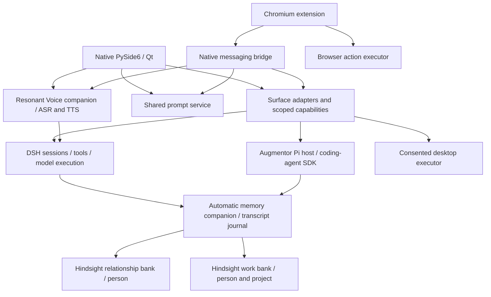

<!-- Copyright © 2026 Manolo Remiddi · SPDX-License-Identifier: LicenseRef-Augmentor-MIT-Resale-1.0 -->

# Current architecture

Current development source: Augmentor 0.2.9 preview. Start with the
[agent handoff](AGENT-HANDOFF.md) for the authoritative Git ref and evidence.
The [documentation index](README.md) maps every subsystem to its detailed guide.
The [original 0.1 design](HISTORICAL-ARCHITECTURE-0.1.md) is historical.

Installed Linux desktop selection follows [desktop deployments](DESKTOP-DEPLOYMENTS.md):
one atomic descriptor selects a separately staged release for login, launchers,
recovery and mobile. Working source trees are not the installed release.

## Product and runtime ownership

Augmentor is one product with native PySide6/Qt and Chromium surfaces in this
repository. DSH is the full-featured conversational harness; Pi is a supported
subset. Each chat stays owned by its selected harness. Neither memory nor voice
starts another conversational agent. OpenCode is retired; its old data remains.

The diagram shows logical ownership, not every transport call. Voice uses the
existing authenticated DSH session and generation protocol. Desktop authority
is not granted to a browser session by sharing a host or memory bank.

## Source map

| Owner | Source | Contract and detail |
| --- | --- | --- |
| Native surface | `apps/native/augmentor_linux` | [Native map](../apps/native/README.md); controllers choose Pi or DSH |
| Chromium surface | `apps/browser/extension`, `native-host.mjs`, `pi-bridge.mjs`, `pipe.mjs` | [Browser](../apps/browser/README.md), [distribution](BROWSER-DISTRIBUTION.md) |
| Pi lifecycle | `packages/runtime`, `packages/pi-linux` | [Pi protocol](PROTOCOL.md), SDK 0.85.1 |
| DSH setup, sessions, exact branching | `services/dsh`, `adapters/dsh-product`, `adapters/dsh-steering` | [DSH setup](DSH-SETUP.md), [feature boundaries](FEATURE-MATRIX.md) |
| Shared prompts and templates | `services/prompt-library`, `packages/prompt-library`, `packages/templates`, `adapters/dsh-prompt-library` | [Prompt improvement](PROMPT-IMPROVEMENT.md), [commands](SLASH-COMMANDS.md) |
| Shared visual behavior | `packages/design`, `scripts/sync-design.py` | [Skins](SKINS.md); build generates surface bindings |
| Automatic memory | `services/memory/{service,hindsight,dual}.py`, `packages/memory/src/dual.ts`, `adapters/dsh-memory/automatic.mjs` | [Architecture](DUAL-MEMORY.md), [operations and RPC](MEMORY-OPERATIONS.md) |
| Optional manual memory | `services/memory/provider.py`, prompt-service routing, `packages/memory/src/index.ts` | [Manual memory](MEMORY.md); separate 0.9.2 connection |
| Speech engine and plugin | Separate [Resonant Voice repository](https://github.com/ManoloRemiddi/resonant-voice) | [Voice handoff](https://github.com/ManoloRemiddi/resonant-voice/blob/main/docs/AGENT-HANDOFF.md); protocol `resonant-voice/1` |
| Audio controls and capture | Native `voice*.py`, browser `voice.mjs` / `voice-worklet.js` | [Controls](VOICE-SINGLE-BUTTON.md), [hands-free](HANDS-FREE-IMPLEMENTATION.md) |
| Desktop tools / specialist | `services/desktop`, `packages/desktop`, `packages/computer-use`, `adapters/dsh-desktop` | [Desktop control](DESKTOP-CONTROL.md), [specialist](DESKTOP-SPECIALIST.md) |
| Recovery, maintenance and support | `services/recovery`, `services/lifecycle`, `services/support`, `scripts/maintenance.py` | [Recovery](DESKTOP-OFFLINE-RECOVERY.md), [lifecycle](LIFECYCLE.md), [data](DATA-AND-SUPPORT.md) |
| Packaging and compatibility | `release`, `scripts/package-*`, `.github/workflows/validate.yml` | [Sources](SOURCES.md), [release status](CROSS-PLATFORM-RELEASE-STATUS.md) |

## Memory decision

The user requested two independent kinds of continuity: relationship knowledge
and project state. Reuse MIT-licensed Hindsight 0.10.0 for extraction,
consolidation, knowledge pages and hybrid retrieval. Relationship banks maintain
wiki-like pages; project banks support semantic retrieval plus a current-state
page. This is one maintained memory engine with separate banks, not one mixed
summary. A vector database alone would not maintain a distilled relationship;
handwritten summaries would duplicate existing memory-engine work.

Augmentor owns capture, stable person/project bindings, a durable SQLite source
journal, durable processing stages/budgets, selected cached context, and separate
capture/processing pause controls. Its memory-only gateway admits inference only
during bounded activity windows; no idle archive drain is permitted. See
[controlled memory](CONTROLLED-MEMORY.md).
Hindsight owns PostgreSQL/pgvector, derived facts, observations and pages. The
custom automatic summarizer is retired. Voice signals a relational register;
it does not establish speaker identity. Both typed and spoken turns can
contribute to both banks. See [dual memory](DUAL-MEMORY.md) for boundaries.

## State and recovery contracts

Pi persists its own conversation state; DSH persists its own. Shared memory does
not merge or convert conversations. Prompt records are independently stored in
`prompts.sqlite3`; automatic transcript memory uses `dual-memory.sqlite3`.
Speech configuration belongs to Resonant Voice. UI preferences belong to the
surface. [Data and support](DATA-AND-SUPPORT.md) explains data flow and retention.

Preserve selected models, explicit surface authority, Stop, pending interactions,
and original history. A reconnect or unknown acknowledgment must not replay a
model/tool action. Historical branching must preserve the selected boundary and
must not inject newer automatic memory into the historical context. Memories,
web pages and transcripts are evidence, never execution authority.

## Deployment boundaries

Source, CI artifacts, installed packages and the user-local preview are distinct.
The September memory upgrade stages a versioned user-local adapter and requires
idle DSH/voice before activation; it does not replace the root-owned desktop or
installed browser extension. Native controls refresh on a natural restart.
Speech is a separate versioned tarball, not a sibling runtime import.
See [handoff](AGENT-HANDOFF.md) for exact qualification and remaining work.

The September 20 user-local desktop deployment has one registered build and a
graphical-session supervisor. DSH startup ownership is shared by its surfaces;
permanent saved-chat failures are distinguished from transport loss. See
[restart reliability](RESTART-RELIABILITY-2026-09-20.md) for installation scope,
legacy diagnostic repair and cold-start evidence.
