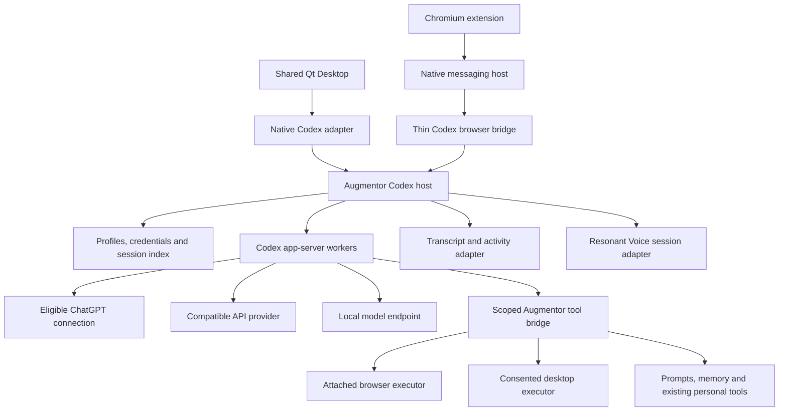

<!-- Copyright © 2026 Manolo Remiddi · SPDX-License-Identifier: LicenseRef-Augmentor-MIT-Resale-1.0 -->

# Codex integration build plan: Augmentor Desktop and Browser

Date: 30 September 2026. Status: implementation plan; no Codex integration is
implemented or qualified by this document.

Source baseline: canonical `ManoloRemiddi/augmentor-agent` main at
[`b8e36a44f6fc58c1a1a491040c81a21c17e82bb7`](https://github.com/ManoloRemiddi/augmentor-agent/commit/b8e36a44f6fc58c1a1a491040c81a21c17e82bb7).
This plan follows the owner's decision to build Codex-backed Desktop and Browser
surfaces with subscription, API-provider and local-model connections. Publishing
this plan does not change the installed application, default harness, license,
or any account. All implementation checkboxes begin uncompleted.

October 1 implementation decision: the [separate pinned Codex prerequisite](CODEX-PACKAGING.md#separately-installed-runtime--october-1)
keeps the current Linux/Mac installers working while supplier redistribution
review remains incomplete. This is an interim distribution mode, not completion
of C8 or a reduction of the full acceptance scope below. Preserve the native
notice gate before any future bundled Codex payload.

## 1. Product outcome and boundaries

Users keep Augmentor's native desktop and Chromium interfaces, persona, prompt
library, relationship/project memory, speech, saved chats and scoped tools. They
can select Codex as the conversation engine and choose a connection profile:

| Connection | Setup | Billing and model selection |
| --- | --- | --- |
| ChatGPT subscription | Supported browser OAuth sign-in, subject to distribution eligibility | Eligible OpenAI models; existing ChatGPT/Codex allowance and account limits |
| API provider | Provider endpoint, model ID and protected API credential | The user's provider account; no ChatGPT subscription required |
| Local model | Compatible local endpoint and model; optional authentication | User-operated inference; no OpenAI account required |

The new Sign in with ChatGPT integration and Codex-managed login are separate
authentication implementations behind the same account/profile interface. Do
not call a pasted OAuth token a supported sign-in experience.

Required product rules:

- One shared Codex integration serves both surfaces; Browser works with the
  Desktop window closed through the installed local companion.
- Linux and macOS share behavior and the existing approved UI. Platform adapters
  own service management, secure storage, permissions and packaging.
- Codex owns its conversation/tool loop, compaction and native thread history.
  Augmentor coordinates presentation, service access and lifecycle around it.
- Keep DSH and Pi selectable during qualification. Preserve their saved sessions,
  settings and data. Changing the default engine is a separate release decision.
- Show connection, model and billing source. Never silently change accounts,
  providers or billing modes after a failure or limit.
- Preserve visible Stop, user authorization, independent instances and the
  existing one-presenter approval lease across Desktop and Browser.
- Do not promise every model works. Publish tested endpoint/runtime/model
  combinations and their actual capabilities.

Out of scope: ChatGPT plugin-store publication, an embedded Qt app in ChatGPT,
a hosted multi-tenant inference service, replacing Hindsight or Resonant Voice,
converting old sessions into native Codex history, or redesigning the interface.
The Home backend remains DSH-owned; existing personal-agent Home tools must be
audited and either carried through the shared tool boundary or explicitly gated.
Windows and Pi/ARM release qualification are later workstreams. Keep the design
portable, but do not claim those platforms merely because upstream has binaries.
Coordinate with any separately approved Windows work when implementation starts.

## 2. Evidence and external constraints

Official sources were inspected on 30 September 2026. These are documentation
claims, not a tested Augmentor integration. Recheck them at implementation start.

| Evidence | Consequence for this build |
| --- | --- |
| [Codex app-server](https://learn.chatgpt.com/docs/app-server) is the interface for rich custom clients | Use its supported protocol; do not scrape CLI text or automate the Codex UI |
| [Custom providers](https://learn.chatgpt.com/docs/config-file/config-advanced#custom-model-providers) configure endpoint, transport and authentication | Validate profiles and generate isolated runtime configuration |
| [Model documentation](https://learn.chatgpt.com/docs/models#other-models) marks Chat Completions support deprecated | Prefer Responses; qualify legacy transport only on a pinned runtime and publish its retirement risk |
| [Sign in with ChatGPT eligibility](https://developers.openai.com/siwc/quickstart) separates open-source access and selected commercial partners | Distribution eligibility is a release gate, independent of adapter engineering |
| [App-server authentication](https://learn.chatgpt.com/docs/app-server#auth-endpoints) excludes its legacy authentication route from commercial/hosted services | Do not use Codex-managed login as a commercial-access workaround |
| [Codex with plan usage](https://developers.openai.com/siwc/token-sharing-open-source/codex-app-server) documents a Responses provider using an authorized OAuth token | Build this as a distinct provider/auth route; the host manages renewal and process resumption |
| [Plan-usage limitations](https://developers.openai.com/siwc/token-sharing-open-source/preview-limitations) restrict hosted tools and request fields | Test that path independently from API-key and Codex-managed access |

For the new plan-usage route, HTTP inference requires `store: false` and
`stream: true`. Local Codex history remains usable. Hosted connectors, native
computer-use tools, image generation, transcription and audio/video input are
not supplied by this route. Local tool bridges and Resonant Voice need their own
execution paths; they are not automatically included OpenAI services.

The repository's [combined license](../LICENSE) restricts resale. Do not assume
a public repository qualifies for OpenAI's open-source route. Obtain a recorded
eligibility answer for the intended free/local and paid distribution models.
Do not change the license as part of this integration. Commercial approval has
no documented delivery date and must not be included in an engineering estimate.

## 3. Current implementation and migration points

The [current architecture](ARCHITECTURE.md),
[platform contract](PLATFORM-PARITY-AUDIT.md) and
[shared personal-agent behavior](SHARED-SURFACES-2026-09-24.md) remain authoritative.

| Inspected area | Existing behavior | Work required |
| --- | --- | --- |
| `packages/contracts/src/index.ts` | Harness IDs are `pi` and `dsh`; capability flags are coarse | Add Codex identity and negotiated capabilities without falsely advertising parity |
| `apps/native/augmentor_linux/controller.py` | Validates two harnesses and constructs Pi/DSH clients | Add a Codex adapter through the common controller contract |
| `apps/browser/native-host.mjs` | Selects `pipe.mjs` or `pi-bridge.mjs` after a version handshake | Add a thin Codex bridge and retain companion/extension compatibility checks |
| `packages/runtime/src/main.ts` | Pi uses bounded JSON frames over a private Unix socket | Reuse reviewed IPC patterns, not Pi's agent loop or session store |
| `services/surface/browser.py` | Prompt improvement instantiates `DshAdapter` | Route improvement by connection/session identity and preserve draft semantics |
| `apps/native/augmentor_linux/adapters/dsh.py` | Supplies DSH voice tickets, saved chats and interactions | Add equivalent product operations for Codex with explicit capability gaps |
| `apps/native/augmentor_linux/voice.py`, `services/voice/browser-client.py` | Both surfaces share `VoiceSession`; service tickets and generation events are DSH-coupled | Adapt the speech bridge; retain one capture/playback implementation |
| `services/memory`, `packages/memory`, `adapters/dsh-memory` | Shared Hindsight storage plus harness capture/context/activity bindings | Add Codex bindings and preserve bounded processing policy |
| `services/lifecycle`, `services/recovery`, platform launchers | Existing runtime ownership, maintenance and recovery | Add Codex worker leases, readiness and orderly shutdown |
| `release/product.json`, package/install scripts | One product manifest and platform-specific artifacts | Pin and inventory the Codex runtime and new protocol/schema versions |

Implementation must refresh this inventory against then-current main. Open
feature branches and local overlays are not automatically included; reconcile
their contracts deliberately without merging unrelated work.

## 4. Target architecture and source ownership

Proposed new paths below are design targets, not existing implementations:

| Component | Proposed owner |
| --- | --- |
| Shared TypeScript host, profiles, RPC mapping, events and durable operation ledger | `packages/codex-runtime/` |
| Versioned product types and capabilities | Existing `packages/contracts/`, with an explicit Codex transport schema |
| Native client | `apps/native/augmentor_linux/adapters/codex.py` and a small wire client |
| Browser client | `apps/browser/codex-bridge.mjs`, reusing existing renderer and executor |
| Tool registration/context boundary | `adapters/codex-tools/`, calling existing service implementations |
| Platform bootstrap/health helpers | `services/codex/`, using existing lifecycle/platform helpers |
| Runtime manifest and reproducible acquisition | `release/codex/` plus existing package scripts |
| Protocol fixtures and proofs | `tests/fixtures/codex/`, focused Node/Python/browser tests and an isolated integration-proof script |

Do not duplicate profile logic or OAuth in Python and JavaScript. The shared host
owns it; Python and Browser bindings transport product requests and render state.

Use a user-owned, supervised local host independent of either UI process.
On Linux/macOS, start with bounded framed JSON over a private Unix-domain socket,
with protocol negotiation, ownership/mode validation and request correlation.
The host drives app-server children through stdio. Avoid exposing an unauthenticated
HTTP/WebSocket control port. Windows transport remains an adapter decision.

Worker reuse is keyed by account/profile, workspace and execution authority.
Two compatible surfaces can attach to the same thread, but two accounts or
incompatible tool permissions must not share mutable process-global credentials.
Persist the worker-to-thread binding. Final worker pooling limits are measured
in phase C0 rather than guessed; one worker per security/configuration boundary
is the conservative starting point.

## 5. Profiles, identity, secrets and billing

### Profile contract

Define a versioned profile record with stable ID, display name, connection kind,
provider ID, approved endpoint, transport, selected model, capability results,
credential reference and configuration revision. Record account/workspace IDs
where needed without embedding secrets. Distinguish a saved model choice from
successful inference validation. Preserve model settings only when supported.

Use separate Augmentor-owned runtime directories. Pass a scoped child environment
and configuration; never rewrite the user's general Codex CLI/app configuration
or copy its auth cache implicitly. Audit project/system config, hooks, MCP tools
and instructions so an isolated state directory is not mistaken for a complete
permission boundary. Respect enforced administrator restrictions.

Prefer OS credential storage through adapters. If a supported route requires a
protected token file, implement its documented record and atomic updates with
owner-only permissions. Define locked-keychain/unavailable-store behavior before
shipping. Do not silently fall back to insecure storage. Keep secrets out of
extension storage, launch arguments, logs, model-visible tools and support bundles.
Audit whether model-executed child commands inherit credential environment
variables; remove credentials from their execution environment where supported.

### Authentication implementations

1. **API provider:** configure the matching provider authentication mechanism;
   do not send third-party credentials through OpenAI account-login RPCs. Support
   optional credentials for local endpoints. Validate destination and redirects,
   preserve TLS verification, and require deliberate configuration for non-loopback
   plaintext endpoints. Never forward a ChatGPT OAuth token to a custom provider.
2. **Codex-managed ChatGPT:** use supported account/login/status/logout methods
   in isolated Augmentor state, letting Codex manage renewal. Treat new-product
   and commercial eligibility as unresolved until confirmed. Do not advertise
   this route publicly solely because a local proof succeeds.
3. **New Sign in with ChatGPT:** implement the applicable approved registration
   flow. For the documented local route, use PKCE, state/nonce validation, a stable
   host identity, saved account/workspace client registration, ID-token verification
   and explicit plan-usage scope verification. Identity-only consent is not an
   inference grant. Follow [registration](https://developers.openai.com/siwc/token-sharing-open-source/sign-in)
   and [account/session guidance](https://developers.openai.com/siwc/token-sharing-open-source/profiles-and-sessions).
   Commercial registration may differ; do not substitute the local registration
   flow to bypass partner eligibility.

Serialize refresh for a credential set across all workers. For the documented
SIWC environment-token configuration, renew centrally, drain/restart the affected
worker and resume its saved thread without resubmitting an uncertain turn.
Define mid-turn expiry, expired refresh tokens, revoked consent, cancelled login,
callback timeout, account mismatch and logout during active work. Report local
logout separately from confirmed remote revocation.

Keep account selection independent from the local person's memory identity.
An explicit account switch must not accidentally share another user's memories,
history or credentials. Reconnecting the same account should preserve stable
bindings; cross-account memory linking requires an intentional product action.

### Model validation and usage

- List models through the route appropriate to the selected account/provider.
  Permit a manually entered model ID where a compatible provider has no catalog.
- Qualify streaming, tools, cancellation, images, context limits and continuation
  separately. A catalog entry or HTTP 200 is not completed inference.
- Prefer Responses. Do not invent an in-app Chat Completions-to-Responses proxy
  in the first release; any bridge would be a separately scoped dependency with
  tool-call, reasoning, context and failure semantics to prove.
- Show subscription/API/local as the funding source. Usage units and reset times
  may be unavailable; never synthesize a token allowance from incomplete data.
- Handle quota/429, unavailable models and failures arriving after partial output.
  Preserve the draft/history and require explicit selection for a billing change.
- Local-provider mode must not silently call OpenAI for chat, prompt improvement,
  title generation or recovery. Audit optional search and memory inference too.

## 6. Conversation and event contract

Create a mapping ledger against the pinned generated app-server schema. The
following are integration targets; verify each method and field before coding.

| Augmentor behavior | Codex integration target | Acceptance condition |
| --- | --- | --- |
| Readiness | Initialize protocol, provider/account readiness and required tool startup | Distinguish process reachable, login needed, model unverified and ready |
| New/reopen conversation | `thread/start`, `thread/resume`, list/read methods | Same profile/workspace and native history; failed restore never silently becomes a new chat |
| Send/stream | `turn/start`, item events and terminal turn status | Stable message IDs; partial output survives; only completed status means success |
| Stop | `turn/interrupt` and resulting state reconciliation | Model work and owned tools receive cancellation; uncertain side effects remain visible |
| Fork/edit | Supported `thread/fork` boundary plus a new user turn | Exact chosen history boundary and tool context; original thread retained |
| Steering | Supported turn-steer operation with active-turn identity | Correction delivered once at a valid point; no cancel-and-replay approximation |
| Queued input | Host admission queue if native semantics do not match the product | Stable IDs, ordering, remove/steer, restart reconciliation and visible unconfirmed state |
| Approvals/questions | Server-initiated requests mapped to interaction broker | One presenter, bounded leases, stale replies rejected and no default approval |
| Reasoning/progress | Exposed reasoning summaries and actual events only | No fabricated thinking, queue position or prompt-prefill progress |

Separate request IDs, product session IDs, Codex thread/turn/item IDs, UI instance
IDs and stream generation IDs. A persisted session reference includes harness,
profile/account binding, workspace, native thread and schema version. Preserve
the legacy `linux` surface identifier where it already means native Desktop;
do not rename persisted IDs just to add macOS.

Use a durable operation ledger for queued/accepted/started/completed/failed/
interrupted/unconfirmed submissions. An Augmentor request ID does not imply
upstream idempotency. Persist intent before dispatch and record acknowledgments;
after a lost acknowledgment, inspect the thread and either reconcile it or show
an unknown outcome. Never replay a user prompt, approval or side-effecting tool
automatically because a connection dropped.

Serialize mutations per thread; allow independent threads to progress. Handle
duplicate/out-of-order events, missing terminal events, bounded output/backpressure,
long transcripts, tool-output truncation, process death and stale subscriptions.
Use native history for recovery and normalized transcript data only for display.
Snapshot/event reconciliation must not append duplicate messages or memory writes.

A model/provider/account change while a turn is active is deferred or refused
visibly. Start a new thread for account/provider changes by default. Offer an
explicit bounded context transfer later if needed, without presenting it as an
exact native-history migration or silently sending prior data to another provider.

## 7. Tool execution and user authority

Port tool bindings, not DSH's agent loop. Inventory the installed personal-agent
tool composition from maintained source, including filesystem, shell, browser,
desktop, memory, prompts and optional Home tools. Choose one executor for each
operation; avoid exposing both a Codex built-in and an Augmentor tool with
conflicting semantics.

Prefer a scoped local MCP bridge for Augmentor-specific tools. Experimental
dynamic-tool RPCs are optional only if their value and version support are proven.
Bind trusted session/profile/workspace/surface context outside model-supplied
arguments. A tool argument must not let the model impersonate another session.

Preserve browser attachment, current-tab selection, navigation observations,
private-page boundaries and disconnect behavior. A browser action needs a live,
authorized executor; the Desktop window being closed must not detach it.
Desktop capture/control retains OS permission and user-consent checks. Browser
access does not automatically grant desktop authority. In shared personal chats,
both surfaces may present the same tools only under the existing grants.

Map Codex sandbox and approval policies to Augmentor's existing user choices.
Fail explicitly where an equivalent restriction cannot be enforced. Document
which external MCP/desktop executors run outside the Codex shell sandbox and
enforce their own boundaries. No automatic full-access fallback. Preserve
attachment limits, safe file references, UTF-8/text behavior and image-capability
checks. Speech input is a user request, not a permission escalation.

## 8. Persona, prompts, memory and speech

### Persona and prompts

Load the maintained `config/agent-persona.md` through supported Codex instruction
configuration, respecting platform and project instruction precedence. Validate
that ordinary personal-assistant tasks work as well as coding. Do not overwrite
the agent's safety/system layer. Track the persona revision used by a session.

Keep the shared prompt database, revisions, editing, literal clipboard expansion
and one-time clipboard snapshot. Replace DSH-specific improvement calls with
profile-aware routing. Draft improvement must not post into the live conversation,
run tools, write memory or change its history; bill through the deliberately
selected profile and preserve the original draft on failure. Audit titles,
summaries and any other auxiliary inference for the same rule. DSH slash commands
need a capability mapping; unsupported commands should explain the limitation.

### Memory

Use the existing Hindsight banks, source journal, deterministic bounded selection,
provenance and [controlled processing](CONTROLLED-MEMORY.md). Implement a Codex
capture adapter for committed public user/assistant/tool events. Do not collect
private reasoning, credentials, unrelated Codex chats or other accounts' history.
Deduplicate using native identities and mark reconnection/backfill distinctly.

Prove the supported pre-turn context-insertion boundary. If Codex cannot replace
older injected context like DSH, choose a documented versioned-context strategy
and test growth/compaction; do not directly edit Codex's private session files.
Historical forks must not receive newer recall that changes their selected past.

Map genuine foreground/tool/terminal activity to memory leases. Preserve the
existing absolute windows, pause controls, per-batch budgets and no-idle-drain
policy. Stop, disconnect and worker death terminate admission. Do not infer
spare compute from a generic tool event. Keep memory's configured inference route
separate: new subscription login must not silently redirect Hindsight processing
or consume allowance through extra background model calls. Memory failure must
leave chat usable with an accurate degraded-state indicator.

### Speech

Adapt the DSH ticket/session/text-generation coupling while retaining the shared
`VoiceSession` and browser worker. Define Codex session tickets, spoken-request
IDs, turn/generation association, streamed text delivery and cancellation with
the independently versioned Resonant Voice service. Never start another agent
conversation inside the speech adapter.

Preserve hold/release, locked/hands-free input, echo handling, playback buffering,
exactly-once transcript submission, capture heartbeat and named-instance voice
settings. Text from tool output or reasoning must not be spoken as an answer.
Close/Stop and interrupted generation must prevent stale audio from playing.
Do not change the approved Qwen/Breeze deployment, model settings, GPU placement
or CPU ASR/VAD path. Needed Resonant Voice changes belong in its own repository
and release, with an explicit cross-repository dependency and compatibility test.
No OpenAI audio entitlement is assumed from subscription login.

## 9. Desktop, Browser and platform experience

Integrate connection setup into the existing Agent setup/settings entrypoints.
Add only controls needed for this requested feature: engine/profile selection,
login/logout, endpoint/model/key configuration, connection test and funding/status
display. Reuse the approved layout, skins, streaming presentation and shortcuts.

Both surfaces need the same setup/readiness state machine: runtime unavailable,
installing, signed out, login pending, provider reachable, model unverified,
ready, usage limited, recovering and failed. Keep recoverable drafts on every
failure. Test provider selection and settings through the real UI, not only RPCs.

Browser setup uses the native host for sensitive operations and system-browser
OAuth. Extension storage contains only opaque profile/session references and
non-secret UI settings. Reconnect after service-worker suspension and native-host
restart, preserve version handshakes and multiple-browser ownership. Test the
supported Chromium variants, including the existing Chrome/Comet registration
path, without implying untested browsers are supported.

Primary and secondary Desktop windows remain independent by default. Explicitly
opening the same saved Codex chat in both surfaces is supported with one mutation
owner and approval presenter. Viewers may synchronize history without taking over
an active decision. Assess mobile remote access and embedded Browser contracts
when those branches are integrated; do not silently expose profile secrets or
control sockets to a remote page.

Linux uses the established user-session supervision model; macOS uses the
corresponding launchd ownership and app-bundle lifecycle. Test host operation with
all windows closed, logout/login, restart, sleep/wake and two concurrent instances.
Service install/uninstall must remove only owned registrations and preserve data
according to the product's existing choices.

## 10. Ordered implementation work packages

Each package should land as a reviewable change with its owning documentation,
contract tests and sanitized evidence. The suggested split is adjustable after
C0; dependencies and acceptance gates are mandatory. Estimates should be made
after the protocol/local-model/speech spikes, not from a working text-only demo.

### C0 — Validate runtime and release eligibility

Dependencies: this plan and a refreshed canonical main.

- [ ] Pick an exact upstream Codex release; inspect its generated app-server
  schema, supported configuration, license/notices and available target binaries.
- [ ] Run isolated app-server proofs for streaming, a tool call, Stop and history
  resume against one approved API provider and one real local model.
- [ ] Exercise an eligible subscription route; record what was permitted/tested
  separately from commercial distribution permission. Never publish credentials.
- [ ] Resolve or explicitly block open-source/commercial eligibility for both
  login routes. API/local engineering can proceed independently.
- [ ] Spike context insertion, scoped tools, worker isolation, token renewal and
  Resonant Voice decoupling; record unsupported methods/fields.
- [ ] Record actual runtime/provider capabilities and pin the tested version in
  `docs/SOURCES.md` and a proposed runtime manifest.

Exit: a reproducible compatibility report, exact dependency pin, and decisions on
transport, auth release gates and tool/context boundaries. If the chosen local
endpoint cannot execute tools through Codex, resolve compatibility here; do not
hide the gap in a later UI milestone.

### C1 — Contracts, shared host and lifecycle

Dependencies: C0 protocol decisions.

- [ ] Add `codex` identities, profile/session schemas, typed errors and negotiated
  features; preserve old persisted identifiers and compatible clients.
- [ ] Implement private IPC, worker registry, scoped runtime config/state, service
  locks, bounded queues, readiness and graceful shutdown/maintenance.
- [ ] Implement the durable operation ledger, event normalization and recovery.
- [ ] Add schema/version compatibility tests and subprocess crash/timeout tests.

Exit: two thin clients can observe one isolated fixture thread, recover after
disconnect, and cannot cross profiles or replay an uncertain submission.

### C2 — API/local profiles and protected credentials

Dependencies: C1; C0 compatible model endpoints.

- [ ] Implement endpoint/model/key configuration and optional local authentication.
- [ ] Add credential-store adapters, profile revisions and isolated child config.
- [ ] Implement model discovery/manual IDs, capability checks and completed-turn
  validation; audit auxiliary calls and unsupported provider parameters.
- [ ] Implement explicit profile switching, provider errors and usage states.

Exit: real API and local inference/tool flows pass without ChatGPT login;
credentials are absent from the renderer, tool environment and diagnostics.

### C3 — Desktop and Browser conversation integration

Dependencies: C1–C2.

- [ ] Add the native Codex adapter and browser bridge/selector, using shared host
  semantics rather than two implementations of the Codex protocol.
- [ ] Wire setup/model selection, send/stream, history, Stop, reconnect, saved chats,
  names, delete/archive behavior, exact fork/edit and supported queue/steer.
- [ ] Integrate approval/questions and enforce one presenter across surfaces.
- [ ] Preserve named windows, existing visual controls, clipboard and attachments.

Exit / milestone M1: an opt-in text/tool preview works through both actual UIs
with API and local profiles; Browser works with Desktop closed. Missing memory,
speech or subscription features remain visibly unavailable and unadvertised.

### C4 — Subscription login implementations

October 1 implementation checkpoint: [OAuth transactions, protected accounts and
shared login controls](CODEX-ACCOUNTS.md) now include host RPC and existing
Desktop/Browser status/sign-in/cancellation/consent/logout controls. Source
contract tests and isolated actual Linux storage pass; production login remains
disabled. The host/UI source checkpoint `95229aa` passes Mac 14/26 contracts and
all actual Keychain proofs; Linux packaging retains its native notice gate.
Account/model profile binding and pre-dispatch worker renewal are now implemented:
configuration revisions remain separate from rotating credentials, default-account
selection cannot redirect saved chats, and failed renewal preserves unsent work.
Scripted host and actual pinned Codex/loopback provider proofs pass. The separate
Codex-managed route, known limits, eligibility and real account/inference
acceptance remain open. Current account catalogs now use the documented fixed
OpenAI model endpoint through shared setup controls, with synthetic acceptance.
The C4 acceptance checkboxes below are not certified complete. See the account guide for exact evidence scope.

Dependencies: C1–C2 and the applicable C0 eligibility gate. Can be developed
alongside C3 once shared account contracts are stable.

- [ ] Implement the permitted Codex-managed login/status/logout lifecycle.
- [ ] Implement SIWC registration/consent/token verification and account binding
  for the eligible distribution route, with a replaceable registration strategy.
- [ ] Serialize refresh/revocation, coordinate worker renewal and resume safely.
- [ ] Add account-specific models, known usage/limit information and clear
  funding labels; never switch to API billing on exhaustion.
- [ ] Test cancellation, identity-only consent, mismatch, revoked/expired grants,
  refresh races and limits reported after partial streaming.

Exit / milestone M2: all three connection categories work in both surfaces where
eligible. A commercially blocked subscription route stays an explicit release
blocker; a mocked login is not live qualification.

### C5 — Product tool and persona integration

Dependencies: C3, plus C4 for subscription-specific tool tests.

- [ ] Bind the shared persona, prompt library, draft improvement and supported
  commands through the selected profile.
- [ ] Expose scoped existing filesystem/browser/desktop/memory/Home operations;
  remove duplicate executor registrations and document permission boundaries.
- [ ] Implement browser executor attachment and desktop consent/approval mapping.
- [ ] Prove personal-assistant behavior, structured interactions and multimodal
  inputs on qualified models; disable unsupported capabilities accurately.

Exit: a real browser task and a consented desktop task complete with evidence;
negative permissions and disconnected executors fail without hidden fallback.

### C6 — Memory capture, context and processing

Dependencies: C1 event identity, C5 instruction/tool boundaries.

- [ ] Add durable Codex event capture and stable person/project/profile bindings.
- [ ] Add bounded context selection/insertion, branch exclusions and compaction
  handling without editing private Codex storage.
- [ ] Integrate activity leases, budgets, pause/resume and existing inference route.
- [ ] Test restart/backfill deduplication, scope isolation, expiry, unavailable
  memory and exactly-once source capture.

Exit: Desktop and Browser share intended continuity; no background inference is
admitted by idle windows, replayed history, process restart or expired activity.

### C7 — Resonant Voice adapter

Dependencies: C3 session/Stop semantics, C5 persona; companion protocol spike C0.

- [ ] Add session ticket/text/generation integration and any separately released
  Resonant Voice bridge changes with a pinned dependency.
- [ ] Reuse shared capture/playback and Browser worker, including all input modes.
- [ ] Test interrupted speech, Stop, lost acknowledgments, echo protection,
  worker heartbeat, profile changes and two independent instances.
- [ ] Perform physical microphone/playback acceptance on Linux and macOS.

Exit / milestone M3 with C5–C6: required personal-agent features are qualified;
voice never sends a duplicate prompt or creates a second conversation loop.

### C8 — Distribution, upgrade and rollback

Dependencies: C1 lifecycle; final qualification depends on C3–C7.

- [ ] Acquire pinned binaries reproducibly per target with checksums, dependency
  inventory and notices; do not silently follow a globally installed latest CLI.
- [ ] Integrate complete installers, native-host registration, first-run setup,
  health diagnostics, version handshakes and offline/retry behavior.
- [ ] Build Linux and macOS from one reviewed source/dependency contract; validate
  embedded binary signing/sealing and current Mac preview constraints.
- [ ] Add schema-safe backup/migration and rollback; preserve DSH/Pi source data
  and Codex native history. Confirm older app versions refuse unsupported schemas.
- [ ] Test upgrades with active chat/voice/approvals: postpone activation until
  safe, retain a rollback artifact and report selected versus running builds.

Exit: fresh-user and upgrade/rollback proofs pass for each supported artifact;
no package contains developer credentials, conversations or machine state.

### C9 — Release qualification and documentation

Dependencies: C0 eligibility gates and C1–C8 acceptance.

- [ ] Run the shared/platform/provider matrix below and resolve critical gaps.
- [ ] Complete user setup, provider compatibility, data/deletion, troubleshooting,
  permissions and release notes; update the feature matrix and handoff.
- [ ] Record source SHA, artifact checksums, exact dependencies, test type, host
  platform and remaining limitations in a release acceptance ledger.
- [ ] Stage and activate through the existing approved deployment workflow only
  when the release is qualified. Default-engine changes require a separate choice.

Exit / milestone M4: a reproducible Codex-backed Augmentor release with explicit
supported connection modes, real two-surface/platform evidence and rollback.

## 11. Validation matrix and acceptance evidence

Every check is labelled **fixture**, **live provider**, **real UI**, **physical
device** or **installed artifact**. Success in one category is not evidence for
the others. Keep credentials, private transcripts and full model outputs out of CI
artifacts; use synthetic fixtures and sanitized outcome records.

| Dimension | Required coverage |
| --- | --- |
| Platforms | Linux desktop target and macOS Apple silicon; shared contracts on both, real adapters on each |
| Surfaces | Native primary/secondary, Browser with Desktop closed, same-chat attachment and separate chats |
| Providers | OpenAI API, at least one non-OpenAI compatible API, one real local model; each eligible subscription route independently |
| Conversation | Text/images where supported, long history, tool use, Stop, exact fork/edit, queue/steer, reconnect and recovery |
| Accounts | Signed out, identity-only consent, multiple profiles, limits, expiry, revocation, logout and account isolation |
| Permissions | Allow/deny, stale/multiple presenters, out-of-workspace access, browser detach, desktop consent and sandbox failures |
| Memory | Capture/recall, both scopes, compaction, branch history, pause, lease expiry, restart and no idle drain |
| Voice | Hold/lock/hands-free, physical audio, cancellation, no duplicate submission, heartbeat and independent profiles |
| Lifecycle | Cold start, duplicate launch, worker crash, suspend/resume, upgrade, rollback, uninstall and retained data |

Pairwise UI coverage is acceptable for low-risk appearance permutations; account
isolation, billing routing, cancellation and side-effect recovery need dedicated
tests for every auth/transport route. Include deliberate malformed/oversized RPC,
partial stream, model rejection, missing credential-store and process-kill cases.
Observe endpoint destinations in local-mode tests to catch unintended cloud use.

Use existing `npm run check`, `npm run build`, Node tests and native/browser suites,
plus new scoped Codex tests. Expand both `.github/workflows/validate.yml` and
`.github/workflows/macos-feasibility.yml` with relevant shared and OS checks.
Live OAuth proofs use a dedicated eligible test account and explicit human login;
do not put reusable account tokens in public CI. Public automation can use a
protected API test configuration when available and authorized.

Measure startup, first output, Stop latency, memory/CPU overhead, idle activity
and two-window concurrency against DSH on the same machine/model where comparable.
Set numerical regression thresholds from the C0 baseline. Record actual observed
latency; do not attribute all elapsed time to model decoding. No fixed performance
claim is made before measurement.

## 12. Release blockers, decisions and handoff

| Risk / unresolved decision | Action and owner | Blocks |
| --- | --- | --- |
| Commercial and resale-restricted-license eligibility | Product owner obtains OpenAI eligibility/partner confirmation | Public distribution of affected subscription login; not API/local development |
| Chat Completions retirement and local tool compatibility | Runtime implementer qualifies exact endpoint/runtime and pins it | Any advertised provider combination |
| Pre-turn context insertion and historical fork fidelity | Runtime/memory implementer proves schema-supported behavior in C0/C6 | Memory and exact-history parity |
| Speech depends on DSH ticket/generation semantics | Voice maintainer implements/version-tests the companion bridge | Full voice release |
| Auth refresh or profile changes disrupt active turns | Runtime/auth implementer adds serialized renewal and recovery proof | Subscription release |
| External tools bypass Codex sandbox | Tool implementer preserves executor authorization and tests rejection paths | Tool-enabled release |
| Concurrent feature branches alter UI/service contracts | Implementation lead refreshes source inventory before each phase | Safe integration, not authorization to merge unrelated work |
| Cross-platform lifecycle or artifact drift | Release maintainer builds and qualifies one reviewed source contract | Full Linux/macOS release |

Required documentation during implementation: this ledger, `ARCHITECTURE.md`,
`FEATURE-MATRIX.md`, `SOURCES.md`, `DATA-AND-SUPPORT.md`, `COMPLETE-INSTALL.md`,
`BROWSER-SETTINGS.md`, memory/voice guides, platform release guides,
`tests/README.md` and `AGENT-HANDOFF.md`. Mark each package complete only with
linked source and acceptance evidence. Add a dedicated Codex setup/protocol guide
when its implementation stabilizes; this plan must not masquerade as usage docs.

The next build task is **C0**. Start from current canonical main, preserve local
work, select the exact Codex runtime, and produce the API/local/subscription
compatibility and context/tool/voice spike evidence. Then implement C1–C3 for the
first usable two-surface preview. The public release remains gated by C4–C9 and
the applicable eligibility decisions.

## 13. Additional references

- [Codex versus SDK integration](https://learn.chatgpt.com/docs/codex-sdk)
- [Authentication and credential storage](https://learn.chatgpt.com/docs/auth)
- [SIWC account-specific models and completed inference](https://developers.openai.com/siwc/token-sharing-open-source/models-and-inference)
- [SIWC recovery and errors](https://developers.openai.com/siwc/token-sharing-open-source/errors-and-recovery)
- [SIWC usage presentation](https://developers.openai.com/siwc/ui-ux-guidelines)
- [User controls for plan usage](https://learn.chatgpt.com/docs/sign-in-with-chatgpt)
- [Existing composable design](COMPOSABLE-AUGMENTOR-PROPOSAL.md)
- [Existing deployment contract](DESKTOP-DEPLOYMENTS.md)
- [Existing data and support boundaries](DATA-AND-SUPPORT.md)
- [Existing feature ledger](FEATURE-MATRIX.md)
- [Resonant Voice repository and handoff](https://github.com/ManoloRemiddi/resonant-voice/blob/main/docs/AGENT-HANDOFF.md)
