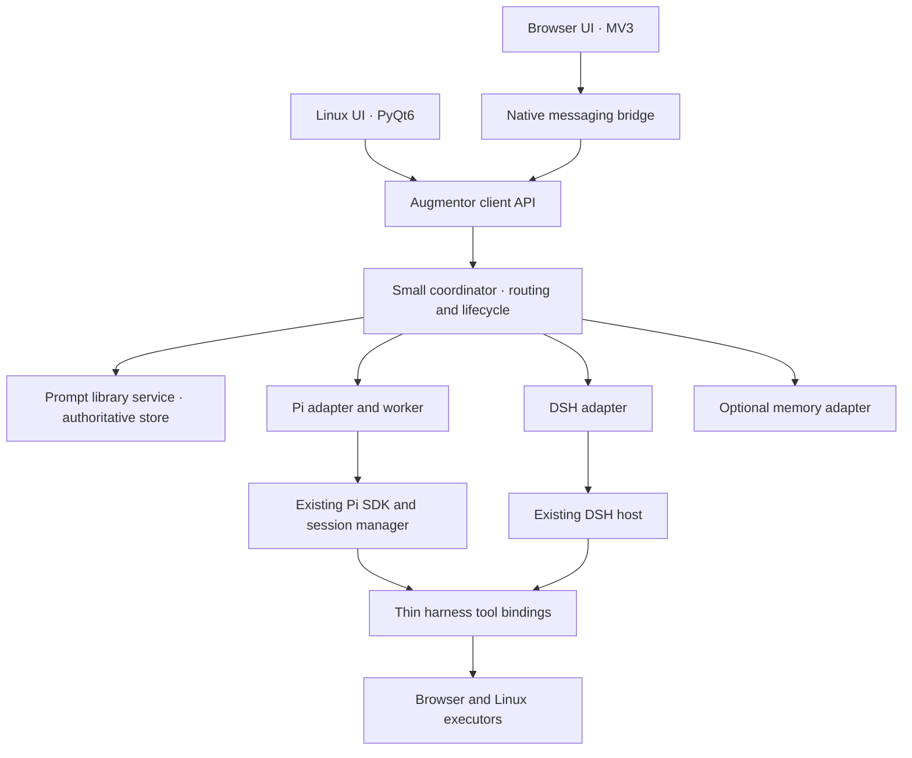

<!-- Copyright © 2026 Manolo Remiddi · SPDX-License-Identifier: LicenseRef-Augmentor-MIT-Resale-1.0 -->

# One Augmentor: shared services, two surfaces, replaceable harnesses

This is a dated plan/ledger, not the current source map. Read the
[agent handoff](AGENT-HANDOFF.md) and [current architecture](ARCHITECTURE.md)
for the present implementation, Git ref and qualification.

Status: accepted by the user, 2026-09-06. Implementation proceeds in the working slices below. This replaces the Pi-only repository ownership plan; installation cutovers require the acceptance evidence described here.

## What the code shows

| Component | Current implementation | Consequence |
| --- | --- | --- |
| Linux + Pi | PyQt6 app, Node/Pi host, private socket; local prompt editor, clipboard templates, copy/check, branch/edit | Most recent Linux behavior exists here only. |
| Linux + DSH | Separate PyQt6 source tree and DSH controller/client; reads the DSH prompt namespace | UI fixes require a second port. Prompt editing goes through DSH. |
| Browser + DSH | MV3 side panel, native messaging bridge, DSH API and browser plugin | Already has message Copy/check feedback, implemented separately with different sizing/timing. Slash prompts come from DSH; editing opens DSH settings. |
| Browser + Pi | Planning scaffold, no loadable extension | Opportunity to add Pi behind the existing browser surface rather than create another UI fork. |

The DSH prompt plugin already solved sharing between its two surfaces: both read the same `prompt-library` settings namespace. Pi split the data again by introducing its own Markdown store under its agent configuration. Both stores have revision checks, but no common authority or cross-store synchronization.

Inspected sources: Pi `apps/native/augmentor_linux/{window,transcript,prompts}.py`, `packages/runtime/src/{host,branches}.ts`, `docs/PROTOCOL.md`; DSH Linux `app/augmentor_linux/{window,controller,dsh,prompts}.py` and `prompt-library-plugin/README.md`; installed browser checkout `/home/example/Desktop/Deepseek harnes test/augmentor`, commit `a6a43fb`, especially `extension/{chat-render.js,prompt-library.mjs,panel-api.mjs}` and `shared/prompts.mjs`. Browser behavior here is source inspection, not a new live acceptance run. Pi branch semantics are implemented; equivalent DSH branch/edit support still needs an API audit and contract tests.

## Recommended boundary

Maintain one product, with two rendering implementations and replaceable engines. Harness choice belongs to a conversation, not to a separate copy of the application.



The coordinator does not implement an agent loop. Pi and DSH retain their own model calls, tool loop, compaction, credentials and durable native sessions. Prompt and memory services own their data; the coordinator routes requests and checks capabilities. These are logical modules first, not a mandate to create a microservice for every feature. A local service process can initially host the coordinator and prompt module; engine workers have separate lifecycles so their failures need not take down prompt editing or the other engine. Process separation by itself is not security containment.

The public [ResonantOS architecture](https://resonantos.com/#architecture) describes a small core for routing, permissions and component lifecycle, with surfaces and memory outside it. Its public page also describes the baseplate as a design seeking implementation. Adopt the boundaries now; do not invent or depend on a released ResonantOS SDK that this audit has not verified. A later ResonantOS adapter should integrate against its actual versioned contract.

## What is shared, and what still needs two implementations

| Concern | Shared owner | Surface/harness-specific part |
| --- | --- | --- |
| Prompt CRUD, identity, revisions, validation | Prompt service | Qt editor and browser editor render the same records |
| Template syntax and expansion rules | Pure template module and common input/output fixtures | Local clipboard access in Qt or Chromium |
| Copy/check, labels, icon assets, timing | Shared UX specification and assets | Qt mouse/focus handling versus DOM buttons |
| Branch and edited resubmission | Product contract plus engine capability tests | Adapter preserves each harness's real session context |
| Models, streaming, Stop and history | Versioned client API and normalized events | Each adapter maps its harness API |
| Browser/desktop actions | Shared platform executor where practical | Thin DSH/Pi registrations; browser/OS execution remains distinct |
| Long-term memory | Optional memory service contract | Provider implementation and harness retrieval hooks |

Retain PyQt6 now. A browser component cannot be imported as a native Qt widget. Share SVGs, labels, design values, schemas and behavioral fixtures; implement the rendering and platform interactions once per surface. If literal single-source rendering later becomes a priority, a shared web UI embedded in a desktop shell is an option, but it entails a desktop rewrite and new integration testing. It is unnecessary for eliminating the two Linux harness forks.

Browser and host TypeScript/JavaScript can share pure logic directly. Generate Python/TypeScript contract models from one schema where useful. For small platform-local rules such as template expansion, equivalent Python/JavaScript implementations must pass the same language-neutral fixtures. Avoid RPC calls for every hover or pointer movement.

## One authoritative prompt library

Create a harness-independent Prompt Library service. Start local to this machine, with a single writer and transactional SQLite storage outside both DSH and Pi directories, for example `$XDG_DATA_HOME/augmentor/prompts.sqlite3`. A prompt has a stable UUID, shortcut name, template text, revision, timestamps and import provenance. Renaming must not change its identity. Optional folders/tags can wait.

Expose list/get/create/update/delete and change notifications. Update/delete require `expectedRevision`; creation enforces name uniqueness transactionally. A stale editor retains its draft and offers a conflict resolution view. Use a monotonic library change sequence; clients that reconnect after missing events fetch current state. Initial offline behavior: clearly identified cached reading, with saves requiring reconnection. Do not silently queue competing writes in the first implementation.

All connected surfaces edit this same service, regardless of selected harness. DSH's existing settings editor can remain as another editor only after it is changed to forward reads/writes to the service through a supported DSH plugin bridge. It must stop maintaining an independently writable settings copy. If that bridge proves impractical, make the old panel point to the shared editor. Do not directly rewrite DSH's live YAML file from another process.

Migration is a reviewed, repeatable import: inventory both stores, back them up, deduplicate exact matches, preserve differing bodies under explicit conflict choices, record source IDs, and switch clients only after comparison succeeds. Original stores remain available for rollback. Cut over writers deliberately; a reverted client must not resume writing an obsolete store unnoticed.

Markdown/JSON are useful export and backup formats. Harness-native prompt files, if needed for other Pi/DSH interfaces, should be generated projections with a declared source revision, not additional editable authorities. Existing conversations keep their submitted text even if the library changes later.

On one computer, this is shared access to one store rather than syncing four databases. Synchronization across computers is a separate phase: define an authenticated service or replication contract, conflict handling and deletions before enabling it. Do not synchronize an open SQLite database through a generic folder-sync tool.

### Clipboard example

1. The saved template retains the literal `[clipboard]` token.
2. Selecting `/rewrite` captures one plain-text clipboard snapshot in the initiating surface, using its supported user-gesture flow.
3. The common expansion rule replaces every original occurrence once; tokens inside copied text are not recursively interpreted.
4. The result enters that surface's draft for review. No automatic send.
5. The expanded clipboard text is not written back to the library. Unavailable/empty clipboard leaves the draft unchanged with concise feedback.

Implement and test the same behavior in both surfaces. Keeping the library in one place alone will not make the existing browser picker interpret `[clipboard]`.

## Harness and memory contracts

The app API should cover capabilities, model listing/selection, session creation/attachment, messages/history, streaming/recovery, Stop, interactions and branch/edit. Adapt the existing `augmentor-pi/1` contract gradually behind a new harness-neutral version; do not silently change old envelopes. Negotiate versions and optional capabilities. Publish an explicit compatibility matrix for app, adapter and harness versions.

Every session reference includes harness ID plus native session ID. Preserve stable message/turn identifiers and event sequence cursors. A normalized display transcript is a read model, not a replacement for native tool/session history. Concurrent surfaces coordinate through the service; duplicate request IDs, stale mutations and response/approval races have explicit outcomes. Reconnection reconciles history and pending work without blindly retrying actions whose outcomes are unknown.

Branch means creating a child with actual model context through a selected completed reply, including earlier tool calls/results without replaying them. Edited resubmission branches before the latest user turn and sends the changed input once. Originals remain accessible. Unsupported engines must report that capability as unavailable; silently copying visible text into a new chat is not equivalent branching.

Harness switching starts a new engine-owned session. Continuing across engines is a separate, explicitly labelled export/import or handoff feature; it is not promised by sharing a UI. Similarly, a shared prompt store does not merge conversations, credentials or model catalogs.

Memory is separate from templates and session history. Introduce a small versioned adapter for search/read, explicit write/update/delete and provenance/scope metadata. Include memory only when selected for the relevant user/workspace; define context budget, unavailable-provider behavior, export and replacement. Chat should remain usable without optional memory. Each harness needs a tested retrieval/insertion hook; attaching a provider is not enough to make its content enter model context. Use MCP where a chosen provider/harness supports it, but MCP alone does not define cross-provider durability, conflict or memory-selection semantics. Start with one actual provider requirement, not a generic plugin marketplace.

New harness support should normally involve an adapter, small tool/memory bindings, capability declarations and conformance tests. Some harnesses will not offer every feature. Modularity reduces changes and makes limitations visible; it cannot guarantee zero-effort integration.

## Source organization and shipping

Recommend one development monorepo with separate installable artifacts:

```text
augmentor/
  apps/linux/                 # one Qt surface, both harnesses
  apps/browser/               # one MV3 surface, both harnesses
  services/coordinator/
  services/prompt-library/
  adapters/pi/
  adapters/dsh/
  adapters/memory/             # add when the first provider is selected
  packages/contracts/
  packages/templates/
  packages/design/            # SVGs, labels, design values
  packages/browser-tools/
  packages/linux-tools/
  tests/contracts/
  tests/parity/
```

This makes a feature, its contract, both UI bindings and tests reviewable in one change. It does not force the Linux app, browser extension and engine packages into one installer, or require both harnesses to be installed. Bundle only selected components and pin compatible versions. Independently deployed adapters/extensions still need compatibility checks even in a monorepo.

Evolve a maintained checkout into this structure and import the existing components with their history and attribution. Preserve existing installations and release tags until each replacement passes its acceptance gate. The current Pi browser scaffold becomes the browser adapter workstream rather than a second browser UI fork. Do not archive repositories or change launchers as part of merely approving this architecture.

If separate repositories remain important, the alternative is a neutral shared repository publishing versioned contracts, services, assets and tests, consumed by two UI repositories. That is viable but requires dependency upgrades and cross-repository CI; copying folders or relying on sibling checkout paths is not a maintainable distribution mechanism. For the present small, tightly coordinated project, the monorepo has less release coordination overhead.

## Incremental delivery and acceptance

1. **Agree ownership and record parity.** Define the neutral contracts and feature matrix; audit DSH branch/edit support. Create conformance fixtures and a compatibility map before moving runtime behavior.
2. **Unify prompts first.** Extract/import the prompt service, connect existing clients, add editing and clipboard expansion to each current surface. Gate: edits/renames/deletes are visible across clients, conflicting saves preserve drafts, and prompts remain available with both harnesses stopped.
3. **Unify Linux.** Extract one Qt UI from the maintained Pi version, implement Pi and DSH adapters, and retain known-good launchers during transition. Gate: selected models, streaming, Stop, recovery and supported actions pass on both harnesses without regression in session history.
4. **Unify browser and add Pi.** Reuse the existing browser UI/executor, connect the neutral API through native messaging, and implement Pi browser tool registration. Gate: browser-only operation without Qt, correct tab scoping, restart recovery, and matching prompt/action behavior on both harnesses. Initially unsupported DSH branch/edit remains explicitly unavailable until its audit and tests succeed.
5. **Add one memory provider.** Implement and test its optional attachment through both adapters. Gate: scoped retrieval, clear provenance, provider failure and removal, with ordinary chat preserved.

Use one feature ledger with surface/harness applicability. A feature is available product-wide only when every applicable combination has passed or an explicit capability limitation is recorded. A proposed standard interaction should not drift silently into different icon sizes, labels or feedback timing.

Testing has three distinct layers: shared contract tests, real Qt/DOM interaction tests, and installed desktop/browser acceptance. Copy tests must press the actual rendered control at middle/bottom scroll positions, read the clipboard from another process, and verify position before/after tick expiry. Branch tests verify hidden tool context and unchanged parents; prompt tests use multiple independent clients and stale revisions. Run targeted suites on changes, plus the compatibility matrix before releases. Do not treat a screenshot, direct handler invocation, or a count of passing unit tests as proof of user interaction.

The first useful deliverable is a shared prompt library with `[clipboard]` behavior in the existing surfaces. The wider refactor should be delivered in working slices, not used as a prerequisite for every small UI improvement.
