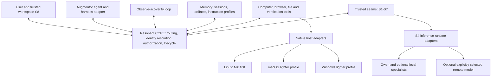

<!-- Copyright © 2026 Manolo Remiddi · SPDX-License-Identifier: LicenseRef-Augmentor-MIT-Resale-1.0 -->

# Computer use for Augmentor through Resonant CORE

Research date: 9 September 2026. Scope: public documentation, primary research, and a read-only inspection of the current working checkout. This is an architectural assessment, not an implementation or a live model benchmark. Existing uncommitted work was included in the inspection; this is not a release certification.

**The central finding:** useful computer use is a property of the complete system: model, observations, tools, execution environment, task state, recovery, and verification. Augmentor already implements a substantial part of the Linux execution foundation. The next research priority is to measure where that foundation limits task completion and where the selected model limits it.

**Revised scope following the user's clarification:** Resonant CORE is the architectural center; Augmentor, tools, and loops connect through its contracts. Local models, including Qwen3.8-27B, are first-class targets. Begin on this Linux machine and preserve a path to macOS and Windows through replaceable host adapters and knowledge profiles. Astra is a reference implementation to learn from and an optional comparison model, not a platform dependency.

**Additional user priority:** keep Augmentor's working context focused, with minimum irrelevant detail. Specialized workers may absorb tool-specific work and return bounded, evidence-backed results. Delegation and parallelism must be selected from actual model/tool capabilities, available resources, and task dependencies rather than enabled indiscriminately.

The controlling ResonantOS sources were fetched through authenticated GitHub access at commit `e804f16709891e42b67646c1c8387c1ae57185ec`: [CONCEPT](https://github.com/ManoloRemiddi/resonantos/blob/e804f16709891e42b67646c1c8387c1ae57185ec/CONCEPT.md), [R-12 integrated architecture](https://github.com/ManoloRemiddi/resonantos/blob/e804f16709891e42b67646c1c8387c1ae57185ec/research/R-12-architecture-paper.md), and [R-20 current decisions](https://github.com/ManoloRemiddi/resonantos/blob/e804f16709891e42b67646c1c8387c1ae57185ec/research/R-20-taxonomy-authority-rederivation.md). They supersede older seven-family, single-owner, and systemd-dependent assumptions. This document is downstream computer-use research, not a competing ResonantOS specification. The repository's phase remains unchanged; the proposals below are not frozen schemas or implemented services.

**Source-status correction, 9 September:** subsequent inspection found the active `design/core-interoperability-assessment` branch, verified locally and remotely at `eb1a4ab3fda6ed49c18ceafc760eabc646d3d5a7`. Phase 2 is already active there; main's phase marker is historical. Its [current instructions](https://github.com/ManoloRemiddi/resonantos/blob/eb1a4ab3fda6ed49c18ceafc760eabc646d3d5a7/AGENTS.md), [inference/context design](https://github.com/ManoloRemiddi/resonantos/blob/eb1a4ab3fda6ed49c18ceafc760eabc646d3d5a7/docs/phase-2-inference-policy-evaluation-design.md), and [standards/swarm assessment](https://github.com/ManoloRemiddi/resonantos/blob/eb1a4ab3fda6ed49c18ceafc760eabc646d3d5a7/docs/phase-2-standards-swarm-assessment.md) now govern implementation sequencing. They already define `InferenceCapabilities`, `ContextBudget`, explicit model/context binding, and orchestration placement. Match this report's proposals to those existing contracts rather than adding duplicate ones. Fixed resident model routes are the initial target; dynamic model swapping remains a later experiment. The current first CORE proof is text-only, and native experiments/product implementation remain subject to its review gates. Computer use is a proposed subsequent extension, not a replacement for the accepted first-proof obligations.

“Pi” here means the Pi agent toolkit, not Raspberry Pi hardware. The maintained Linux repository also owns the browser interface; the parent workspace README is older than the maintained repository's description.

## CORE-centered placement

Being central means CORE mediates universal routing, domain-aware identity resolution, authorization, and logical lifecycle. Computer-use reasoning and execution stay in replaceable components. The current architecture selects five families—agents, memory, tools, loops, apps—and separate trusted services. [R-20 placement decisions](https://github.com/ManoloRemiddi/resonantos/blob/e804f16709891e42b67646c1c8387c1ae57185ec/research/R-20-taxonomy-authority-rederivation.md).

| Computer-use responsibility | Placement consistent with ResonantOS | Boundary to preserve |
| --- | --- | --- |
| Conversation, planning, specialist delegation | Augmentor agent element; replaceable harness adapter | An agent is not the platform's root authority |
| Durable observe–act–verify workflow | Loop element using S5 admission and S6 task records | Loop policy does not move into CORE |
| Model registry, serving, local runtime adapters | S4 inference | Qwen/Astra/backend details do not enter CORE |
| Capture, accessibility, input, files, browser operations | Tool elements with native host adapters | Side effects remain scoped and cancelable |
| Platform/app know-how | Memory instruction profiles | Passive instructions cannot grant capabilities |
| Sessions, verified milestones, artifacts | Domain-scoped memory and S6 records | Restart does not depend on one agent process |
| External/irreversible action handling | S3 consequence intents | Preserve unknown outcomes and reconcile before retry |
| Principals, membership, domain policy | S1; CORE enforces authorization | Shared presence does not imply shared authority |
| Model/profile signatures and custody | S2 where required | Acting elements do not own the trust root |
| Action evidence and its projections | S7 trajectory/audit | Agent claims remain distinguishable from observations |
| User interface, trusted consent, emergency revoke | App surface and S8 trusted attention | Stop must remain available if the agent hangs |

The tool interfaces and existing executor code are reusable candidates. Their current direct Python/socket paths are not evidence of Resonant CORE integration. A future binding must carry domain identity, grants, deadlines, trace/intent references, and cancellation through the approved seams. Retain each harness's native conversation lifecycle; do not run a second agent loop for the same conversation. A Loop element can coordinate stages and durable progress around that lifecycle.

Large observations need a specific design: R-12 caps message envelopes at 1 MiB and recommends small inline payloads, with larger data using blob/stream references. Augmentor currently allows a 900,000-byte JPEG, which becomes roughly 1.2 MB in base64 before metadata. It cannot simply be embedded in that bus envelope. Use authorized, domain-scoped artifact references with bounded retention and use-time checks; CORE need not decode images or run OCR. The blob transport must preserve the authorized communication boundary rather than becoming an unrestricted side channel. [R-12 signal flow](https://github.com/ManoloRemiddi/resonantos/blob/e804f16709891e42b67646c1c8387c1ae57185ec/research/R-12-architecture-paper.md#7-registration-addressing-and-signal-flow).

## Portability requires three separate layers

**Common contracts** describe what can be requested and what the result means. **Host adapters** implement those contracts using native mechanisms. **Knowledge profiles** explain conventions and workflows. Swapping a prompt cannot replace a missing native adapter.

| Layer | Example | What changes on another platform |
| --- | --- | --- |
| Portable observation contract | Capture a permitted surface; return pixels, geometry, identity, time, and evidence provenance | Contract stays; capture implementation and guarantees change |
| Portable input contract | Click, scroll, drag, type text, press a key chord | Contract stays; input API, layout mapping, focus and permission rules change |
| Optional semantic contract | Locate a control, invoke its action, inspect a value | Native accessibility mapping and supported operations change |
| OS knowledge | Paths, packages, permissions, service conventions | MX/Linux versus macOS versus Windows profile |
| Desktop knowledge | Application switching, panels, window behavior | KDE versus Xfce versus GNOME, and host equivalents |
| Application knowledge | Export a document; inspect a save result | App/version/locale-specific profile |
| User preferences | Preferred app, folders, shortcuts, intervention policy | Principal/domain configuration |

Proposed common operations include `observe`, `find_target`, `click`, `scroll`, `drag`, `type_text`, `press_keys`, `wait_for`, and `verify`. These are vocabulary sketches, not new family protocols. A semantic target should carry its observation identity and be resolved again before use; coordinates must carry the frame/crop/scale transform. “Save document” belongs in an app workflow or app-specific tool, while “press these keys” is a lower-level input operation.

The host profile should declare versions, session type, available capture/input/semantic operations, scaling, Unicode support, and isolation limits. Unsupported operations must remain distinguishable from denied operations. An OS label alone is insufficient: MX with KDE/Wayland and MX with Xfce/X11 require different implementations. Likewise, an init-agnostic supervisor must support MX's choices even though this session currently uses systemd. [ResonantOS platform strategy](https://github.com/ManoloRemiddi/resonantos/blob/e804f16709891e42b67646c1c8387c1ae57185ec/CONCEPT.md#platform-strategy).

For Linux, reuse the portal/AT-SPI path and isolate KWin-specific identity handling. For macOS, investigate ScreenCaptureKit and AXUIElement-based accessibility through a native adapter. For Windows, investigate UI Automation patterns and native capture/input; SendInput is subject to integrity-level restrictions. The common contract cannot promise identical coverage or enforcement. [Apple capture](https://developer.apple.com/documentation/screencapturekit), [Apple accessibility](https://developer.apple.com/documentation/applicationservices/axuielement), [Windows control patterns](https://learn.microsoft.com/en-us/windows/win32/winauto/uiauto-controlpatternsoverview), [Windows input restrictions](https://learn.microsoft.com/en-us/windows/win32/api/winuser/nf-winuser-sendinput).

Load a small, versioned set of relevant profiles based on detected host and task. Profile instructions suggest methods; live observations establish current state, and grants establish authority. User-specific overrides and app versions must be explicit. Executable helpers remain tools even if packaged alongside a profile.

## Local models and compositional intelligence

Qwen3.8-27B's official card describes a native vision-language model with image/video understanding and configurable thinking. That supports testing it directly before adding another model. The installed quantization, vision components, serving engine, chat template, and tool parser still determine which capabilities reach Augmentor. A model-card capability is not a tested local endpoint. [Official Qwen3.8-27B card](https://huggingface.co/Qwen/Qwen3.8-27B).

Keep inference normalization in S4/adapters: image handling, tool-call syntax, cancellation, context limits, output validation, and backend-specific reasoning settings. Responses is an Astra integration requirement, not a universal ResonantOS wire protocol. Local models with different APIs should use the same computer-use contracts. Where native tool calling is inadequate, constrained structured output is an experiment; parse/validate it in the adapter and reject invalid output before execution.

The following are hypotheses to compare, not a requirement to run a model team on every action:

| Candidate | Division of work | Potential gain | Failure/cost to measure |
| --- | --- | --- | --- |
| Qwen alone | Main model plans, interprets screens, and verifies | Lowest integration and loading overhead | Fine-grained target errors or excessive reasoning |
| Qwen + semantic/OCR parser | Parser returns text, roles, boxes, and source image references | Less visual/context burden on planner | Missing controls, wrong labels, lost layout meaning |
| Qwen + GUI specialist | Main model chooses intent; specialist locates target in a crop | Better precision on difficult interfaces | Specialist latency and coordinate disagreement |
| Qwen + targeted verifier | Another model inspects ambiguous before/after results | May catch overlooked failures | Correlated errors and false confidence |
| Qwen + reusable procedures | Model chooses a tested, parameterized routine with pre/postconditions | Fewer model calls for familiar work | App/version drift; misuse outside routine preconditions |

OmniParser demonstrates converting screenshots into structured UI elements; it is a reference candidate for perception, not an executor or an authority source. Its repository directs users to component-specific model licenses, so package selection needs to consider the exact artifacts. [OmniParser repository](https://github.com/microsoft/OmniParser), [research paper](https://arxiv.org/abs/2408.00203).

UI-TARS supplies a GUI-specialized model family and grounding-oriented prompts. The released UI-TARS-1.5-7B is one concrete candidate to benchmark in a narrow target-location role. Its published historical scores do not predict improvement over Qwen3.8 on our tasks. [UI-TARS code and grounding guidance](https://github.com/bytedance/UI-TARS), [7B model card](https://huggingface.co/ByteDance-Seed/UI-TARS-1.5-7B).

A creative direction is to request **additional evidence before additional reasoning**: obtain a sharper crop, accessibility values, or the saved file; then reconsider the action. Another is a local observation cache that refreshes changed regions while keeping short-lived target references tied to a frame. Change detection is a scheduling hint, not proof that a control is unchanged. A third is to convert successful, user-authorized workflows into versioned procedures with applicability tests; do not memorize coordinate recordings as universal skills.

Use deterministic checks wherever possible: file contents, application values, window identity, target bounds, or an export's structure. A second model's agreement is useful evidence to evaluate, not a calibrated probability of safety. Perception specialists should return evidence without receiving desktop-input authority. Only one controller may mutate a given desktop session.

**Local resource evidence:** read-only inspection on 9 September found MX 25.2 KDE, Debian 13 base, Wayland, approximately 60 GiB RAM and an RTX 5090 reporting 32,607 MiB GPU memory. At that moment 31,935 MiB was used. This is a transient occupancy snapshot, not a benchmark or attribution to a particular process. It argues for measuring sequential/on-demand helpers, CPU parsing, and loading costs before assuming simultaneous model residency. No process was stopped or model loaded.

Plan memory for weights plus quantization metadata, vision components, context/cache, activations, and runtime overhead. Measure time to load, first observation, target resolution, completion, and resource contention. S4 serves models and reports resource needs; S5 admission governs budgets according to its finalized contract. The machine-scoped rescue model must remain separate from personal screen-analysis specialists and must not acquire their content authority. [R-12 model and recovery strategy](https://github.com/ManoloRemiddi/resonantos/blob/e804f16709891e42b67646c1c8387c1ae57185ec/research/R-12-architecture-paper.md#12-model-strategy).

## Context efficiency and capability-aware delegation

The target is **minimum sufficient context for a correct decision**, not the shortest possible prompt. Removing an authorization constraint, unresolved uncertainty, or a crucial visual detail would make a small context worse. Nominal model context length, runtime-configured capacity, and the context size that delivers acceptable accuracy and latency are different quantities. Local deployments should advertise and measure all three rather than assuming every local model has the same small limit.

ResonantOS already proposes bounded worker tasks, structured returns, delegation limits, and collective cancellation. R-20 relocates scheduling and task records to S5/S6 and supersedes R-14's older single-owner/core-service terminology. The following proposals refine those seams; they introduce neither a new family nor an autonomous router inside CORE. [R-14 coordination research](https://github.com/ManoloRemiddi/resonantos/blob/e804f16709891e42b67646c1c8387c1ae57185ec/research/R-14-multi-agent-collaboration.md), [R-20 corrections](https://github.com/ManoloRemiddi/resonantos/blob/e804f16709891e42b67646c1c8387c1ae57185ec/research/R-20-taxonomy-authority-rederivation.md).

### Separate four kinds of context

| Location | Keep there | Avoid automatically copying into Augmentor |
| --- | --- | --- |
| Augmentor's working context | User objective, constraints, brief plan, verified milestones, unresolved decisions, compact worker results | Every screenshot, click, log, full tool catalog, or specialist conversation |
| Worker working context | One bounded objective, necessary constraints, relevant profile/tool schemas, current evidence | Whole parent conversation, unrelated memory, other workers' transcripts |
| Domain task/evidence store | Detailed observations, artifacts, procedure state, tool outcomes, provenance and task lineage | Unfiltered store contents; retrieve relevant spans or artifacts on demand |
| Instruction store | Versioned OS/app/tool profiles selected for this task | All installed skills and all operating-system instructions |

Workers should be able to request a specific missing fact or bounded artifact range. Under-briefing them and repeatedly repairing their output can cost more than supplying a slightly larger initial brief. Context assembly belongs in the agent/harness/loop implementation, using authorized memory access; CORE enforces the access boundary.

A worker is a separate task/session, not necessarily separate model weights. A LibreOffice specialist and a file-verification specialist can sequentially use the same S4-served Qwen model with different profiles and scoped tools. A specialized model is optional where it improves measured performance. Active sessions still consume context/cache resources; unloading a session does not erase its durable task record.

Anthropic's context-engineering guidance describes focused subagents, selective retrieval, compaction, and external notes as ways to manage long tasks. This supports evaluating the pattern, but it does not establish benefits for our Qwen runtime. [Context-engineering guidance](https://www.anthropic.com/engineering/effective-context-engineering-for-ai-agents).

### Discover declarations, evidence, availability, and authority separately

Use a small catalog for discovery; load detailed schemas only for shortlisted workers/tools. A registry containing hundreds of capabilities should not cause hundreds of descriptions to enter every model request.

| Descriptor | Proposed information | Source/owner |
| --- | --- | --- |
| Model/runtime profile | Model and quantization revision, runtime/template, modalities, configured input/output limits, effective tested context range, tool/schema behavior | S4 declarations plus versioned evaluation evidence |
| Worker profile | Task classes, required tools/profiles, input and result schemas, typical task/context budget, cancellation behavior, delegation depth | Agent contract registration and evaluation record |
| Tool/host profile | Versioned operations, schemas, supported host features, side-effect/resource classes, required grants, freshness constraints | Tool registration and live host capability checks |
| Live availability | Health, model residency, load time estimate, resource pressure, free desktop lease, remaining task budget | S4/S5 and responsible adapters |
| Effective authority | Principal/domain, current grants, membership, intent requirements, expiry, resource scope | Existing CORE/S1/S3 mechanisms; never a model's self-description |

Separate **declared**, **measured**, and **currently available** capability. “Supports images” is a declaration. “Passed these target-location tasks under this configuration” is evidence. Neither grants permission to view a particular window. Evidence must retain task class, configuration, date, sample size, and failure cases; one generic intelligence score is insufficient. Model, template, tool, or platform changes may invalidate a previously tested combination.

MCP already defines tool discovery, input/output schemas, and change notifications; tool annotations are not automatically trustworthy. A2A Agent Cards describe peer capabilities and skills. Reuse this vocabulary at adapters, while keeping internal delegation on ResonantOS's bus-native agent contract. Neither protocol alone proves a model's skill or implements ResonantOS's domain authority. [MCP tools specification, inspected 2025-11-25 edition](https://modelcontextprotocol.io/specification/2025-11-25/server/tools), [A2A specification](https://a2a-protocol.org/latest/specification/).

### Delegate a result, with an explicit evidence contract

An illustrative worker brief should contain: `task_id`, parent task, domain/grant references, goal, definition of success, input artifact references, relevant constraints, permitted tool/resource scope, deadline, input/output and step budgets, cancellation reference, and return schema. Exact wire fields remain a design task.

The result should distinguish `completed`, `partial`, `blocked`, `failed`, `cancelled`, and `unknown`, and include a concise outcome, verification evidence, changed artifacts/state, unresolved issues, resource use, and a detailed trace reference. These are proposed task-result states, not replacements for the existing transport reply statuses. If the result exceeds its budget, return a bounded index plus references; never silently truncate uncertainty or side effects.

For example, a document worker might return: “PDF exported; destination X; file exists and opens with 4 pages; layout review pending; evidence Y.” Augmentor can continue without reading 20 UI steps. It can retrieve Y if pagination matters. The worker's claim still has its proper evidence origin; a typed result is not automatically verified truth.

Do not return hidden reasoning or full transcripts by default. Preserve task-relevant action evidence under domain retention policy. Summarization must retain provenance, uncertainty, and all task constraints; screen text must not become an instruction merely because a worker summarized it.

### Decide execution mode before spawning workers

First filter candidates for contract compatibility, current authorization, required host/tool support, context fit, and resource admission. Then choose among direct execution, a deterministic tool/procedure, one specialist, a sequential pipeline, or bounded parallel workers. The agent/loop chooses; S5 admits work; CORE enforces authority. Recheck changing capabilities near dispatch.

| Scenario | Preferred experiment | Why |
| --- | --- | --- |
| One simple known operation | Direct tool or tested procedure | Delegation adds overhead without isolating substantial work |
| Long tool-specific subtask with a compact result | One specialist, often sequential | Keeps detailed work out of the parent context |
| Independent document inspections | Bounded parallel read-only workers if resources permit | Work can proceed independently and returns can be compared |
| Several actions on one live desktop | One worker with the desktop lease | Parallel mutation would create focus/state conflicts |
| Tightly coupled reasoning requiring shared details | One agent or sequential stages | Repeated handoffs risk losing dependencies |
| Ambiguous visual target | One targeted perception worker | A bounded evidence request may resolve uncertainty cheaply |
| GPU full or model reload expensive | Sequential worker on resident model, or deterministic extraction | Logical isolation does not require concurrent inference |
| No eligible worker or missing information | Stay with parent, request narrow evidence, or report the limit | Do not route to an unqualified worker merely to fill a role |

The comparison is expected task quality and parent-context reduction against added inference, briefing, loading, communication, verification, and recovery costs. Until measurements exist, use conservative task-class rules rather than invented utility scores. A smaller parent context can still accompany greater total token use and longer completion time.

Bound fan-out, depth, retries, messages, time, and total inference across the entire task tree. Worker-to-worker group chat should not be the default: it risks reproducing the same noisy context in every participant. Exchange scoped results through task records. Prevent recursive delegation ping-pong and duplicate work; propagate parent cancellation. Use per-artifact revision checks for concurrent file edits, and exclusive leases for shared desktop mutation. Failed or timed-out side effects remain subject to S3/adapter reconciliation, even if another worker is available.

### Budget and evaluate the context boundary

For each model request, budget system instructions + selected schemas/profiles + task brief + retrieved evidence + active tool history + reserved generation space within the runtime's actual capacity. Include image-token accounting and runtime-specific reasoning/cache overhead. A reference is cheap only until its contents are fetched; retrieval must also be budgeted. Use runtime tokenization/counting where available, with measured margins otherwise.

Do not prescribe one occupancy percentage for every model. Establish a tested operating range per configuration. Before a worker exceeds it, persist a structured milestone and unfinished-operation record, then resume with selected evidence. Never discard an unresolved tool outcome or treat a resumed worker as permission to repeat it. Immutable/versioned artifact references prevent summaries from silently pointing at changed evidence.

Compare four modes on the same tasks: parent with selective retrieval only; sequential workers on the same model; workers using different specialized models; and bounded parallel workers. Measure peak parent and worker context, critical-constraint recall, evidence-retrieval accuracy, handoff omissions, task success, total tokens, latency, memory use, duplicate/unknown effects, and recovery. Delegation should earn adoption by preserving or improving correctness while meeting the user's context and resource goals—not merely by reducing visible transcript length.

## Computer-use authority needs more than domain labels

A screenshot of an entire monitor may contain another domain's window, notifications, credentials, or personal content. Adding `domain_id` to that image does not isolate the captured information. Test window-scoped capture, notifications/overlays, visible surfaces from other principals, and the limits of OS-session sharing. Where the required isolation is unavailable, restrict the supported scenario or use separate OS sessions/VMs. An agent's assertion that it ignored other content is insufficient.

For a proposed action, preserve domain/task/grant provenance, the observation reference, expected effect, and an optional S3 intent. The adapter must check current authority and target state near dispatch. CORE authorization does not prove the click landed or that saving succeeded; a tool's application claim retains its proper S7 evidence origin. Revocation must stop bounded in-flight work and release held input. Core/worker restart should invalidate old input authority and trigger reconciliation, not resume a mouse sequence from memory.

Keep ordinary task recovery—observe, inspect, adjust—in the contained agent/loop path. Machine recovery stays on the restricted watchdog path. Human review follows the principal/domain automation policy and consequence class, without asking for approval on every mouse movement. This follows ResonantOS's shrinking delegation, typed evidence, and Creative Latency decisions. [R-20 authority and consequence](https://github.com/ManoloRemiddi/resonantos/blob/e804f16709891e42b67646c1c8387c1ae57185ec/research/R-20-taxonomy-authority-rederivation.md), [Augmentatism](https://augmentatism.com/).

## What is actually known about Astra

The official model page lists image input, function calling, and computer use for `gpt-6-astra`. These capabilities make it a candidate for interpreting interfaces and choosing actions. They do not establish how much any particular tool or infrastructure component contributes to its performance. [Official model specification](https://developers.openai.com/api/docs/models/gpt-6-astra).

OpenAI's computer-use guide recommends **code execution for Astra**, with the structured `computer` tool as an alternative. Existing custom function or MCP interfaces can also be retained. The application supplies and controls the execution environment. Persistent execution state and API conversation state are separate responsibilities; continuing a conversation does not restore a desktop or browser session. [Official computer-use guide](https://developers.openai.com/api/docs/guides/tools-computer-use).

Astra's model guide documents asynchronous tools, mid-turn steering, and support for compaction and persisted reasoning. It explicitly requires Responses for tool calling. These are integration capabilities whose benefit depends on harness support; model selection alone does not wire them into Augmentor. [Official Astra guidance](https://developers.openai.com/api/docs/guides/latest-model).

The desktop product documentation describes a plugin, operating-system permissions, application access controls, and different foreground/background behavior across supported platforms. It prefers structured integrations when available. This establishes that the product experience includes infrastructure beyond the model, but does not reveal the complete internal implementation. [Computer Use product documentation](https://learn.chatgpt.com/docs/computer-use).

**Unknown:** the sources inspected do not disclose Astra's complete training recipe, training data mixture, internal desktop executor, or controlled experiments separating model gains from harness gains. We should not present an inferred architecture as OpenAI's private implementation, or promise equal performance from copying tools.

## What the model contributes, and what the system must supply

This decomposition is an engineering analysis, not a claim about hidden OpenAI components.

| Layer | Responsibility | Typical failure |
| --- | --- | --- |
| Model | Interpret intent and images, reason about state, select tools, recognize mistakes | Clicks a plausible but wrong control; stops before completion |
| Observation | Supply readable pixels, accessible controls, identity, geometry, and freshness | Correct reasoning from an unreadable or obsolete view |
| Tool interface | Describe available operations, arguments, errors, and return values precisely | Confuses screenshot coordinates with desktop coordinates |
| Executor | Perform the requested operation with bounded authority and cancellation | Wrong focus, partial typing, stuck modifier, duplicated input |
| Harness | Preserve conversation, pending operations, task progress, and interruptions | Loses a tool result, repeats uncertain work, forgets a requirement |
| Environment | Keep applications, authentication, files, display, and permissions available | Session expires, dialog interrupts, desktop changes |
| Verification | Check whether the requested outcome actually exists | Reports success because input was dispatched |

For illustration, if each of 30 necessary steps independently succeeds with probability 0.98, the whole sequence succeeds with probability about 0.545. Real steps are dependent and agents can recover, so this is not a measured success estimate. It explains why long tasks need short feedback loops and recovery even when individual clicks look impressive.

## Why programmable tools matter

Consider a request to update a document and export it. The model can inspect a UI, choose a sequence, and use code to handle predictable mechanics locally. Conditional logic can wait for a control, operate it, and report an observation without spending a model round trip on every intermediate step.

The advantage is greatest when the program can test meaningful conditions. A long list of blind coordinate clicks merely concentrates fragility. A bounded routine that checks the target, performs a small operation, and verifies the result can reduce overhead while retaining control.

For Augmentor, a candidate design is a contained execution tool whose scripts invoke scoped tool contracts through the CORE-mediated boundary. The desktop adapter would still enforce ownership, freshness, focus, and Stop. This is a proposal to evaluate, not an already available capability. A Python interpreter, JavaScript VM, or process timeout by itself is not sufficient isolation. Arbitrary generated code should not gain unrestricted access to the user's session bus, credentials, filesystem, or desktop input devices merely because it is called a tool. This is an optional execution strategy to compare with structured actions and tested procedures for local models.

Browser automation offers a concrete example: Playwright checks conditions such as visibility, stability, and whether an element receives events before clicking, and provides retrying assertions. Those mechanisms reduce timing ambiguity; their applicability to the existing Augmentor browser executor needs a separate integration assessment. [Playwright actionability](https://playwright.dev/docs/actionability).

## What Augmentor already has

The following findings come from the inspected local files, not from running the tests described in them.

| Existing foundation | Evidence | Implication |
| --- | --- | --- |
| Shared desktop broker and tool bindings | [Desktop tools](../packages/desktop/src/index.ts), [preview documentation](DESKTOP-CONTROL.md) | Extend the shared owner rather than creating one executor per harness |
| Consented capture/input on KDE Wayland | [Portal backend](../services/desktop/portal.py) | A working platform-specific starting point already exists |
| Compositor-owned active-window identity | [KWin integration](../services/desktop/kwin.py) | Stronger targeting evidence than window-title guesses |
| Single-use, 30-second observation tokens; geometry/focus checks | [Portal backend](../services/desktop/portal.py) | Preserve these protections while evaluating longer operations |
| Independent Stop, ownership, partial-outcome handling | [Preview documentation](DESKTOP-CONTROL.md) | Preserve cancellation through every future execution layer |
| AT-SPI observation | [Linux tools](../packages/pi-linux/src/index.ts) | A semantic observation channel exists alongside pixels |
| Harness-specific sessions and common surfaces | [Accepted architecture](COMPOSABLE-AUGMENTOR-PROPOSAL.md), [feature matrix](FEATURE-MATRIX.md) | Keep engine-specific state and capability negotiation explicit |

The current desktop action schema offers click, key chord, and 1–256 ASCII characters. It does not offer general scroll, drag, hover, double-click, Unicode typing, or semantic control activation. Its supported environment is deliberately narrow: one monitor, KDE Plasma Wayland, accessible keyboard focus, and an image-capable model.

Capture creates and tears down a GStreamer pipeline per observation, reduces large images to fit 1600×1200, and encodes JPEG at quality 80. These are **performance and perception hypotheses to measure**, not demonstrated bottlenecks. Small text could become harder to read; repeated pipeline setup could add latency.

The guided connection builder accepts `openai-completions` and sets `reasoning:false`. Its probe checks text and optionally image acceptance, not tool execution. This is a concrete incompatibility to resolve for Astra through that setup route. It does **not** establish that every Pi, DSH, or OpenCode provider route lacks Responses support. Audit each actual route before changing it. [Connection builder](../packages/runtime/src/setup.ts).

The documented VM/engine proofs verify such things as consent refusal, actual saved text, image transport, and cancellation. The engine fixture supplies predetermined coordinates. This is useful executor evidence but leaves live visual reasoning and autonomous recovery unmeasured. [Evidence description](DESKTOP-CONTROL.md).

## Linux challenges and candidate solutions

| Challenge | Why it matters | Candidate solution and tradeoff |
| --- | --- | --- |
| KDE versus other compositors | KWin identity checks are specific to KDE | Keep KDE as the first supported target; negotiate capture/input/identity capabilities for other backends rather than claiming generic Wayland support |
| Incomplete accessibility | Some controls expose little useful structure; existing typing requires accessible focus | Combine bounded AT-SPI observations with pixels; test missing-accessibility behavior explicitly before deciding whether to support a weaker input mode |
| Small text and scaling | Resizing can erase detail; crops introduce new coordinate spaces | Supply an overview plus requested crops, with explicit transforms and observation IDs; compare accuracy and image cost |
| Dynamic content inside the same window | Stable window identity does not imply stable button location | Re-observe at uncertain transitions; check control state or bounded visual conditions, not only window geometry |
| Modal dialogs and app switching | A legitimate task may need a new target | Design explicit window discovery and target acquisition, invalidating old observations; do not simply disable focus checks |
| Missing input operations | Menus, canvas apps, and long documents require more than typing/clicking | Evaluate scroll, drag, hover, and double-click separately with cancellation and outcome checks |
| Unicode and keyboard layouts | Text entry must work beyond ASCII and one layout | Compare semantic text entry, app APIs, and a carefully scoped paste path; document clipboard side effects and password exclusions |
| Human and agent share input | Concurrent actions can redirect a task | Use an explicit desktop lease and yield on human intervention; explore a separate graphical session/VM for unattended work |
| Latency and stale tokens | Slow reasoning can outlive the 30-second observation token | Record token age and refusal rates; reacquire observations or use fresh semantic resolution instead of globally extending validity |
| Network loss after action | A timeout may occur after the effect | Record dispatch and observations; reconcile real state before continuing; never infer that retrying is safe |
| Untrusted page/document instructions | Content being processed can try to redirect tools | Keep task authority separate from content, constrain tool access, and preserve provenance through summaries |
| Unclear completion | A screen can look correct while a file is unsaved | Define a task-specific postcondition and check the actual artifact or application state |

The XDG RemoteDesktop portal supplies consented session creation and input facilities and can be combined with ScreenCast/PipeWire. It also specifies `ConnectToEIS`. These are interfaces to investigate through capability checks; the specification does not prove support or equivalent behavior in every installed portal backend. [XDG RemoteDesktop specification](https://flatpak.github.io/xdg-desktop-portal/docs/doc-org.freedesktop.portal.RemoteDesktop.html).

AT-SPI exposes roles, names, states, component, action, and editable-text interfaces. That makes semantic control a plausible extension of Augmentor's current observation path, subject to what each application actually implements. [AT-SPI Accessible API](https://gnome.pages.gitlab.gnome.org/at-spi2-core/libatspi/class.Accessible.html).

A separate workspace in the same desktop should not be assumed to isolate keyboard focus or credentials. A VM provides a clearer test boundary but introduces application installation, data-transfer, login, and resource costs. The supported environment should be selected according to whether the goal is assistance on the user's current desktop or unattended work in an agent-owned environment.

## Proposed architecture to compare

This is a placement diagram, not a proposal to merge S1–S7 into one process. Services remain separately supervised. Authorized blob/stream handling and private supervisor/watchdog channels retain R-12's distinct boundaries. Observation/results return through the governed contracts; tools do not acquire an unmediated route to other elements.

Route by the task's required evidence and available capabilities. App APIs/file tools are candidates for exact bulk changes; browser semantics for web controls; accessibility for native controls; pixels for visually defined interfaces and checking appearance. Some tasks require the visible UI specifically, so a direct API is not always an acceptable substitute.

The current Linux and browser roles deliberately expose different tools. Cross-application workflows may justify an explicit delegation or handoff contract between those surfaces, but simply exposing all browser tools to Linux would change the accepted role architecture. Preserve model selection, user intent, session ownership, and action provenance in any proposal.

Parallel work can help independent reads, searches, or artifact processing. Mutations of one desktop should have one controller. Astra's asynchronous tool support is not a reason to let several operations race for keyboard focus.

Use S6 and domain memory for task state that records the objective, constraints, verified milestones, current targets, and pending/uncertain actions. Keep this distinct from long-term memory. Summaries can retain progress, but old coordinates and authorization inferred from page text must not become trusted durable state.

## Research experiments before implementation decisions

We need experiments that vary one layer at a time. Equal tools do not imply equal model quality, and changing model plus tools simultaneously would obscure the cause of improvement.

1. **Provider compatibility audit.** Start with the intended local Qwen deployment, including exact weights/quantization, vision path, tool parser, and context settings. Audit S4/harness seams for image tool outputs, cancellation, continuation, and errors. Audit Astra separately as an optional comparator. A future live probe should demonstrate a real tool-call/result/image cycle; a successful text response is insufficient. Remote account access remains to be checked.
2. **Baseline task suite.** Specify 12–20 representative Linux workflows with initial state and independently checkable outcomes: edit/save a Kate file, change a reversible setting, navigate a file dialog, manipulate a long document, and complete an export. Include a web-to-desktop workflow only with an explicit role handoff design.
3. **Perception experiment.** Hold model and actions constant; compare the current image pipeline with clearer full images, crops, and images plus accessibility. Measure wrong-target choices and unreadable controls as well as task success.
4. **Execution experiment.** Hold model and tasks constant; compare existing atomic tools with bounded programmable routines in an isolated prototype. Measure successful completion, recovery, model calls, and time. Preserve broker checks in both conditions.
5. **Model experiment.** Hold harness, tools, task state, and budgets constant; compare Astra with the user's intended alternative. This estimates the model contribution on our workload, without borrowing a vendor benchmark score.
6. **Failure experiment.** Introduce delayed dialogs, window moves, missing accessibility, user focus changes, interrupted typing, model timeout, and executor disconnection. Grade truthful recovery and absence of duplicated effects.
7. **Local composition experiment.** Compare Qwen alone, Qwen plus deterministic/semantic extraction, and Qwen plus an on-demand GUI specialist. Add a model verifier only after recording failures it could plausibly catch. Include model loading, peak RAM/VRAM, resource contention, and failure rate; measure both cold and warm runs.
8. **Portability and authority design review.** Walk the same task and observation/action contract through MX KDE/Wayland, an MX non-systemd profile, macOS, and Windows. Distinguish documentary API feasibility from actual host tests. Include domain-separated screenshot access, membership revocation, stale grants after CORE restart, blob-reference authorization, and S3 unknown/reconcile behavior. Future conformance fixtures should be shared across adapters while live platform evidence remains separate.
9. **Context/delegation experiment.** Compare selective retrieval without workers, sequential specialist sessions on the same model, heterogeneous specialists, and bounded parallelism. Hold tasks and resource limits constant; include parent/worker context size, total inference, omission of critical constraints, artifact retrieval, and end-to-end success. This is a primary acceptance dimension, not a later optimization.

Repeat conditions from reset environments; vary task order and record versions, prompts, tool schemas, screen geometry, model settings, and budgets. Separate browser-only, native-app, visual-layout, and cross-app results. Review failures before deciding on more tools or a different model.

Track: independently verified success rate; unsafe/wrong-target effects; human interventions; unknown outcomes and duplicates; median and tail completion time; model versus capture/executor latency; image/token use; and cost per successful task, including failed attempts. Do not report fixture passes as live-agent success.

OSWorld provides execution-based evaluation across real applications. OSWorld 2.0 is a relevant source of longer workflows, but code, task assets, and mocked websites must use matching releases. A small Augmentor-specific suite should precede a larger benchmark adaptation. [OSWorld project](https://os-world.github.io/), [OSWorld 2.0 repository](https://github.com/xlang-ai/OSWorld-V2).

The OSWorld-Human study found model planning/reflection dominated latency in its evaluated setup. That is evidence to instrument model time as well as input speed; it is not an Astra or Augmentor measurement. [OSWorld-Human research](https://arxiv.org/abs/2506.16042).

## Decision to carry forward

The strongest candidate is a **computer-use bundle connected through Resonant CORE**, assembled from Augmentor agents, tools, loops, domain memory/instruction profiles, and existing S1–S8 seams. Reuse Augmentor's broker and harness lifecycle as implementation candidates behind those contracts. Keep platform-specific APIs in native adapters and OS/desktop/app know-how in swappable profiles. No model or GUI library becomes a CORE dependency.

The starting requirements are now fixed: this MX Linux machine first; local models as a first-class operating mode, with Qwen3.8-27B a named candidate; focused working contexts with capability-aware delegation; optional local specialists; later macOS/Windows support with honest host capability profiles. Remaining research choices are the representative workflows, shared versus isolated execution environment, model/runtime configuration and resource budgets, and the evidence needed to admit autonomous procedures. “Universal” means portable contracts and replaceable components, with declared capability tiers; it does not mean every model or OS can perform every task equally well.

The research establishes a plausible engineering path. It does not establish performance parity with OpenAI's desktop product. That claim requires measured results on comparable tasks and conditions.

## Earlier recommended next milestone and dependencies (superseded)

**User decision, 2026-09-09:** the CORE-dependent implementation order below was
superseded. Build useful standalone Augmentor capabilities now, retain future
CORE integration seams, and neither wait for nor test the unfinished CORE.
The implemented first slice and its actual limitations are recorded in
[Bounded desktop specialist](DESKTOP-SPECIALIST.md). The material below retains
the earlier research recommendation as context; it is not a current development
gate or an instruction to work in the CORE repository.

This is a downstream integration recommendation for the existing ResonantOS queue, not a second execution queue or an authorization to start code. The active branch's independent review/adjudication and contract closure take precedence. Keep the full accepted first-release requirements, including shared-domain, recovery, SSH and takeover proof; the smaller milestones below are intermediate evidence only. [Active design checkpoint](https://github.com/ManoloRemiddi/resonantos/blob/eb1a4ab3fda6ed49c18ceafc760eabc646d3d5a7/AGENTS.md).

**Immediate design deliverable:** one complete coordinator→worker→tool→verified-result trace, mapped to the existing contracts, with the visual extension explicitly identified.

| Need from this research | Existing design to reuse | Remaining computer-use question |
| --- | --- | --- |
| Model and tool capability discovery | S4 `InferenceCapabilities`, FT schemas and host qualification | Which image/grounding capabilities pass on the exact local Qwen route? |
| Focused parent/worker context | S4 `ContextBudget`, FA context assembly, FM/D1 source bindings | What is the bounded brief/result contract, and which evidence is retrieved on demand? |
| Worker execution and resource limits | FA/FL with S5/S6 admission, lineage and cancellation | How does a specialist receive/release the desktop lease without competing with the parent? |
| Screenshot and result evidence | B bounded transport, FM artifact references, S7 provenance | How are images scoped, transformed, retained, and counted against model budgets? |
| Native input and uncertain effects | FT adapter, S3 where consequential, S8 Stop | How are focus changes, partial typing and worker loss reconciled? |

**First executable milestone, after the existing implementation gate:** use the CORE's text-only local workflow to compare a parent doing a bounded document task against a parent delegating it to one focused worker. Both may use the same resident Qwen route. Prove real context isolation, a bounded structured return, accessible evidence, current authority, actual token accounting, and cancellation. This can test the user's central context hypothesis without first expanding the action set or loading several models.

**First visual milestone:** adapt the existing KDE executor through the reviewed CORE contracts. Suggested benign workflow: in a dedicated test folder, ask Augmentor to create a short note in Kate, save it, and report the verified file contents. The specialist owns the UI sequence; Augmentor receives a concise outcome and evidence reference. The local model must choose actions from observations—fixed-coordinate fixtures are separate executor evidence. Use the existing click/key/ASCII scope initially, and explicitly decline unsupported requirements.

**Proposed acceptance measures for that visual experiment:** ten varied normal runs with initial target of at least nine correct saved files; zero wrong-target or duplicate effects in the test set; all observed Stop/focus-change/unknown-outcome cases handled as specified; no cloud inference; peak parent input context materially lower than the direct baseline without losing required constraints; full latency, total inference and memory accounting. These are suggested experiment targets to finalize in the canonical review, not achieved metrics or production guarantees. A small test set cannot establish a low real-world failure rate.

Then test targeted additions one at a time: semantic extraction, a GUI specialist, a reusable procedure, and bounded parallel reads. Promote only changes that improve measured outcomes under the available hardware budget. macOS/Windows native qualification follows the same portable contracts; UI competence and host-isolation guarantees remain separate evidence.

The next concrete artifact should therefore be a reviewed trace and test specification inside the existing CORE design process, followed by the text delegation proof and then the Kate visual proof. A general swarm framework, additional model downloads, or new platform-wide tool abstractions are not prerequisites for those milestones.
