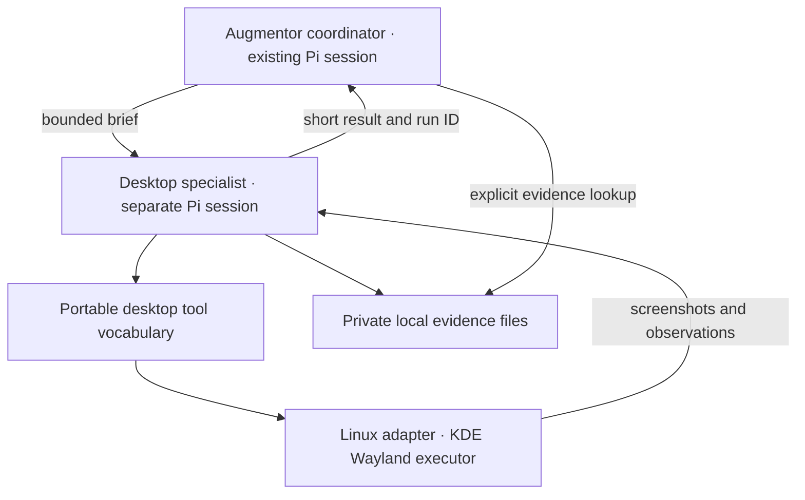

<!-- Copyright © 2026 Manolo Remiddi · SPDX-License-Identifier: LicenseRef-Augmentor-MIT-Resale-1.0 -->
# Bounded desktop specialist

Development implementation, 2026-09-09. This slice runs in Augmentor's Pi runtime
without Resonant CORE. It follows the user's decision to develop useful
standalone capabilities while CORE's design continues. No CORE code, service,
credential store or scheduler is required or modified.

## What runs now

The Linux coordinator has two new tools: `desktop_delegate` and
`desktop_evidence`. For a multi-step desktop task, it supplies a small brief with
`task`, `successCriteria` and `constraints`. The runtime creates an independent,
in-memory Pi SDK session with the **currently selected model**. Parent and worker
use that model sequentially; no second model is downloaded or loaded.

The worker can connect, capture, click/type/send keys, inspect accessibility,
stop, and finish. It cannot use shell/file tools, recall memory, load the parent's
skills or project instructions, recursively delegate, or choose another model.
The coordinator must include all relevant user constraints in the brief. This
explicit handoff can omit important facts; context isolation alone cannot fix a
bad brief. Essential missing information should produce a blocked result.

Only one specialist runs per Pi host, and only one delegation is accepted per
coordinator turn. The coordinator's existing direct desktop tools remain for
simple operations. Pi desktop tool execution is sequential; direct capture/input
is refused while a specialist runs. The native broker continues to enforce
ownership across chats and harnesses.

## Context and execution limits

| Bound | Default |
| --- | --- |
| Worker model requests | 24 |
| Worker tool attempts | 40 |
| Elapsed worker time, including consent/approvals | 180 seconds, plus bounded executor shutdown |
| Provider output request | At most 1,024 tokens, capped by the model's configured maximum |
| Input guard | Smaller of configured model context and 24,000 token budget, including output reserve |
| Images retained in each outgoing worker request | Two most recent |
| Metadata or accessibility observation | 8,192 UTF-8 bytes |
| Evidence per run | 16 MiB |
| Evidence store admission | Reserve space within 256 MiB; refuse new runs at capacity |
| Coordinator result text | Summary and verification, at most 600 characters each, plus bounded metadata |
| Evidence retrieval | At most five events and 10,000 event bytes per call |

The input guard conservatively counts serialized text bytes and reserves 4,096
tokens per retained image. It is **not an exact tokenizer or a verified image
token estimate for every provider**. It may stop early, and a provider may still
reject its context. Model capability data comes from the selected route's
configuration, not a successful visual capability probe. A text-only configured
model is refused before any worker request. There is no silent fallback.

Only old image payloads are replaced in outgoing requests. Tool call/result
pairs, observation metadata, constraints and errors remain. If that bounded
history no longer fits, the worker stops instead of silently dropping task
requirements. Automatic compaction and retries are disabled. The worker's
temporary in-memory session is disposed at completion; its images are not
inserted into the parent's session or display journal. This is context
separation, not a separate operating-system process or a security sandbox.

Limits are host-owned defaults in `packages/computer-use/src/contracts.ts`;
models cannot raise them. Future qualification should tune image reserves and
context budgets for each actual provider. Total token savings and task success
relative to direct execution have not yet been measured.

## Permissions, results and recovery

Read-only chats cannot delegate desktop tasks. Workspace-write chats still
require approval for **each input action** through Augmentor's existing dialog.
Full-access chats use their existing policy. Delegation itself grants no extra
authority. OS screen-sharing consent remains mandatory and can be requested
only once per worker run.

The worker inherits the parent chat's native desktop owner. Chat Stop aborts
worker inference, cancels pending interactions and closes the desktop connection.
The existing independent desktop Stop remains available. A denied/refused tool,
executor error, budget exhaustion or cancellation ends the worker. An intent
record is written before input is dispatched. Interrupted actions are never
resubmitted by this subsystem. A process crash leaves an `unknown` record;
restarting the runtime does not reopen or resume the worker.

`desktop_finish` must return `completed`, `blocked` or `unknown`, a short summary,
and the evidence the worker observed. The runtime additionally reports
`cancelled`, `budget_exceeded` or `failed` when appropriate. It requires a
screenshot after the last input before accepting a completed claim. For an
inspection-only task, at least one screenshot is required.

**A post-action screenshot is not proof that the requested effect succeeded.**
`verificationSource: worker_observation` identifies a model's interpretation,
not an independent verifier. File contents, successful saving or remote delivery
may need a separate check through the coordinator's appropriately authorized
tools. No claim of success is inferred from input dispatch or a worker's final
unstructured prose.

Evidence lives under `$AUGMENTOR_PI_STATE/desktop-runs/<run-id>/`, normally
`~/.local/state/augmentor-pi/desktop-runs/`. Directories are created private;
records and screenshot files use mode 0600. Records contain the brief, attempted
input, observation metadata and result. Screenshots may contain sensitive visible
desktop information. `desktop_evidence` accepts only a run ID belonging to the
current conversation and returns bounded metadata plus a local artifact
directory. It never automatically sends those images into the coordinator.
Ordinary authorized file access is not sandboxed by this tool's ownership check.

Evidence is retained until the user removes it; there is no automatic deletion.
Review and remove completed run directories when storage fills. Do not remove an
active run. This store is separate from ordinary chat deletion and support
exports. A local selected endpoint keeps this module's inference local; a remote
selected endpoint receives worker screenshots just as it receives other model
inputs. This module does not enforce network routing.

## Future Resonant integration boundary

`packages/computer-use` owns Augmentor's versioned brief/result, limits, evidence
records and common desktop tool vocabulary. Its contracts contain no Pi SDK
types. `packages/runtime/src/desktop-specialist.ts` owns the Pi SDK lifecycle,
tool registration and context handling. `packages/pi-linux/src/desktop-executor.ts`
binds the native executor and its Linux knowledge. Changing platforms should
replace the executor implementation and domain instructions; native permission,
focus, input and capture behavior still needs qualification on each platform.
macOS and Windows adapters are **not implemented**.

`augmentor-computer-use/1` is a private Augmentor component contract, **not a
claimed Resonant API**. Once CORE's actual contracts are ready, a reviewed
integration should put CORE at the authority boundary:

| Concern today | Future integration responsibility |
| --- | --- |
| Augmentor chat owner and permission callback | CORE-issued identity, scoped authority and cancellation; do not retain a competing authority source |
| Explicit selected Pi model and SDK worker session | Reviewed inference/agent-loop adapters and capability qualification |
| Host-local one-worker admission and bounded execution | CORE worker admission/lifecycle; replace local policy where CORE becomes authoritative |
| Native Linux control/observation adapter | Tool adapter that validates current CORE authority before effects |
| Local scoped evidence records | Reviewed artifact storage, access, retention and provenance contracts |
| Structured brief/result and outcome uncertainty | Translate to the final CORE task and recovery semantics |

Those are intended seams, not a guarantee of a drop-in connection or just a few
line changes. Existing local implementations can sit behind adapters where the
final contracts permit. CORE identity/custody, scheduling, shared domains and
distributed recovery are intentionally not reimplemented here. The current
native token expires after 30 seconds and remains authoritative for a desktop
target; CORE integration must preserve that protection.

## Use and validation

Build this checkout with `npm run build`, then run its Pi host using the existing
development configuration. No installed service was restarted or replaced by
this change. Existing already-loaded runtime processes must load the new build
before these tools are present.

In a Linux **Pi** conversation with the intended image-capable model selected,
open a harmless target application and give a bounded instruction such as:

> Use the desktop specialist to inspect the open Kate window and report the
> document title. Do not edit anything or open another application.

Choose OS sharing consent yourself. For a subsequent editing workflow, include
the exact text, target file and expected result, then independently inspect the
saved file. Unsupported non-ASCII text, multiple monitors or other desktops
remain outside the current executor's scope. Browser conversations, DSH and
OpenCode do not expose this new specialist; their existing tools are unchanged.

`tests/desktop-specialist.test.mjs` uses actual Pi 0.85.1 sessions and an HTTP SSE
model fixture with a simulated executor. It covers parent/worker context
isolation, image routing, selected-model preservation, scoped evidence,
pre-dispatch intent, permissions, unknown outcomes, post-action observation,
batched calls, no second delegation in a turn, budgets and cancellation. These
are contract/lifecycle checks, **not live GUI reasoning or CORE tests**.

The next empirical step is a small set of harmless real desktop tasks on the
selected local model. Record independently checked outcomes, coordinator and
worker input sizes, total inference, time and blockers. Do this before adding
more models or parallel workers. Stronger perception, deterministic routines,
exact token accounting and model capability qualification remain later work.

Validation on Node 24.19.0: `npm run build` passed and `npm test` passed all
73 tests, including 14 specialist tests and the host eligibility integration
check. No live desktop, local-model quality or CORE test was run for this slice.
