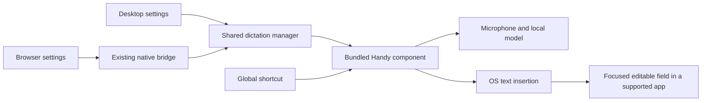

<!-- Copyright © 2026 Manolo Remiddi · SPDX-License-Identifier: LicenseRef-Augmentor-MIT-Resale-1.0 -->

# Handy integration plan for Augmentor Agent

Prepared on 2 October 2026. The owner approved implementation on 2 October 2026, including the overlay
customization below. Release qualification remains separate from implementation.

Current implementation qualification: source `81a2bba` passes all hosted native
component jobs (Linux x64, Mac ARM64, Windows x64), shared SDK/application checks,
Debian build and clean installation/update/rollback/removal, actual packaged
Chromium acceptance, and both macOS 14/26 signed development product jobs.
[Validation](https://github.com/ManoloRemiddi/augmentor-agent/actions/runs/37036303734)
and [Mac product qualification](https://github.com/ManoloRemiddi/augmentor-agent/actions/runs/37036303739)
record the exact completed runs. The owner's Linux installation is enabled and
ready, with Desktop/Mobile online and the standalone tray/startup retired.
Full Windows installer convergence with PR #20, Developer ID/notarization and
physical OS/microphone/compositor acceptance remain customer-release gates.

Implementation checkpoint: the maintained adaptation, shared settings/broker,
animated themed pill, capture arbitration and platform component build pipelines
now exist on `feat/handy-integration`. [The implementation guide](HANDY-INTEGRATION.md)
owns current behavior, exact pins, qualification evidence and remaining rollout
boundaries. Proposal language below is retained as the original acceptance plan.

Augmentor should include Handy as its system-wide dictation component. Users
install Augmentor once, configure dictation inside Augmentor, and dictate into
editable fields in Augmentor and other desktop applications. A bundled background
process preserves Handy's recording, recognition and text insertion functionality.
Augmentor owns setup, settings access, lifecycle and coordinated updates.

## Inspection and source baseline

The canonical origin is `ManoloRemiddi/augmentor-agent`. The local checkout is
on `main` at `f353c52` with substantial existing uncommitted work; refreshed
remote `main` is `d91c520`. The latter includes Codex and the Linux/macOS shared
feature requirement in [architecture](ARCHITECTURE.md). Implementation should
start on a branch from current canonical main, preserve the dirty checkout,
and reconcile its existing settings-layout work explicitly. This inspection
did not switch branches or merge changes.

The running executable is `/usr/bin/handy`, package version 0.9.5. Saved
preferences and process environment were inspected on KDE Wayland. Handy has
login autostart; a root-run `ydotoold` and a user-local `ydotool` wrapper provide
the selected text-insertion route. This is configuration/process evidence.
No new physical microphone/paste test was performed, and no transcript/recording
content or provider credentials were inspected or copied. Installed applications and
preferences remain unchanged.

The [latest published Handy release](https://github.com/cjpais/Handy/releases/tag/v0.9.7)
is 0.9.7, dated 18 September 2026, with Linux/macOS/Windows x64 and ARM64 assets.
Upstream main was inspected at `5ec58f696354fcf64ae831102e673779e0249717`.
Source inspection is not binary qualification. Compare candidate 0.9.7 against
installed 0.9.5 behavior, then pin source, lockfiles, native backends and artifacts.

## Defaults observed on the current machine

Use these as the requested product defaults, with platform adaptations for
shortcuts, permissions and insertion. Version portable preferences separately
from private paths, device IDs, credentials and history.

| Setting | Observed value | Proposed product treatment |
| --- | --- | --- |
| Dictation shortcut | Ctrl+Space | Same initial shortcut on all OSes; editable; report conflicts |
| Activation / cancel | Hold to record, release to finish / Escape | Preserve; do not silently replace hold with toggle |
| Model | Parakeet Unified EN 0.6B, Q8_0 GGUF | Candidate default after license and packaged-runtime verification |
| Accelerators | CPU for both recognition backends | Preserve CPU default and existing speech/GPU placement |
| Language / translation | Auto / translation off | Preserve; show that this model supports English only |
| Always-on microphone | Off | Capture only for explicit recordings |
| Audio devices | No explicit selection | Current OS defaults; user can choose devices |
| Audio feedback / mute other audio | Off / off | Preserve |
| Login / hidden startup | On / on | Product-owned startup after setup; one component |
| Tray / recording overlay | On / bottom, minimal | Owner override: no Handy tray; preserve bottom overlay geometry with Augmentor theme and animated orb |
| Paste | Clipboard plus Ctrl+V; ydotool on Linux | Cmd+V on macOS; supported insertion adapter per OS/compositor |
| Clipboard / paste delay | Leave transcript on clipboard / 60 ms | Preserve; explain behavior and expose adjustment |
| Automatic Enter / trailing space | Off / off | Insert editable text; never automatically send a chat message |
| AI post-processing | Off | Preserve; no implicit cloud request |
| Model unload / VAD | Five minutes / enabled | Preserve |
| History / recording retention | Five entries / preserve limit | Make retention visible with clear/delete controls |

Ctrl+Shift+Space is also configured for post-processing, which is disabled.
Avoid claiming that binding while the capability is unavailable. Local Debug
UI is off but log level is Debug; production diagnostics should exclude speech
content and credentials rather than copy that logging choice.

The cached selected weights occupy 731,357,568 bytes. Language Auto does not
make an English-only model multilingual. Offer separately audited multilingual
models through the same picker.

## Component architecture

Use a small maintained adaptation of Handy's desktop backend as a versioned
product component. Preserve its engine and OS integration code, add management
IPC and an embedding mode, and expose branded controls through the existing
PySide6 settings and browser native bridge.

One owned component per user and graphical session serves both agent windows
and the browser. It works without DSH, Pi or Codex and continues with chat
windows closed when background dictation is enabled. Distinguish closing a
window from full Quit. Full Quit stops the owned component; login startup follows
the saved enable preference. Disable cancels capture, invalidates pending paste,
releases shortcuts, unloads models and prevents automatic restart.

Keep Handy dictation and Resonant Voice conversation controls distinct. Handy
inserts text; Resonant Voice owns hands-free conversation, echo handling, agent
submission and spoken replies. The model picker controls Handy recognition only.
Replacing conversational ASR is a separate future change. Coordinate microphone
ownership: active conversational capture produces a clear busy state; hands-free
idle listening can pause/resume around explicit dictation. Prevent duplicate
capture/submission and define how dictation interacts with agent playback.
Preserve Qwen/Breeze placement, precision, concurrency and existing CPU ASR.

The [stock CLI](https://handy.computer/docs/cli) offers hidden startup, recording
toggle and cancel. Inspected [CLI source](https://github.com/cjpais/Handy/blob/5ec58f696354fcf64ae831102e673779e0249717/src-tauri/src/cli.rs)
also offers file transcription and model/device listing. These are insufficient
for complete live settings management and a push-to-talk key-release contract.
Existing [Tauri commands](https://github.com/cjpais/Handy/blob/5ec58f696354fcf64ae831102e673779e0249717/src-tauri/src/lib.rs)
are internal commands, not an existing external Augmentor API. Add the management
bridge explicitly; avoid editing Handy's JSON store while it runs or relying
on embedding a separate Tauri window into Qt.

Proposed protocol `augmentor-handy/1` covers status/capabilities, validated
settings, models/downloads/selection/removal, devices/permissions, recording
start/stop/cancel and state events. Use request IDs, settings revisions and
recording generations. Query unknown outcomes rather than retrying a toggle
or paste. Fence stale results after cancellation, disable, reconnect or shutdown.
Keep transport owner-restricted: Unix socket on Linux/macOS, user-ACL named pipe
on Windows. Browser settings use the existing trusted native bridge. Structured
status should not expose raw audio, transcripts or credentials to diagnostics.

## Settings and Handy identity

Add **System dictation — Handy** within Voice, with recognizable licensed Handy
artwork and **Powered by Handy** attribution. Preserve familiar General, Models
and Advanced groupings while fitting Augmentor themes and accessibility.

Expose Enable, shortcut capture/reset, activation mode, microphone, language,
translation, model picker/download progress, model size/languages/license,
indicator, clipboard behavior and retention. Show Disabled, Setup needed,
Downloading, Ready, Recording, Transcribing and Error separately. A saved Enable
preference is not proof of readiness. Provide a test field and guided external
app test. Mirror the dictation shortcut in Shortcuts using one authoritative value.

Dictation settings are global to this user's component; both agent windows and
browser display the same state. Existing appearance and Resonant Voice scope
remain intact. Audit artwork and branding terms separately from code licensing,
and identify the bundled adaptation accurately without implying endorsement.

## Approved overlay customization

Augmentor owns the tray controls; the bundled Handy component must never show
its own tray icon. This also requires correcting upstream hidden-startup behavior
on macOS so suppressing the tray does not force a second Dock icon or window.

Preserve the existing Handy bottom recording pill, its waveform in the center,
and the right-hand X cancel button. Replace only the left dot with Augmentor's
existing animated circular identity from Settings. Reuse the approved orb visual
rather than drawing a new logo. Keep waveform feedback tied to real microphone
levels and make X cancel recording/transcription without inserting text.

Skin and colour edits in Augmentor must apply live to the visible overlay and
persist for its next activation. Share a validated semantic palette (background,
foreground, accent, border, opacity and animation preference), and reuse the orb
shader/asset parameters. A setting change must not restart capture or steal focus.
The last explicit appearance edit from an Augmentor surface sets the one shared
dictation overlay theme; opening a differently themed window does not overwrite
it. On first setup inherit the primary appearance. Window preferences remain
independent. Test both light/dark skins, custom colours and animation disabled.

## Platform adapters and installers

| Platform | Work and qualification |
| --- | --- |
| Linux X11 | Pinned runtime and insertion dependencies; global press/release and clipboard paste |
| KDE Wayland | Reproduce current hold shortcut and paste; qualify overlay focus; manage helper/session permissions |
| GNOME Wayland | Test available shortcut/permission and insertion routes; expose limitations if key release is unavailable |
| Other Wayland compositors | Explicit supported shortcut/insertion adapters; Wayland is not one uniform backend |
| macOS | Signed nested helper/app, owned login startup, microphone/Accessibility onboarding, any backend-required Input Monitoring; stable permission identity through updates |
| Windows | Correct architecture, microphone setup, shortcuts/insertion, owned startup and required WebView2/native runtime provisioning |

Handy's [paste documentation](https://handy.computer/docs/paste-methods) describes
Linux typing tools, terminal methods and platform restrictions. Test normal apps
and terminals separately. Secure input and Windows elevated apps need honest
capability handling and a clipboard fallback; do not elevate the entire agent.

The owner's ydotool daemon has a broadly accessible socket. Reproduce the behavior
with access scoped to the intended active user/session, rather than copying its
permissions or wrapper paths. Keep any privileged input helper small and configure
required access through the normal installer permission flow. The app remains
unprivileged. Account for multi-user and multiple graphical-session machines.

Compositor commands that merely toggle recording do not reproduce hold/release;
that gap needs implementation or a visible capability limit. Ctrl+Space may
conflict with input methods or apps; detect registration conflicts where possible
and offer a guided change. Preserve the user's requested default when available.

Linux/macOS have the same product contract with separate OS adapters. Windows is
deferred in Augmentor's feature matrix: upstream Handy binaries alone do not
provide an Augmentor Windows package. Include native app, installer, lifecycle
and regression work in that milestone. Qualify architectures and minimum CPU/OS
requirements for each shipped artifact.

## Licensing and model distribution

The [Handy application](https://github.com/cjpais/Handy/blob/main/LICENSE) is MIT,
as are [transcribe.cpp](https://github.com/handy-computer/transcribe.cpp/blob/main/LICENSE),
[langid.cpp](https://github.com/handy-computer/langid.cpp/blob/main/LICENSE) and
[handy-keys](https://github.com/handy-computer/handy-keys/blob/main/LICENSE).
Preserve full copyright/license notices and disclaimers. Inventory the actual
Rust, JavaScript and native dependencies from pinned builds; these four licenses
do not constitute a complete application dependency audit.

The inspected [ydotool license](https://github.com/ReimuNotMoe/ydotool/blob/master/LICENSE)
is AGPLv3. If redistributed, qualify its exact version, component independence
and corresponding-source obligations. Do not relabel it under Augmentor's
resale-restricted license or import its code without a compatibility review.

The selected [GGUF conversion](https://huggingface.co/handy-computer/parakeet-unified-en-0.6b-gguf)
lists CC-BY-4.0 while the [original model](https://huggingface.co/nvidia/parakeet-unified-en-0.6b)
identifies the NVIDIA Open Model License. Resolve exact weight provenance and
terms before approving the default for redistribution. NVIDIA's
[license](https://www.nvidia.com/en-us/agreements/enterprise-software/nvidia-open-model-license/)
permits commercial use/distribution subject to conditions, including notices;
the conversion's conflicting metadata does not settle all obligations.

Bundle the runtime. Proposed default: download approved weights during Augmentor
first-run setup with size, license, progress, resumability and verification.
No separate Handy installation is needed. Dictation is not Ready until the
model and permissions are available. Fully offline first installation requires
a larger package containing approved weights; decide that variant before release.
Reuse verified caches through explicit ownership records. Never silently fall
back to another model, language or cloud service.

Persist settings, caches and optional history outside immutable releases in
per-user Augmentor storage. Pin download revisions/checksums, promote atomically
and preserve choices across upgrades. Include helper/model notices in installed
licenses, About and artifact inventories.

## Implementation milestones

1. **Component baseline.** Compare 0.9.5 and candidate 0.9.7, resolve default
   weight terms, audit dependencies/assets and produce reproducible pinned builds.
2. **Management and lifecycle.** Add embedding mode, private IPC, session
   ownership, status/events, settings and reliable cancellation. Prove isolation
   from independently installed Handy instances.
3. **Shared settings.** Build branded native controls and browser bridge,
   authoritative preferences, model/device/permission setup and shortcut editing.
   Add microphone coordination with Resonant Voice and live overlay theme/orb updates.
4. **Linux and macOS acceptance.** Reproduce the owner's KDE behavior in an
   isolated profile, qualify clean-user installs and Mac permissions/login,
   and close hold/release and paste gaps for supported desktops.
5. **Packaging and updates.** Extend artifact staging, compatibility manifests,
   lifecycle leases, notices, startup and uninstall. Prove coordinated idle
   activation, rollback and data preservation through interrupted upgrades.
6. **Windows distribution.** Complete missing Augmentor packaging/adapters and
   prove the same behavior; publish support only with clean-machine evidence.

Proposed owners are `services/dictation/` for management/platform adapters and
`apps/native/augmentor_linux/dictation_settings.py` for native controls. Integrate
capture coordination through `services/voice/` and existing audio controls;
extend existing browser settings/native bridge, `scripts/package-*`, installer/
uninstaller/startup tools, `services/lifecycle`, production staging and `release/`
manifests. These new paths/protocols are proposed, not existing interfaces.

Choose a component repository or pinned vendor source for the Handy adaptation
in milestone 1. Preserve upstream notices/history, keep patches small, document
upgrade ownership and ship reviewed artifacts into the canonical Augmentor repo.

## Acceptance and rollout

Real physical shortcut, microphone and insertion tests are required per supported
platform using packaged bytes. Verify Augmentor, browser, document editor and
terminal targets; non-US layouts; focus/overlay changes; permission denial or
revocation; device loss; repeated presses; Escape; and disable during recognition.
Insert exactly one result without Enter or an automatic chat request. If the
target becomes invalid, provide a visible clipboard fallback.

Prove interrupted/corrupt model-download recovery, switching/removal, bounded
history/deletion, offline recognition after setup, shared settings, closed-chat
operation, login startup and full Quit. Test Resonant Voice contention/playback,
helper crashes/reconnect without replay, user/session isolation, uninstall
ownership and interrupted-update rollback. Fixtures and physical acceptance
are separate evidence.

Detect existing standalone Handy and conflicting shortcut/autostart ownership.
Import only reviewed settings and verified models; do not copy credentials,
recordings or history by default. Make cutover reversible after the bundled
component passes tests, then disable redundant startup/shortcut ownership.
Do not automatically uninstall independently owned Handy. On the owner's machine,
stage an isolated candidate and follow [managed promotion](DESKTOP-DEPLOYMENTS.md)
only after acceptance and idle capture. A source commit is not an installed update.

When implemented, update architecture, feature matrix, settings, installation,
data/permissions, licensing and handoff with exact contract/deployment evidence.
Remaining release decisions are the default weight terms, offline package,
component source ownership, branding permissions and supported OS/compositor
matrix. Isolated protocol work can begin while these are resolved.

## Implementation checkpoint — 2 October 2026

The [implementation guide](HANDY-INTEGRATION.md) owns the resulting contracts
and exact evidence. Milestones 1–3 are implemented: pinned public Handy 0.9.7,
reviewed initial model terms, private embedding/lifecycle, shared branded
settings, microphone ownership, editable Ctrl+Space and the themed animated
Augmentor recording pill. Debian packaging/update integration is implemented;
the owner's actual Linux installation has been adopted with reversible removal
of the separate Handy startup/tray owner. Existing UI, voice dependencies, caches
and data are preserved.

Milestone 4 has actual Linux virtual-microphone recording/insertion/focus/cancel
proof and a real Mac component lifecycle pass. The Mac package now gives the
microphone helper a hidden bundle identity and qualifies the signed Desktop and
Browser components. Final hosted tests, physical permission/compositor tests and
clean-user acceptance remain explicit. Milestone 5 has clean-source Debian
packages and installed idle activation; all-platform lifecycle/update/rollback
acceptance still requires its recorded gates. Milestone 6 remains dependent on
convergence with the public Augmentor Windows application/installer work, beyond
building the native Handy component. No complete Windows installer is promised
from a standalone component compilation.

The final clean Debian candidate and all 617 shared native cases pass. macOS
14/26 development product qualification passes at `44b13ee`; the final
Accessibility setup and checkout/cache corrections require the hosted results
recorded in the implementation guide. Windows convergence depends specifically
on [the public Windows distribution PR #20](https://github.com/ManoloRemiddi/augmentor-agent/pull/20),
including actual component payload staging and WebView2/MSVC provisioning.

Final macOS 14/26 signed Desktop/Browser development product qualification now
passes at `0e7a19a`, including actual copied-helper proofs. Final Windows release
compilation succeeds; the notice-only follow-up supplies a missing original
clipboard dependency license and passes the complete target-filtered notice audit.
Final hosted Windows lifecycle and package results remain required.
