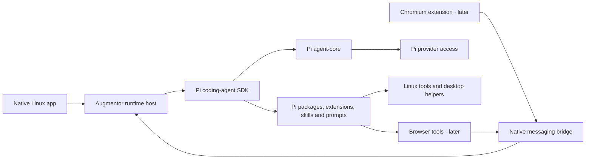

<!-- Copyright © 2026 Manolo Remiddi · SPDX-License-Identifier: LicenseRef-Augmentor-MIT-Resale-1.0 -->

# Historical architecture · Pi 0.1

**Historical record, superseded by [current architecture](ARCHITECTURE.md).** Do not use this page as current setup or component ownership guidance.

Implemented 2026-09-05 for Linux release 0.1.0. Browser components in the diagram remain deferred. See VERIFICATION.md for tested scope.

## Runtime ownership

Use a Node/TypeScript host around the public coding-agent SDK. Pi owns model execution, agent state, tool execution, session persistence and compaction. Augmentor owns client connections, application metadata, surface-specific identity and the OS/browser integrations. The host must run independently of the Qt window so that hiding the window does not cancel a turn and the future browser client can work without the native UI.

The SDK already uses agent-core. Import its public types or APIs where needed, but do not run a second agent loop alongside the coding-agent session. Use Pi's provider/resource machinery rather than rebuilding catalogs, credentials or package discovery. The integration is pinned and tested against 0.85.1.

The transport is a private Unix-domain socket between the host and local clients, with a versioned JSON contract. The browser native-messaging host can use the same socket later. This is an Augmentor application boundary, not a reimplementation of Pi's agent protocol. Reuse public Pi commands/events where their semantics fit. Pi's existing subprocess RPC mode is the fallback integration candidate if the SDK spike reveals an obstacle; record any resulting transport decision before porting the UI.

## Two repositories and package distribution

The Linux repo owns the headless runtime, client protocol and Linux Pi extension package. The browser repo owns the Chromium surface, native host and browser Pi extension package. Runtime startup must allow Linux and browser resources to be enabled independently. Each surface gets its own identity and default session working directory; sharing a host does not implicitly share a conversation or desktop permissions.

The Linux archive includes the independently launchable runtime and protocol fixtures; browser implementation must consume a recorded release. Develop against an explicit local package artifact or release, and record supported protocol versions in the browser repo. Avoid permanent sibling-path imports, runtime-source duplication or a third repository until there is a concrete need.

## Existing packages first

- Use the coding-agent SDK for session creation/resumption, supported tools, resource loading and compaction, with agent-core underneath.
- Use Pi's model/provider support for local and network models. Validate the exact selected provider/model before sending; detect SDK fallback and do not silently substitute another model.
- Package Augmentor tool registrations and prompt resources through Pi's extension/package mechanisms. Audit which existing ecosystem packages satisfy a need before adding custom integration. A DSH plugin is not automatically a Pi package.
- Keep PyQt6 for the existing native surface. Pi TUI and web UI components are optional for future surfaces; neither is a prerequisite for migrating the native app.

## Application contracts

The protocol needs handshake/version/capabilities, catalog and model selection, session create/list/open/rename, history, prompt submission, streaming, cancel, questions and approvals, prompt-library operations and health. The implemented v1 envelope and method contracts are documented in PROTOCOL.md and distributed with fixtures.

Requests require correlation IDs; streams require session/turn identity and a recovery strategy. Reattachment reconciles state/history without resending a prompt. Unknown outcomes remain unknown until verified. Stop must cancel active work and clear queued work when the user's intent is to stop the task; aborting one active turn alone may allow queued messages to continue in Pi.

Persist conversations through Pi's session manager. Keep Augmentor-only saved/bookmarked state and UI preferences in a small separate store. Do not pretend that DSH workspace IDs are Pi session IDs. Historical DSH conversations remain in DSH for the first release; any later importer requires explicit format mapping and provenance.

## State, tools and desktop integration

Use separate paths, `$XDG_CONFIG_HOME/augmentor-pi/` and `$XDG_STATE_HOME/augmentor-pi/` with standard XDG defaults. Pass the corresponding explicit Pi resource/session paths through supported APIs. Keep credentials in runtime-owned private storage; clients receive model metadata, never provider keys. Do not implicitly load unrelated global Pi extensions into the new application.

Port `linux_system_profile`, `linux_browser_open`, and `linux_desktop_observe` as Pi tools, retaining the existing Python desktop helpers and cancellation/size limits. Advertise only implemented capabilities. Browser opening reports dispatch separately from verified loading. General desktop input, portal capture and OS setting adapters remain later Linux work.

DSH's policy system does not transfer with its UI. Implement and test the required execution policy through supported Pi hooks/tool wrappers. Map pending questions and approvals to Qt, including denial, timeout, cancellation and disconnected-client behavior. Extension permission hooks are not a process sandbox. Capability grants belong to the intended surface/session; a browser connection does not automatically acquire Linux tools.

Before cutover, give the Pi app its own launcher, desktop ID and shortcut handling. Preserve the user's active DSH installation while developing. The initial target is the recorded MX/KDE Wayland machine; broader Linux support is a separate acceptance claim.

## Primary references

- [Pi SDK](https://github.com/earendil-works/pi/blob/main/packages/coding-agent/docs/sdk.md)
- [Pi agent-core](https://github.com/earendil-works/pi/blob/main/packages/agent/README.md)
- [Pi RPC, including extension UI and cancellation](https://github.com/earendil-works/pi/blob/main/packages/coding-agent/docs/rpc.md)
- [Pi packages](https://github.com/earendil-works/pi/blob/main/packages/coding-agent/docs/packages.md)

These references describe upstream capabilities. Augmentor contract, native UI and live desktop evidence is recorded separately in VERIFICATION.md.
