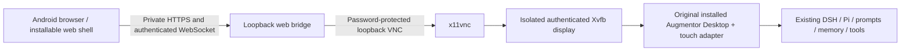

<!-- Copyright © 2026 Manolo Remiddi · SPDX-License-Identifier: LicenseRef-Augmentor-MIT-Resale-1.0 -->
# Original Desktop on mobile: revised implementation plan

Updated 2026-09-19 following the user's explicit direction: use the actual
Augmentor Desktop interface, retaining its graphics, controls and functionality,
and adapt it for finger-sized interaction. The earlier separate web-chat design
is superseded and its implementation has been removed.

## Architecture now implemented

The mobile browser is a thin remote-display client. It displays the real Qt
Desktop application running on the computer and forwards pointer and keyboard
input. It does not recreate the app's conversation or settings screens.

A named `mobile` Desktop instance shares the existing agent services, histories
and prompts. Its current chat, placement and appearance are independent from the
user's open main and secondary windows. This is actual Desktop application code,
not a screenshot mockup or a second mobile business-logic implementation.

On this machine the running Desktop is the installed Resonant Voice preview
0.2.8, while the maintained checkout declares 0.2.9. The launcher uses that same
installed 0.2.8 build and matching Python runtime. It does not change the installed
source, upgrade a live DSH integration or bypass its version check. Touch changes
are applied in memory from the maintained adapter. An explicit `--desktop-root`
selects another compatible build when needed.

## Research and tradeoffs

[noVNC](https://novnc.com/info.html) is an established browser VNC client with
Android/iOS browser support. Its [RFB API](https://github.com/novnc/noVNC/blob/master/docs/API.md)
provides the display, input and clipboard transport. Using it preserves the
Desktop renderer and avoids a bespoke pixel/input protocol.

[Xpra](https://github.com/Xpra-org/xpra-html5) is another viable application-
forwarding option. It was not installed or available as a package candidate in
the current host's configured apt sources. Xvfb was already available, and the
small x11vnc runtime could be extracted from official Debian packages without root.

Qt's bundled VNC platform plugin was inspected as an alternative. Its pinned
[6.8 server implementation](https://github.com/qt/qtbase/blob/6.8/src/plugins/platforms/vnc/qvnc.cpp)
binds all interfaces, so this implementation instead uses an explicitly loopback-
bound, authenticated server. Listener checks are part of validation, including
the VNC library's independent IPv6 listener.

Compared with a semantic web UI, remote rendering preserves feature identity and
reduces ongoing duplication. Its costs are bandwidth for animations, sensitivity
to network latency, less native web accessibility, and additional work for phone
keyboards, audio and files. These are measured acceptance gates, not reasons to
silently return to a different UI. There is no claim that remote display by itself
makes every phone integration complete.

[Capacitor](https://capacitorjs.com/docs) remains an optional later wrapper for
native Android/iOS permissions, audio and sharing. The native app would still
connect to this original Desktop surface. iOS packaging uses
[Xcode](https://capacitorjs.com/docs/ios); native iOS qualification needs a Mac.

## Touch changes in the original interface

The default Desktop layout remains unchanged. Opt-in touch mode:

- Moves the original toolbar to a separate row, preserving its original action
  order, icon artwork and handlers.
- Uses 44×44 minimum primary button targets with 8-pixel gaps.
- Gives existing message-action icons transparent 44×44 targets.
- Enlarges the original composer, model picker, voice and Send/Stop hit areas.
- Supports tapping the native title to rename it.
- Constrains native menus to the transmitted viewport and wraps original dialog
  content in scrolling containment. Existing close buttons are reused when possible.
- Resizes the native window at 1:1 scale rather than shrinking controls to fit.

The small transport footer supplies Keyboard, Show app, Copy and Disconnect.
Keyboard-only helper keys are visible when requested. Application functionality
remains in the native interface. The connection form is only a pairing gate.

## Security and lifetime

The isolated X display has an Xauthority cookie and no TCP X listener. It does not
capture or control the user's main desktop display. x11vnc has an ephemeral random
password, IPv4 loopback binding and an explicitly disabled IPv6 listener. The web
bridge binds loopback and only accepts configured Host/Origin pairs. A private
pairing key grants the owner remote Desktop control; session cookies are HttpOnly,
SameSite Strict and Secure on HTTPS, and expire after 12 hours. Restart revokes
sessions. Logout closes associated WebSocket connections. One viewer controls the
window at a time. Bounds protect request and stream buffering; heartbeats detect
dead connections. Pair attempts are rate-limited.

Phone access uses [Tailscale Serve](https://tailscale.com/docs/features/tailscale-serve),
not public Funnel. The user configured Serve on 19 September 2026. HTTPS pairing, encrypted
remote rendering, native interaction and cancellation have now passed on the host.
A separate-device/radio test remains required. The server allows the configured
private HTTPS origin alongside localhost.

Input is forwarded live and is never saved for replay. Reconnection attaches to
the same native window; the existing harness owns durable tasks. A reconnect must
not resend a prompt, approve a tool, or recreate a native action. Original Desktop
approval rules remain in effect. The supervisor owns only its own display/window/
VNC/bridge processes and cleans those up without stopping unrelated applications.

## What parity now means

| Function | Present in the remote surface | Remaining qualification |
| --- | --- | --- |
| Conversation rendering, model picker, Send/Stop | Original native code | Live remote interaction/reconnect and cellular latency |
| Settings, appearance/skins, history, prompt library, memory dialogs | Original native dialogs | Every dialog at phone/tablet sizes; no hidden actions |
| Branch/edit, prompts, queue/steer, approvals/questions | Original handlers and adapter behavior | End-to-end remote touch tests; modal/dialog edge cases |
| DSH/Pi and setup/recovery | Original harness adapters | Each supported harness separately; preserve version checks |
| Host browser and desktop tools | Existing host services | Verify correct target display/browser, especially across isolated UI and host executors |
| Copy | Native clipboard forwarded to browser transport | Mobile permission/gesture behavior and Unicode |
| Voice, hold/lock/hands-free | Original control is visible | **Phone audio forwarding is not implemented**; currently host audio devices apply |
| Attachments and download/export | Native host file dialogs | Phone upload/download bridge, bounded paths and explicit device distinction |
| Compact view/hide/pin | Original controls | Show app transport escape route; host workspace pin has limited meaning for a remote-only window |
| Accessibility | Qt controls retain semantics on host | Canvas does not expose native widgets to phone screen readers; needs a deliberate solution |

A visible control is not automatically a verified phone capability. In particular,
never describe phone microphone/speaker use as implemented while the native control
still uses host audio.

## Delivery order

1. **Original-UI engineering MVP (current work).** Actual installed Qt app in a
   private isolated display; touch targets; native menu/dialog containment;
   keyboard and clipboard transport; authenticated reconnect. Verify through real
   browser input, actual screenshots and native regression tests.
2. **Android and network acceptance.** Finish private HTTPS setup, install a pinned
   Android SDK/emulator, test Chrome/PWA install, touch, keyboard/IME, rotation,
   suspend/resume and Wi-Fi/cellular changes. Then test the user's Pixel. Gate:
   same native chat survives interruption; Stop works; no action replay; controls
   remain reachable without scaling below touch size.
3. **Complete touch audit.** Test all listed native dialogs and every approval,
   history, prompt, model, branch/edit, queue and memory workflow. Add reflow only
   where a native form cannot fit. Preserve original handlers and skins. Measure
   bandwidth/CPU with active effects and add an opt-in reduced-motion mode if needed.
4. **Phone hardware integrations.** Implement microphone streaming and audio
   playback through the existing voice service, interruption/echo/Bluetooth tests,
   clipboard permission handling, and file transfer. Do not use host microphone
   recording as a substitute for phone voice support.
5. **Installable Android product.** The internal WebView shell and user service
   are now implemented for qualification. Finish device pairing/revocation,
   update/rollback and migration tests, signed Android packaging if needed, tablet
   ergonomics, accessibility and external security review. Do not broaden access
   from single owner to multiple users without separate authorization boundaries.
6. **iPhone/iPad.** Reuse the remote surface and transport; add platform integration
   and signing. Test real WebKit, keyboard, touch, audio and lifecycle behavior on
   simulator and devices. Do not assume Android acceptance proves iOS behavior.

The computer must remain awake and online. Cloud model requests still go to the
configured provider; “runs on my computer” refers to the agent/runtime and tools,
not a promise that every configured model performs local inference.

## External prerequisites

Tailscale Serve is configured. After the administrator enabled KVM and user access,
the accelerated Android 16 emulator booted in about 20 seconds. Private HTTPS,
original Desktop rendering, Send/reply, touch keyboard editing, rotation and
background/resume now have live emulator evidence. See the
[validation record](MOBILE-REMOTE-VALIDATION.md) for exact scope and remaining gates.
The physical Pixel still needs its own authorized Tailscale connection and device
acceptance; the emulator uses the computer's tailnet connection.

[Run instructions](../apps/mobile/README.md) · [Validation](MOBILE-REMOTE-VALIDATION.md)
