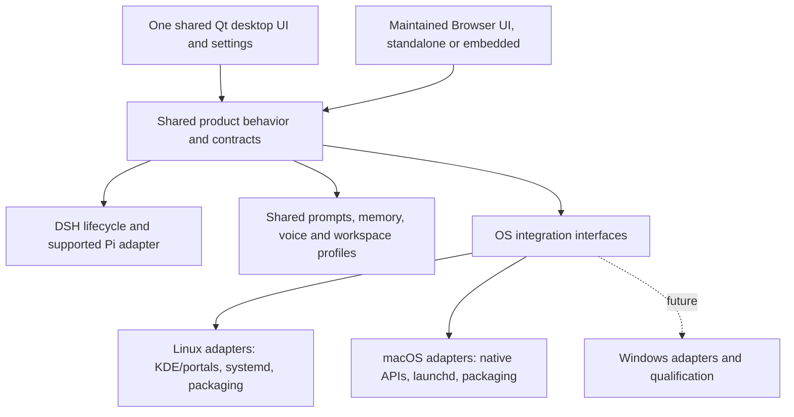

<!-- Copyright © 2026 Manolo Remiddi · SPDX-License-Identifier: LicenseRef-Augmentor-MIT-Resale-1.0 -->

# One Augmentor product across operating systems

## Decision — 26 September 2026

Augmentor is one product. Linux and macOS must implement the same applicable
features, using the same maintained desktop UI and product behavior. Each feature
change must be assessed in both directions: a Mac correction may belong in shared
code, and a Linux feature may require completing the Mac adapter. Missing work
in an adapter is a tracked parity gap, not permission to redefine the product.

The owner requested an architecture analysis after finding only one shortcut in
Mac Settings while Linux exposes two independent agent instances. This audit
records the implementation gaps and an incremental correction plan. It changes
engineering guidance and documentation, not the installed apps, shortcuts or UI.
The owner's approval remains necessary for additional visible redesigns.

Different binaries, package formats, key labels and OS permission dialogs are
expected. Different conversation, memory, instance or settings semantics need a
specific reason. DSH/Pi capabilities, native/Browser presentation, and operating
system support are separate dimensions; do not use one to explain away another.
Windows remains a later target, with its own adapters and qualification required.

## Evidence and scope

Inspected canonical `main` at `f353c52`, Mac changes through `15e4c0c` in PR #13
(application source `252215b`), and workspace embedding at `02af061` in PR #12.
Both PRs were open drafts during this audit. The installed Mac's relevant source
files were read and hashed; its application source is `252215b`, version 0.2.12.
The selected Linux artifact is 0.2.11 with recorded workspace-embedding overlays.
Selection is not proof that every existing Linux process has adopted that build.
No working process was restarted or user configuration changed for this audit.

The existing three `test_instances.py` checks passed on Linux and against the
installed Mac modules with isolated temporary state. They cover name validation,
separate IPC/state paths, model-selection inheritance without inheriting a chat,
and clone-once appearance settings. These are shared-controller/preferences
fixtures, not two live DSH conversations or physical shortcut acceptance.

## Findings

### 1. The missing Mac shortcut is an implementation gap

The same [`ShortcutSettings`](../apps/native/augmentor_linux/shortcut_settings.py)
class contains an OS branch that creates one row on Darwin and two elsewhere.
[`shortcuts.py`](../apps/native/augmentor_linux/shortcuts.py) explicitly rejects a
secondary instance on Mac. This is more than a hidden field:

- [`macos_shortcuts.py`](../apps/native/augmentor_linux/macos_shortcuts.py) persists
  one `sequence`, with one active registration per manager.
- [`macos_shortcut_service.py`](../apps/native/augmentor_linux/macos_shortcut_service.py)
  owns one manager and one activation target. Its requests have no instance ID.
- [`shortcut_activation.py`](../apps/native/augmentor_linux/shortcut_activation.py)
  hardcodes the main activation socket and starts the app without `--instance`.
- [`test_shortcut_settings.py`](../tests/test_shortcut_settings.py) explicitly
  expects Mac to show one row. It protects the divergence instead of testing the
  product's two-instance requirement.

The shared [`instances.py`](../apps/native/augmentor_linux/instances.py), controller,
preferences and native entrypoint already support named windows. Reuse them.
Exposing a second field alone would leave registration and activation incorrect.

### 2. Shared source exists, but platform choices leak into product behavior

Both packagers consume `apps/native`, `apps/browser`, `services`, `adapters` and
`config` from this repository. The native `augmentor_linux` directory name is
historical; Mac already runs those same Python modules. A directory rename would
not solve the missing capabilities and would risk import/launcher compatibility.

Good existing boundaries include `packages/platform`, `services/platform_support.py`,
the shared controller and harness adapters, and the desktop-control backend.
However, OS checks also decide settings rows, update reporting and setup paths.
Those product decisions should be driven by a common contract. OS checks belong
primarily in the implementation that registers a key, controls a window, starts
a service, grants capture permission or installs a package.

There is also a navigation inconsistency: `SettingsDialog` directly opens the
external `DshSetupDialog`, while the Mac branch's menu uses `Window.open_setup`
to select managed setup. The same user intent can reach different configuration
flows. Route both through one product action, retaining advanced external setup.

### 3. Installed releases have drifted independently

PR #12 contains the maintained embedded Browser and workspace profiles. PR #13
contains the Mac setup/authentication and resize corrections. The selected Linux
artifact includes embedding; the installed Mac has no `apps/browser/embed` or
`services/workspaces` files. Those absences are directly verified, not inferred
from a version label. The embedding installer also currently writes a systemd
service and reads Linux's selected-release registry; Mac hosting needs a service
adapter even after integrating the portable code.

Emergency overlays are traceable and useful for recovery, but cannot become
permanent platform release lines. Integrate reviewed changes onto a common
release source, then build and qualify both OS artifacts from that revision.
A higher product version alone does not prove it contains another installation's
features. Preserve source/artifact identities and matching DSH/plugin versions.
Do not solve drift by replacing a running Linux release with incompatible Mac
source or by merging unreviewed branches blindly.

### 4. Current tests do not enforce feature parity

The Debian workflow runs the full native suite. The Mac workflow runs
`test_macos*.py` plus selected payload/startup checks and real DSH setup proofs.
Useful shared suites such as `test_instances.py` and `test_window.py` are not
part of that Mac unit-test selection. Some common tests assume KDE; running the
entire suite on Mac without classifying those tests would not establish parity.

Define shared behavior tests separately from backend-specific tests. Run the
same shared contract suite on both OS runners, then exercise each real adapter.
Tests should expect two independent instances on each supported desktop target;
a missing backend must remain an explicit failing/open parity requirement.
Packaging or a successful chat fixture cannot substitute for this check.

### 5. The feature ledger mixes independent support dimensions

`FEATURE-MATRIX.md` mainly compares Linux and Browser behavior against DSH/Pi.
The platform release ledger contains dated snapshots, several already superseded
by later installed evidence. These are useful history but insufficient as the
current Linux-versus-Mac product contract. A current ledger must distinguish
implemented code, shipped artifact, runtime capability, permission/configuration,
and tested user behavior. Availability of a native helper is not permission to
use it, and permission is not proof of correct behavior.

## Subsystem audit

| Product responsibility | Existing shared owner | Platform-specific work / gap |
| --- | --- | --- |
| Chat, streaming, Stop, history, editing, queue | Native controller + DSH/Pi adapters; Browser uses the maintained bridge | Keep semantics shared; test the same flows on both OSs. This audit sent no model request. |
| Two independent instances | `instances.py`, controller state, preferences, voice profile ID | Mac shortcut registry, messages and launch target currently only support main. Highest-priority parity fix. |
| Menus, settings, appearance | Shared Qt window, panels, skins and design assets | Remove OS-driven feature subtraction; preserve approved layout. Consolidate the two DSH setup entrypoints. |
| Resize and window placement | Shared resize borders and saved placement | Mac fallback is in PR #13; Linux uses native compositor resizing. OS mechanics may differ while behavior remains the same. |
| Workspaces and window following | Shared UI policy with KWin and AppKit helpers | Verify each window and its halo stay together; physical Spaces behavior is separate acceptance from setting an AppKit flag. |
| DSH setup and browser authentication | Shared DSH integration/transport; Mac managed setup script | One setup state model and action routing, separate runtime installers. Fresh authenticated browser opening is shared logic, not intrinsically Mac-only. |
| Recovery and background ownership | `services/recovery` with saved endpoint/profile checks | systemd/launchd lifecycle adapters; preserve active work, profile, model and session on reconnect. No replay after uncertain send outcomes. |
| Prompts and automatic memory | Shared prompt/memory services and harness hooks | Platform paths, IPC and process supervision differ. No new summarizer or separate Mac memory system is warranted. |
| Speech | Shared native controls, transport and Resonant Voice package | Audio devices/permissions and engine availability need OS acceptance. Preserve current engine placement, voice/profile settings and independent Stop. |
| Desktop observation and control | Common tool contract and consent coordinator; KDE/portal and Mac native helpers | Actual desktop/session capabilities and permissions matter, not merely `platform == linux`. Keyboard/text support currently differs; scope and test it explicitly. |
| Browser and embedded dashboards | Same maintained Browser renderer; embedding transport and workspace profile boundary in PR #12 | Integrate portable embedding code; supply a Mac service owner and test workspace history/memory isolation. Keep the external browser executor ownership intact. |
| Home integration | Shared Home client/settings and separately deployed Home service | Endpoint configuration is a deployment issue; an OS should not acquire its own Home agent implementation. |
| Installation, upgrades and diagnostics | Product manifest/protocols, inventories, leases; different existing installers | Share lifecycle requirements and status vocabulary; retain OS package formats. Inspect all instances before upgrade and report selected/running artifacts distinctly. |

Shared source is architectural evidence, not a claim that all these features are
qualified on Mac today. Existing feature-specific guides retain their concrete
fixture, physical-device and installed acceptance limits.

## Required architecture

This is a logical ownership diagram, not a new agent core or a demand to replace
all Python and JavaScript with one language. DSH continues to own agent execution,
context and compaction. Browser and desktop are presentation surfaces; embedding
reuses Browser. A specialist's role/tools/memory scope belong to its trusted
workspace profile, not the OS. Two personal windows retain their independent
chats/settings without silently becoming two new memory identities.

Introduce interfaces incrementally around existing implementations:

| Interface | Shared contract | Adapter responsibility |
| --- | --- | --- |
| Instance activation | `activate(instance, intent)` where intent is explicit show/hide/toggle | Resolve that instance's endpoint and launch the selected executable with its ID; never toggle another instance or retry an uncertain delivery. |
| Shortcuts | Read/save bindings per instance, resolve conflicts, preserve failed saves | KDE registration or Mac native hotkey helper; platform-native display names/defaults. |
| Runtime owner | Inspect/start/recover the saved owned runtime | systemd or launchd, credentials environment, ownership/health checks. |
| Window integration | Resize, placement, pin/follow intent for each instance | Qt/native fallback, KWin/AppKit integration and OS-specific limitations. |
| Desktop permissions | Describe capability and permission state; connect/observe/act/stop | Portal or native capture/accessibility implementation. |
| Installation lifecycle | Quiesce eligible components, verify/stage/activate/rollback/resume | OS package operations, signatures, native-host registration and login ownership. |

Keep existing public module paths, protocols and saved data compatible while
extracting seams. Use a capability/result contract with a reason for unavailable
operations, but do not normalize unfinished ports by silently hiding features.
One source/version for a release still produces different OS binaries and hashes.

## Correction sequence and acceptance

1. **Close the two-instance shortcut gap as the first implementation slice.**
   Use one shared instance list in Settings. Carry the instance ID through Mac
   save/status requests, registrations and activation. Extend the current Mac
   shortcut owner to manage both bindings; reuse the current native helper.
   Migrate the existing single-binding file safely, preserving the owner's main
   shortcut. Do not invent a new second shortcut or overwrite a conflicting key.
   Secondary starts without inheriting the primary conversation; existing settings
   and chats remain intact. Old requests default to main only through an explicit
   compatibility rule. Treat both windows as product instances during maintenance.

2. **Make parity part of testing and review.** Run the same portable instance,
   settings, activation, history/recovery and UI contracts on Linux and Mac.
   Keep OS-specific helper tests in addition. For shortcuts, verify both saved
   bindings, conflict refusal with previous binding retained, targeted hide/show,
   cold launch, quit/reopen, login recovery, and unchanged other-window draft,
   conversation, appearance, voice profile and model. Real DSH fixtures and real
   OS registration/activation tests are required beyond the three unit checks.

3. **Unify setup, recovery and diagnostics around product actions.** Menu,
   Settings and first run must use the same intent. Keep owned-service start and
   authenticated browser opening shared, with platform installers underneath.
   Upgrade tests must include multiple idle/busy instances, launch races, rollback,
   service restoration, sleep/wake and preservation of unsent input. The recent
   Mac shortcut-relaunch incident belongs in that common lifecycle contract.

4. **Converge the release line.** Review/integrate the open feature branches into
   one compatible source revision, including specialist profiles and their speech
   dependency contract. Build both artifacts from that revision. Record feature
   evidence per platform and distinguish delayed deployment from missing source.
   Stage, qualify, then activate through each existing installer; a doc or commit
   is not an installed update. Do not restart active work merely to align versions.

5. **Apply the rule to each further feature.** Specify intended behavior once;
   implement common logic once; implement/test necessary OS adapters. Any temporary
   gap must have a concrete reason, scope and follow-up acceptance criterion. New
   platforms implement these contracts rather than receive copied product code.

This audit has not implemented the second Mac shortcut, merged the feature
branches, added the common CI suite or updated either installed application.
Those are the concrete follow-up changes; they must not be reported complete
because this architecture decision is now documented.
