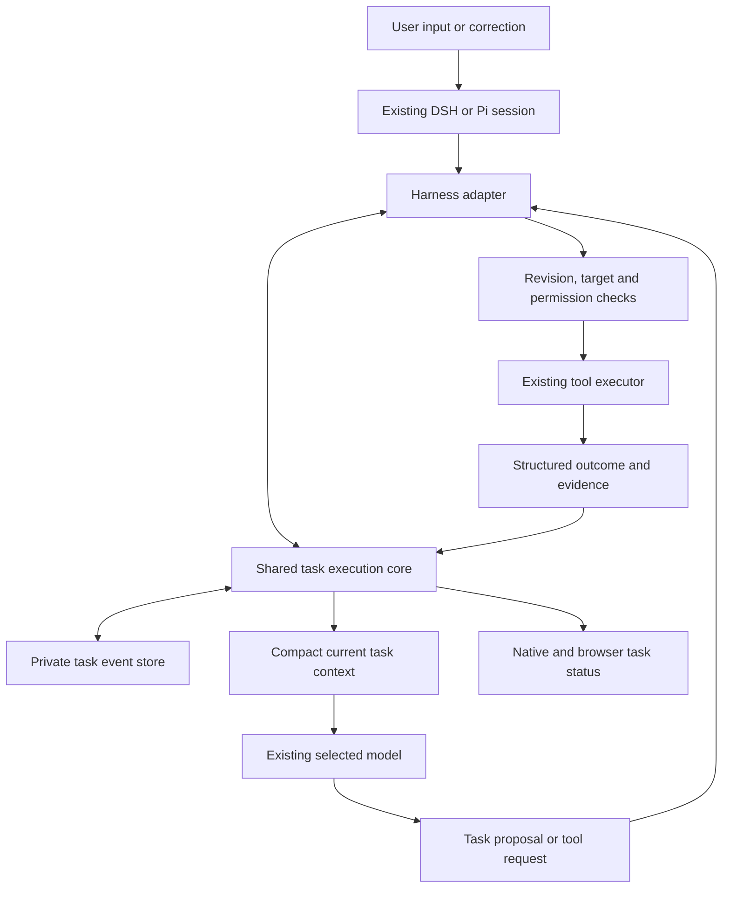

<!-- Copyright © 2026 Manolo Remiddi · SPDX-License-Identifier: LicenseRef-Augmentor-MIT-Resale-1.0 -->

# Reliable task execution: harness implementation plan

Status: proposed implementation, not implemented or deployed. Revised after challenge review, 20 September 2026.

Read [the design challenge review](TASK-EXECUTION-DESIGN-REVIEW.md) before implementation.
It changes the initial commitment: P0A tests factual tool receipts before P1 or
any new task-management subsystem. Later phases are conditional on measured need.
The review takes precedence over the original broad build sequence.
Source inspected: `f9d665c9b211d3b29167af5708f9fd1162d21e4e` on
`productization/shared-memory-and-desktop`. Recheck the ref and concurrent work
before implementation. This plan contains synthetic examples, not private transcripts.

## 1. Goal and intent

Make Augmentor better at completing varied user tasks with the **same selected
model** by improving the environment in which it interprets requests, selects
tools, observes results, handles corrections, and stops or resumes work.

The product must preserve both the desired result and the user's binding
constraints. It must distinguish execution from verified outcome, detect stale
targets and unproductive repetition, and represent unfinished work honestly.
When a dependency is genuinely beyond its capabilities, it must provide an
actionable handoff rather than fabricate progress or continue indefinitely.

Success means measurable improvement across different tasks, not successful
completion of one website workflow. No model replacement, fine-tuning, inference
configuration changes, GPU changes, or resumption of the earlier incident task
is included. Implementation must preserve existing permissions, Stop, history,
voice placement, and each harness's conversation ownership.

### User-facing outcomes

- Corrections affect the next eligible action, not just the next explanation.
- Actions use the intended account, document, app, browser tab, host, or path.
- Completed actions and uncertain outcomes are distinguishable.
- Waiting and blocked tasks explain the exact missing condition and retain work.
- The UI never equates an ended reply with verified task completion.
- Ordinary conversation and creative work remain lightweight and fluent.
- Cancellation ends execution and associated waits; no hidden background polling.

## 2. Design boundaries

1. **One execution owner.** DSH or Pi continues to own its existing agent loop.
   No second model controller, evaluator agent, or parallel conversational loop.
2. **Shared semantics, thin adapters.** Build one reusable TypeScript core for
   task state and execution rules. DSH/Pi translate their public lifecycle hooks.
   Tools and applications supply domain-specific observations and validators.
3. **Facts and judgments remain distinct.** The model proposes interpretations
   and plans. The core validates schemas, revisions, identity, evidence references,
   and supported postconditions. It cannot prove arbitrary natural-language truth.
4. **No approval ritual.** Do not require user confirmation of every task record
   or correction. Ask only when material ambiguity or existing permissions require it.
5. **No universal browser workflow.** The same lifecycle works for file tasks,
   analysis, code, documents, browser actions, and user-assisted workflows.
6. **Honest unsupported coverage.** Legacy/arbitrary tools remain available under
   existing policy where allowed, but cannot claim evidence or guarantees they lack.
7. **Minimal overhead.** Structured state is primarily internal. Extra model calls
   are not required for routine classification or every tool invocation.

## 3. Current integration points and gaps

| Existing component | Reuse | Required addition |
| --- | --- | --- |
| `adapters/dsh-desktop/browser-policy.mjs` | Tool guard and post-execute hooks | Target-specific evidence validity, structured outcomes, shared policy decisions |
| `adapters/dsh-steering/steering.mjs` | Identified correction delivery at safe boundaries | Task revision invalidation and reconciliation before later actions |
| `adapters/dsh-memory/automatic.mjs` | Session event capture and pre-step injection | Bounded task-first context composition without promoting memory to authority |
| `adapters/dsh-product` | Authenticated product endpoint and UI integration | Task-state snapshots/events and supported resume operations |
| `packages/runtime/src/host.ts` | Pi SDK ownership, tool hooks, event journal | Equivalent task events, explicit error classification, adapter parity |
| `apps/browser/extension/{actions,worktab,port}.mjs` | Actual browser execution | Explicit target contracts, session ownership, precise observation/action results |
| Native controller and DSH/Pi adapters | Queue, Stop, reconnect, rendering | Task status independent of streaming/generation state |
| Existing lifecycle and deployment services | Single release selection and rollback | Package new core/adapters and advertise protocol compatibility |

Current source guards largely track failure flags per agent; they do not establish
which resource an observation authorizes an action against. Source steering delivers
corrections but does not maintain an explicit task interpretation. The observed Pi
submit path can append a normal turn-end after recording a runtime error; this
must not be translated into successful task status. DSH behavior must be tested
independently rather than inferred from the Pi implementation.

## 4. Target architecture and ownership

Proposed source layout:

| Location | Responsibility |
| --- | --- |
| `packages/task-execution/src/contracts.ts` | Versioned task, evidence, operation and event schemas |
| `reducer.ts`, `policy.ts`, `progress.ts`, `context.ts` in that package | Pure state transitions, checks, progress/recovery decisions and bounded context |
| `store.ts` in that package | Single-writer journal, snapshots, restart recovery and schema checks |
| `adapters/dsh-task-execution/index.mjs` | DSH lifecycle mapping; compiled shared core imports |
| `packages/runtime/src/task-execution.ts` | Pi lifecycle mapping using supported SDK extensions |
| Existing tool packages/executors | Resource identity, observation extraction, effect and postcondition validators |
| Existing protocol/product endpoints | Versioned task snapshot/event transport to surfaces |
| `tests/task-execution*.test.mjs` | Core and adapter contract tests |
| `tests/fixtures/task-execution/` and `scripts/task-execution-eval.mjs` | Synthetic cross-task scenarios and reproducible evaluation runner |

Do not put business logic in the UI, duplicate the reducer in Python, or create
a new long-running service for this feature. The backend owning a session owns
its task store and publishes read-only projections to all connected surfaces.

## 5. Contracts

### Task record: `augmentor-task/1`

Required fields: `taskId`, namespaced `sessionKey`, `schemaVersion`, `revision`,
`kind`, `status`, `objective`, `sourceMessageIds`, `constraints`, `criteria`,
`targets`, `dependencies`, `pendingActions`, `latestEvidenceIds`, and timestamps.

- `kind`: conversation, artifact, external-action, or mixed. The model proposes
  it within the existing turn. Plain conversation need not create a durable task.
- Constraints carry their source message, authority, and whether they are exact
  machine-checkable requirements or semantic interpretations. External content
  and memory cannot introduce new user authority.
- Criteria specify `verificationMode`: deterministic, evidence-reviewed, or
  user-confirmed. They cannot silently switch to a weaker mode to permit closure.
- Dependencies distinguish user input, authentication, external operation, and
  capability gaps. Each has a status, actionable explanation, and optional resume trigger.
- Preserve identifiers as source values with provenance. Canonicalize only through
  a documented domain rule; never fuzzy-match a consequential destination silently.
- Revision changes use compare-and-swap. Evidence and calls reference the revision
  under which they were produced; stale updates cannot erase newer corrections.

Model-facing operations, implemented as internal tools through both adapters:
`task_update` proposes a record/patch, `task_wait` records a dependency, and
`task_finish` submits outcome plus evidence references. Host-assigned IDs,
permissions, source identities and verification results cannot be supplied as
trusted facts by the model. Validate and return precise correction feedback.
Do not require these operations for every conversational response.

### Observation and target contracts

An `EvidenceRecord` contains a host-issued ID, task/revision, originating call,
resource identity, observation time, resource version when available, observed
properties, applicability scope, and uncertainty. Use private references to
screenshots/large content rather than copying them into every state update.

A `TargetRef` identifies the adapter and stable resource: e.g. browser instance,
session, window/tab and document revision; filesystem root/path plus observed
identity/version; application and document ID. Identity is domain-specific.

An action referencing evidence must pass target/revision checks immediately before
execution. Executors recheck relevant state as close to mutation as possible;
where atomic checks are unavailable, report the remaining race instead of claiming
a guarantee. Navigation, document replacement, account changes, and corrections
can invalidate evidence. Elapsed time alone does not establish validity.

Fresh evidence is necessary where a next action depends on observed state. It is
not mandatory to inspect a nonexistent destination before intentionally creating
a file, or to capture a screenshot before every independent read.

### Operation/result envelope: `augmentor-operation/1`

Request metadata: task/session/turn, expected revision, `operationId`, target,
evidence references, adapter capability version, and effect classification.
The adapter attaches trusted metadata; tool authors declare effects rather than
relying on the model to classify a mutation as a read.

Result fields: execution status, observed target, evidence IDs, verified effects,
unverified conditions, structured error category, and retry semantics.

Distinguish `not-executed`, `succeeded`, `failed`, and `unknown` execution outcomes.
Separately track criterion outcomes: satisfied, unsatisfied, or unverified. An
accepted request and a successful process exit do not imply task completion.

Errors include target-stale, target-mismatch, capability-unavailable,
authentication-required, permission-denied, transient-read-failure,
validation-failed, and outcome-unknown. Adapters map concrete errors; an unrecognized
error stays unknown rather than being reinterpreted optimistically.

Operation IDs deduplicate journal delivery, not arbitrary external writes. Retry
a write only if the executor offers real idempotency or observation proves the
effect did not occur. Shell commands retain unknown semantics unless handled by
a known validator; do not invent a generic success verifier for arbitrary shell.

## 6. Lifecycle and correction handling

Task statuses: `working`, `awaiting-user`, `awaiting-external`, `blocked`,
`interrupted`, `complete`, and `cancelled`. Generation status remains separate.

| Event | Required handling |
| --- | --- |
| Model response ends | Preserve pending task state; never automatically mark complete |
| Runtime failure | Record failed operation/error and interrupted or blocked task as appropriate |
| Valid `task_finish` | Close only after criterion policy accepts evidence; expose verification level |
| User Stop | Cancel eligible execution and task-owned waits; mark interrupted; do not wake automatically |
| User abandons task | Mark cancelled, remove waits, preserve history |
| Waiting dependency becomes satisfied | Re-observe prerequisite, check revision/ownership, admit at most one resume per dependency revision; preserve unknown external outcomes |
| Transport reconnect or process restart | Recover state; never replay a possibly executed action |

Correction handling at a safe execution boundary:

1. Retain the original user message and stable delivery ID. Queued follow-ups are
   not automatically corrections; honor existing Steer semantics.
2. When steering is delivered, increment the input epoch. Reject subsequently
   dispatched mutations carrying the old epoch. Do not kill an in-flight mutation
   merely to improve responsiveness; collect or classify its outcome first.
3. Inject a short reconciliation request into the existing model step: identify
   changed constraints, affected targets, pending work and next action. Read-only
   inspection may continue while resolving ambiguity.
4. Validate its task patch and source references, record the new revision, and
   invalidate affected target evidence. When scope is uncertain, require fresh
   targeting rather than silently keeping the previous binding.
5. Resume eligible actions. If the same contradiction recurs, apply bounded
   recovery and accurately report the unresolved condition.

The harness enforces epochs and evidence validity, but semantic interpretation
remains fallible. Evaluation must explicitly test missed and misclassified
corrections. A plan update is not proof that the next action obeys it.

## 7. Progress, recovery and waiting

Count progress as a newly satisfied criterion, resolved dependency, relevant new
observation, or verified effect. Do not count narrative length, token usage,
task-list rewriting, or tool-call volume as progress.

Fingerprint operations using normalized arguments, resource/revision, outcome
category and relevant state. Redact sensitive fields. A repeated unchanged read
is not automatically a failure: it may be a bounded wait for an identified event.

Initial configurable defaults for evaluation: two equivalent no-progress cycles
produce one targeted recovery instruction; allow at most two recovery rounds for
the same unresolved condition. After that, stop automatic continuation and expose
the blocker. Tune against false positives before promotion. A changed premise or
user correction can justify a new attempt; superficial argument variation cannot.

Recovery instruction includes the unmet criterion, attempted operations and
observed limitation. The model selects a supported new action, requests genuinely
missing information, or records a blocker. No arbitrary quota of alternatives and
no forced mutations to prove persistence.

`task_wait` records the trigger, expiry, ownership, and resume condition. Prefer
user reply or actual executor events. Poll only when justified, with an explicit
interval, deadline and cancellation path; persist registration identity to prevent
duplicate resumes. No automatic recurring monitor is created just because a task
is blocked. Expired waits leave a clear state, not an endless scheduler loop.

## 8. Context composition and model interaction

Compose relevant context in this order: binding user instructions and latest
correction, compact current task state, available capability changes, recent
relevant evidence, then retrieved project/relationship context.

Keep original user messages intact. Derived summaries are labeled interpretations,
not replacements for user authority. Tool/web/document content remains evidence
and must not become instructions through the task record.

Start with a proposed 2,000-token budget for the derived task/evidence summary,
separate from original user input and necessary tool results. Measure with the
actual tokenizer where available; otherwise label estimates. Include references
and expand on demand rather than repeatedly injecting the entire task history.
Do not truncate exact identifiers or the latest correction to satisfy this budget.

The P0A receipt experiment introduces no extra model requests by design. Later
model-facing task updates can add inference steps even inside the existing tool
loop; count that overhead explicitly and adopt them only if measured gains justify
it. No separate planning or evaluator model is introduced. A targeted recovery
round uses the same model/session and is budgeted. Task memory is not relationship memory: after completion, export only
an appropriate summary through the existing memory policy, not every execution event.

## 9. Persistence, concurrency and compatibility

Use a private versioned JSONL task journal plus atomically replaced snapshots under
each harness's existing state root. Reuse storage utilities where applicable.
One owning backend process writes a session; acquire an exclusive store lease,
reject a second owner, and serialize task transitions within that process.

Each event has a monotonic sequence, unique ID, task revision and source event ID.
Journal replay is deterministic and duplicate source delivery is harmless. Record
mutation intent durably before dispatch. On restart, intent without a confirmed
result becomes unknown and requires observation; never dispatch it from replay.

Recover only incomplete trailing writes automatically; report corruption of
committed events. Snapshot/checkpoint creation and compaction must preserve
operation outcomes and evidence provenance. Forks use only state/evidence at the
selected historical boundary and never inherit live waits or execution ownership.

Task projections contain no tokens/passwords or unnecessary raw page bodies.
Keep evidence retention aligned with existing local-history/export/deletion policy;
document new data and include task files in appropriate user deletion/export paths.
Private live traces remain local; repository fixtures use synthetic data.

Advertise `taskExecution: {version: 1, mode, coverage}` through existing product
and Pi capability channels. New UI tolerates older backends; older UI ignores
additive events. Missing UI support must not produce a false completion label.
No migration of old conversations into invented verified task state; initialize
on the next actual task interaction. Newer journal schemas must be rejected by
older writers without destroying data.

## 10. UI and user experience

Use one compact status line/card on native and browser surfaces with the actual
task state, unresolved dependency when relevant, and appropriate Resume/Stop
controls. Keep normal conversation free of task bureaucracy.

Replace completion indicators derived solely from turn-end with neutral
“Response finished” or evidence-backed task status. Do not hide model responses;
if text contradicts verified state, display the authoritative task status and
request bounded reconciliation through the existing session when appropriate.
Arbitrary hallucinations in prose cannot all be caught deterministically.

User-visible waits explain what the user must do and how continuation happens.
Do not promise automatic resumption unless a supported trigger is registered.
Preserve native voice, queue, reconnect, draft, history and mobile rendering behavior.

## 11. Implementation sequence and delivery gates

All phases below are pending. Each is a reviewable change set with owning docs,
tests, evidence, and explicit source-versus-installed status.

| Phase | Work and artifacts | Depends on | Exit gate |
| --- | --- | --- | --- |
| P0: baseline and hook proof | Inventory actual loaded versions and public hooks; synthetic eval runner; capture baseline with unchanged model/settings | None | Verify pre/post-tool ordering, steering boundary, context injection, task-event delivery and persistence APIs on locked DSH/Pi; record unsupported hooks explicitly |
| P0A: factual tool receipts | Small shared result renderer using existing events; browser plus file/artifact coverage; matched fixed-model A/B trials | P0 | Factually correct receipts, useful behavioral improvement and acceptable overhead; otherwise revise the hypothesis before expanding |
| P1: contracts and core | Shared schemas, reducer, store, task proposals, capability negotiation | P0A plus demonstrated need for durable task state | Deterministic replay, duplicate delivery, revision conflicts, corruption, crash/unknown-write, fork and ownership tests pass |
| P2: DSH vertical slice | DSH adapter, authenticated task state, synthetic filesystem/document executors; basic native status | P1 | Real selected-model task completes with verified result; correction, blocker and restart cases behave correctly end-to-end |
| P3: target/evidence adapters | Browser/desktop and supported file operations return normalized results; target-scoped guards and exact identifiers | P2 | Two sessions and similar resources cannot silently cross targets; stale evidence and unknown writes handled; coverage advertised |
| P4: corrections and recovery | Steering epoch integration, reconciliation, progress detection, bounded waits, resume deduplication | P2/P3 | Corrections affect next eligible action; no repeated writes or unbounded retries; Stop cancels waits |
| P5: context and full UX | Task-first context budget, native/browser status parity, completion semantics, mobile and voice regressions | P4 | Useful context remains available; no false Done indicators; normal chat remains lightweight |
| P6: Pi parity | Pi adapter and identical contract fixture replay; no second agent-core loop | P1–P5 | Same semantic traces yield same state/decisions; platform/subset limitations exposed rather than silently emulated |
| P7: qualification | Fixed-model paired evaluations, held-out domains, installed multi-window and restart checks | P5/P6 | Quantitative gates below pass; runtime identity recorded |
| P8: staged promotion | Documentation, compatible artifact, shadow then limited enforcement then default; rollback rehearsal | P7 | Source/installed evidence and rollback complete; no active sessions interrupted |

P0A is the first candidate user-benefiting milestone. P1–P8 are a conditional
roadmap, not a mandatory package. Test each new mechanism against the simpler
configuration before expanding; successful receipt reporting does not by itself
justify a durable task-management subsystem. P3 includes
basic target selection/creation/activation capabilities when required by the
generic operation contract. Full multi-monitor desktop support is a separately
scoped executor enhancement; report unsupported topology precisely until qualified.

Phase 0 is a real gate: exact DSH/Pi APIs must be verified, not invented. If a public
hook cannot block dispatch or provide reliable session identity, document the gap
and solve it in the owning adapter/API before claiming enforcement. Do not replace
the agent loop or patch private SDK internals as a shortcut.

## 12. Verification and measurable acceptance

### Deterministic invariants

Require zero violations in automated contract/fault tests: wrong session target,
old-epoch mutation after correction admission, automatic replay of unknown writes,
resume after Stop, duplicate resume, wrong evidence identity, unsupported upgrade
write, or deterministic completion without its required evidence. Concurrent
in-flight actions already dispatched before correction are recorded separately.

Test no unnecessary fresh-observation requirement for independent reads and new
artifact creation. Validate errors, rejected permissions, missing capabilities,
delayed results, focus/document changes, duplicate/out-of-order transport events,
and restart between intent, execution, result and journal commit.

### Cross-task fixed-model evaluation

Use at least 24 versioned synthetic scenarios across six families: file/artifact
work, document editing, browser navigation/forms, code/test work, analysis/creative
responses, and user-assisted/external waits. Include task corrections, similar
identities, missing capabilities, misleading success, delayed operations and
unknown writes. Reserve variants/domains from tuning; do not publish private prompts.

Use three repetitions only as an initial smoke test, not a promotion claim. For
behavioral comparisons start with at least five repetitions, increase them when
results overlap, and report uncertainty. Run baseline and candidate with matched
model, inference settings, environment, tool fixtures and reset state. Record exact
versions, context sizes, timings, tool traces and outcomes. Use deterministic
oracles where possible and a written human rubric for semantic constraints and
handoff usefulness. No second model is required as judge.

Before candidate tuning, freeze scenario selection, metrics and thresholds. Proposed
initial gates: no regression on previously reliable scenarios; no deterministic
invariant violations; at least a 20-percentage-point improvement on the predefined
recoverable-failure subset unless baseline exceeds 80%, in which case require at
least a 50% reduction in failures. Report run variation and sample limitations.

Measure false blocks, constraint adherence, correction recovery, incorrect success
claims, exact-identifier accuracy, user interventions, repeated no-progress calls,
time and tokens. Proposed overhead gates: no extra model call on the ordinary
path for the P0A receipt change; separately measure added requests from any later
task-management tools. Also target no more than 15% median token increase on
uncomplicated tasks, and under
50 ms p95 core processing per event on the qualification machine excluding disk
sync, executor and model latency. Record disk durability overhead separately.
If a gate is unsuitable, revise it with rationale before evaluating the candidate,
not retroactively to declare success.

Legitimate blocked cases are scored on correctness/actionability and cessation,
not counted as solvable-task failures. Creative tasks are judged on delivered
output and constraints, not external-action postconditions.

### Existing regression and installed checks

Run targeted tests per phase, then required TypeScript/build/Node/native/browser
checks from the repository handoff and CI. Include queue/steering, history/forks,
permissions, memory, voice, product installation and restart tests. Keep fixture,
real-model, real-desktop and installed-release evidence separate.

## 13. Rollout and rollback

Feature modes: off, shadow, enforce. Shadow computes/logs decisions without changing
tool admission, adding model context, or claiming verified UI status. Compare shadow decisions with independent outcome
oracles to estimate false positives; shadow mode alone cannot establish model
behavior improvement. Enforcement starts only for advertised covered operations in
isolated acceptance sessions. Do not silently turn live user work into an experiment.

Build a compatible staged artifact, never patch a selected release. Follow
[desktop deployments](DESKTOP-DEPLOYMENTS.md): preserve matching native/DSH/plugin/
extension dependencies, verify actual loaded identities, and activate without
interrupting active work. The browser extension may require its own reload;
source changes alone do not constitute deployment.

Rollback at idle boundaries disables new task admission/enforcement and restores
the prior compatible artifact. Preserve task journals and unknown outcomes; do
not erase or replay pending work. Test old-version handling of new journal schemas.
Record selected versus running roots, artifact hashes, protocol versions, rollback
result and any pending updates.

## 14. Documentation, completion and first build slice

During implementation update architecture, protocol, feature matrix, data/support,
queue/steering, owning tool guides, tests map and deployment instructions. Publish
reviewed sanitized implementation and evidence through the repository workflow;
no private transcript or machine state belongs in that handoff. This plan itself
does not assert publication, implementation, or installed activation.

The feature is complete only when both supported harness paths have verified
capability coverage, the fixed-model evaluation gates pass, installed behavior
matches the source contracts, user corrections/Stop work, and rollback is proven.
Unqualified capabilities remain explicitly limited in the feature matrix.

**First build slice:** P0 hook proof and baseline, followed by P0A factual tool
receipts using existing tool events across browser and file/artifact operations.
Measure whether the unchanged model makes better subsequent decisions. Introduce
a durable task ledger, additional model-facing tools, and broader enforcement only
when the simpler configuration leaves demonstrated failures they can address.

Before P1, incorporate the review requirements for one-to-many tasks per session,
independent completion oracles, uncovered-tool boundaries, cross-journal
reconciliation, and input provenance into the detailed contracts.
