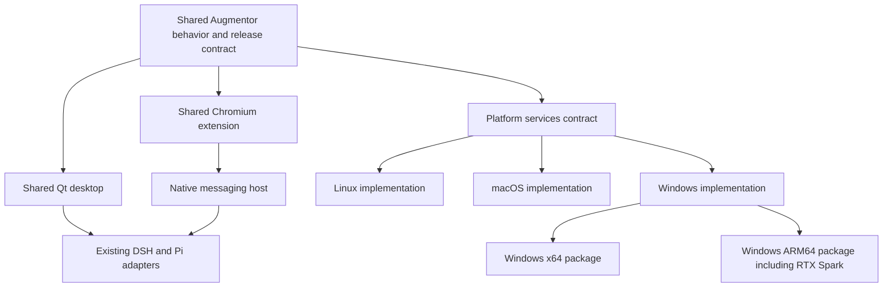

<!-- Copyright © 2026 Manolo Remiddi · SPDX-License-Identifier: LicenseRef-Augmentor-MIT-Resale-1.0 -->

# Windows implementation plan: one Augmentor product, x64 and ARM64

Date: September 27, 2026. Status: **implementation authorized; W0/W1 active**.
Current work and evidence: [implementation status](WINDOWS-IMPLEMENTATION-STATUS.md).
W1 update: [stock installer busy-uninstall failure and next qualification](WINDOWS-INSTALLER-DECISION.md).
The successful disposable update fixture does not select Velopack for production.
Source inspected: canonical application repository at `b8e36a44f6fc58c1a1a491040c81a21c17e82bb7`.
This document defines future work and its acceptance criteria. A checkbox, proposed
file or architecture decision is not evidence of an implemented feature.

Read the [corrected Windows and RTX Spark research](WINDOWS-RTX-SPARK-RESEARCH.md),
[architecture](ARCHITECTURE.md), [platform parity contract](PLATFORM-PARITY-AUDIT.md)
and [current handoff](AGENT-HANDOFF.md) before starting. Reconcile this baseline
with the latest reviewed `main` at implementation time; preserve unrelated work.

## 1. Outcome and boundaries

Build the Windows edition of the existing Augmentor Agent, retaining the approved
desktop interface, Chromium companion and shared DSH/Pi composition. A user downloads
one installer appropriate for their computer, installs without developer tools,
opens one recognizable Augmentor application, connects a model, chooses their browser
and receives future updates through an understandable notification and one action.

There are two Windows build targets:

| Target | Intended machines | Qualification requirement |
| --- | --- | --- |
| `windows-x64` | Supported Intel/AMD Windows PCs, with integrated graphics or discrete GPUs | Actual x64 Windows install, runtime and desktop tests |
| `windows-arm64` | NVIDIA RTX Spark N1X and other supported Windows ARM PCs | Native dependency/build tests, existing Windows ARM hardware, then RTX Spark hardware |

RTX Spark is an explicit Windows ARM64 target. It does not introduce an additional
operating system, a different agent core or a separate product branch. NVIDIA's
[porting resources](https://developer.nvidia.com/topics/ai/local-ai/port-apps)
allow preparation on existing Windows ARM systems before the target hardware is
available. Actual RTX Spark graphics and inference claims require hardware evidence.

Initial OS baseline: Windows 11 25H2; also qualify 26H1 where shipped on supported
hardware. Confirm the shipping RTX Spark OS/driver requirements before advertising
support. Exclude Windows 10, 32-bit Windows, Insider builds, Windows Server and
LTSC-specific deployments from the initial commitment. Do not infer compatibility
with all future releases from a numerical minimum-version comparison. Review the
[Microsoft release table](https://learn.microsoft.com/en-us/windows/release-health/windows11-release-information)
when freezing a candidate. Standard Home/Pro desktop use is the initial test scope;
managed enterprise restrictions are reported without attempting to circumvent them.

Keep existing Linux and macOS targets in the same feature and release process.
This project does not authorize a UI redesign, a harness replacement, a migration
of the owner's model/voice servers or an unrelated Linux distribution expansion.
Windows ARM64 is included in development from the start, not appended after an
x64-only architecture has already been chosen.

## 2. Decisions that guide implementation

| Concern | Default decision | Evidence needed before relying on it |
| --- | --- | --- |
| Application | Existing PySide6/Qt desktop, shared controllers and browser extension | Shared behavior suites on all maintained OSs |
| Product identity | One product version and reviewed source; OS/CPU-specific artifacts | Manifest and installed readback match |
| Windows package | Signed per-user EXE installer; bundled runtime directory | Clean-user installation without global Python/Node/DSH |
| Installer/updater | Qualify Velopack first, in W1; record exact tested version | Install, update, cancellation, host registration and uninstall proofs |
| Runtime payload | Private CPython/PySide, Node, DSH/plugins and small native launchers | Native architecture/ABI and inventory verification |
| Background ownership | One ordinary-user supervisor; one owned login entry | Reboot, crash recovery, disable-startup and shutdown tests |
| Local IPC | Shared protocol with Unix transport on existing OSs and secured Windows named pipes | Cross-user rejection, bounded messages and cancellation |
| Windows shell tools | Supported pinned DSH PowerShell composition, privately bundled compatible PowerShell 7 if needed | Tool execution, quoting, Stop, PTY and process-tree cleanup |
| Browser distribution | Shared extension; store distribution for the consumer channel | Store IDs, permission disclosures and real-browser compatibility |
| Updates | Shared coordinator and compatibility manifest, OS-specific apply backend | Two successive installed versions and failure recovery |
| Native ARM | Matching ARM64 runtimes and DLLs | No accidental x64 dependency loaded into a native ARM process |

Do not freeze the whole application into a new framework solely for packaging.
Keep replaceable application files and persistent user data separate. During W1,
choose the smallest launcher/freezing arrangement that works with the private
runtime and installer hooks; record that choice before building all integrations.

Velopack is a concrete first choice to prove, not an untested commitment. If its
maintenance or trust model cannot satisfy this document, record the failed
requirement and compare MSIX/App Installer against that requirement. Do not quietly
assemble a second home-grown updater or maintain competing production installers.
If switching installer changes user-visible behavior or required privileges,
surface that decision with the specific failed proof. [Python integration](https://docs.velopack.io/getting-started/python).

## 3. Shared architecture and ownership

Product logic remains shared: conversation state, streaming, Stop, recovery,
prompts, history/forks, memory rules, model selection, two independent windows,
appearance and browser contracts. Platform adapters implement mechanisms; they
must not silently remove a shared product feature.

Implement Python adapters under a distinctly named package such as
`services/platform_adapters/`, retaining `services/platform_support.py` as a
compatible entry point where needed. Extend `packages/platform` for Node clients.
Do not introduce a Python module that shadows the standard-library `platform`.
Do not rename `augmentor_linux` throughout the repository as a prerequisite.

| Contract | Required behavior | Windows mechanism to qualify |
| --- | --- | --- |
| Paths and identity | Distinguish install root, data, config, cache and runtime state | Known Folder APIs, user SID and filesystem ACLs |
| Local transport | Same protocol, authorized local peer, bounded operations | Named pipes restricted to the intended user; reject remote clients |
| Locks and leases | Single owner, shared running leases, exclusive maintenance | Named mutex/file-lock implementation with explicit access control |
| Process lifecycle | Identify owned processes; orderly Stop and bounded cleanup | Job Objects/handles and the harness's supported Windows primitives |
| Startup | Enable/disable one owned startup entry, preserve user choice | Per-user startup registration and supervisor |
| Shell execution | Correct dialect, arguments, cancellation and sandbox contract | Pinned PowerShell/DSH provider; no implicit POSIX shell |
| User interaction | Two shortcuts, tray, focus, capture/input, clipboard | Windows APIs behind shared product actions |
| Installation/update | Stage, verify, prepare, activate, health-check and recover | Selected Windows packaging backend |

Scope pipe names and ownership by application identity, user and, where needed,
logon session/instance. A claimed username or PID in a request is not authentication.
Test pipe pre-creation, unauthorized peers and remote access. Reuse the existing
same-user security boundary without claiming it isolates hostile software already
running as that same user. Authenticate loopback DSH endpoints separately.
[Windows pipe security](https://learn.microsoft.com/en-us/windows/win32/ipc/named-pipe-security-and-access-rights).

Proposed storage, finalized against the selected installer in W1:

| Purpose | Location/ownership policy |
| --- | --- |
| Application and updater | Installer-owned subtree of Local AppData; stable launch contract |
| Settings and private engine profiles | Separate Augmentor data subtree with explicit user ACLs |
| Conversations, prompts and memory journal | Persistent data subtree, outside replacement/uninstall payload |
| Logs and download cache | Bounded, separately removable cache/state subtree |
| Credentials | Shared secret-store interface backed by Windows user-scoped protection where integration permits; otherwise explicit ACL-protected compatibility storage |
| Browser host registration | Owned HKCU entries pointing to a stable executable/manifest |
| Optional model weights | Explicitly chosen persistent storage, never redownloaded by routine app updates |

Do not silently relocate existing `.dsh` profiles. Managed Augmentor DSH and an
existing external DSH installation must have explicit ownership and separate
upgrade responsibilities. Do not edit external profiles merely because they exist.

## 4. Required feature and delivery ledger

W0 creates a current feature ledger from source and accepted Linux/Mac behavior.
Track OS, CPU, surface, harness, engine mode and evidence independently. Each row
must be implemented and qualified, or carry a concrete blocker and an honest preview
limitation. A limitation is not permission to redefine the eventual common product.

| Feature group | Windows acceptance |
| --- | --- |
| Chat | Send/Enter, streaming, Stop, approvals, steering, queue/recovery and unknown-outcome handling |
| State | Model persistence, restored history, exact fork/edit boundaries, independent first/second windows |
| Shared tools | Prompts/templates, enabled plugins, existing Home client integration and the declared Pi subset |
| Desktop | Approved layout, flare, skins, immediate 75–150% app sizing, resize, clipboard, shortcuts and tray |
| Browser | User-selected Chromium browser, native host, side panel, live conversation and proper authority boundary |
| Computer control | Consented capture/input, clear active indicator and independent Stop within Windows privilege limits |
| Voice | Existing controls and protocol, microphone/playback, cancellation and configured engine connectivity |
| Memory | Existing journal, retrieval, processing/pause rules and configured engine connectivity |
| Lifecycle | Clean install, repair, startup, update, migration, rollback and complete software removal |
| Support | Versions and actionable component status; sanitized exports and no secret/chat leakage |

Voice and memory remain optional engines, not features silently removed on Windows.
Qualify their supported connection modes and document local engine provisioning
separately. Missing local binaries may prevent a particular local-engine mode while
leaving a configured remote engine usable. Basic chat must not require Docker, WSL,
GPU development tools or model weights. A partial preview is labelled as such;
full parity is claimed only for qualified rows.

## 5. Work packages and dependencies

All statuses below begin **not started**. Each work package ends with code review,
owning-document updates and the recorded acceptance evidence, before dependent
work treats its behavior as established.

| ID | Work package | Depends on | Concrete exit result |
| --- | --- | --- | --- |
| W0 | Baseline, feature ledger and test infrastructure | Planning authorization followed by implementation authorization | Reviewed baseline, available test environments and explicit external blockers |
| W1 | Runtime/dependency and installer feasibility | W0 | Native x64/ARM payload viability and selected installer proven with two test versions |
| W2 | Shared platform services | W1 | Windows imports/startup primitives work; Linux/Mac contracts still pass |
| W3 | Managed DSH and first-run setup | W2 | Clean Windows user sends and restores a real harness conversation |
| W4 | Desktop and Windows shell integration | W3 | Approved UI, two windows, shortcuts, tray and graphics accepted |
| W5 | Browser companion integration/distribution | W2–W4 | Actual chosen browsers exchange messages with the installed runtime |
| W6 | Desktop tools, voice, memory and RTX inference | W3–W5 | Feature ledger has real capability evidence and bounded limitations |
| W7 | Production installer, signing, repair and removal | W1–W6 | Signed clean-user package and repeatable maintenance behavior |
| W8 | Coordinated weekly updates across platforms | W2, W7 | Safe Windows update and shared coordinator/backend contracts proved on Linux/Mac |
| W9 | Full candidate and RTX Spark qualification | W4–W8 | Exact artifacts pass the acceptance matrix; hardware-pending results stay pending |
| W10 | Publication, customer guide and release operation | W9 plus signing/store prerequisites | Anonymous website download and installed update both verified |

Runtime and package feasibility are deliberate early gates: discover a missing
ARM DLL or installer limitation before spending weeks on the interface. Store
and signing preparation begin in W0/W1 because external verification can take time.
W6's RTX hardware tests may remain pending while other work advances; do not
confuse completed preparation with completed hardware qualification.

### W0 — Establish the implementation baseline

- [ ] Fetch/reconcile canonical `main`; inventory relevant open work without overwriting unrelated edits. Start a Windows feature branch from the reviewed baseline.
- [ ] Record all source, product, harness, protocol and data-schema versions. Compare accepted installed behavior with source; do not copy undocumented overlays.
- [ ] Create the feature ledger described above, including existing Mac update/removal limitations and Linux lifecycle behavior.
- [ ] Inventory available authorized Windows hosts/VMs and accounts; arrange x64 and ARM64 build/test capacity. Use disposable users/snapshots. No Windows host availability has been verified by this plan.
- [ ] Inventory signing and extension-publisher access without exposing credentials. Record identity/account actions that only the owner can complete; do all preparatory work first.
- [ ] Add Windows CI selection alongside existing Linux and Mac checks. Record runner OS/CPU/build, not just a floating runner label. Keep untrusted PR jobs separate from signing credentials and private hardware.

**Accept:** documented baseline and machine matrix; existing relevant regression
checks pass before refactoring. Missing hardware/accounts are named blockers,
not silently assumed available. No working installation was replaced to establish
this baseline.

### W1 — Prove dependencies and choose the package mechanism

- [ ] Enumerate native dependencies from Python, Node, DSH/plugins and helper executables. Identify CPU architecture, runtime ABI, license/source requirements and origin/hash for every binary.
- [ ] Evaluate a common supported Qt/PySide baseline with Windows ARM64 wheels. Research candidates include PySide6 6.11.2 and sounddevice 0.5.6; these are **candidates, not pins**. Audit support/security status at implementation time and validate before locking.
- [ ] Qualify Python/Node versions on both Windows architectures and retain pinned harness versions unless evidence requires a coordinated change. Check NumPy, ONNX Runtime, PortAudio, FFI, search tools and terminal/PTY helpers.
- [ ] Stage a self-contained runtime directory and minimal signed/test-signed native launcher using disposable assets. Check Qt platform/plugins, dynamic DLL loading, Unicode paths and console-free GUI launch.
- [ ] Build two disposable Velopack test versions. Verify private runtime launch, update hooks, native-host registration outside virtualized paths, one application identity, uninstall hooks and safe ownership of persistent data.
- [ ] Prove that the chosen API can disable uncontrolled auto-apply/forced termination, verify the intended signing trust and accommodate external child processes. Ensure default package cleanup cannot delete the last recoverable version before new-version health checks succeed. Record unsupported behavior before considering an alternative.
- [ ] Produce per-target lock files and a common dependency manifest. Re-run the shared native/appearance suites on Linux and Mac for any runtime-library upgrade.

**Accept:** clean x64 and ARM64 machines load the actual native modules and test
package without a development environment. An emulated x64 build does not satisfy
ARM64. The installer decision has an evidence-backed record. A required unavailable
dependency blocks that target; do not label it supported or quietly drop the feature.

### W2 — Implement portable platform services

- [ ] Replace direct Unix path, identity, permission, lock and transport assumptions with the contracts in section 3, incrementally.
- [ ] Remove unconditional Unix-only imports from shared startup paths. Unsupported platforms fail explicitly rather than executing Linux fallback code.
- [ ] Implement secured Windows IPC with a shared message contract in Python and Node; adapt Qt instance activation and maintenance clients.
- [ ] Implement lifecycle locks, process ownership, component startup, cancellation and log rotation. Protect against duplicate starts and stale owner records.
- [ ] Use argument arrays and explicit executables; validate Windows paths, quoting, reparse points and case behavior. Never derive trusted execution paths from an untrusted request.
- [ ] Introduce stable runtime location resolution so shortcuts, browser hosts and startup always select the installed release.

**Accept:** shared protocol/behavior fixtures pass on Linux, Mac, Windows x64 and
Windows ARM64. Real Windows probes reject a different user's connection and stale
or pre-created resources safely. Process exit, timeout, restart and concurrent
startup leave one owner and no orphaned fixture processes.

### W3 — Bundle DSH and deliver first-run setup

- [ ] Reuse the existing managed runtime/setup concepts behind a platform-neutral service API. Share setup state and validation; isolate OS process/startup mechanisms.
- [ ] Bundle the pinned DSH payload and owned plugins. Verify the exact payload rather than installing unpinned packages on a customer's machine.
- [ ] Select the Windows-supported PowerShell tools/terminal dialect. Bundle the tested PowerShell runtime privately when required; respect redistribution requirements and existing user installations.
- [ ] Preserve model selection, authentication, prompt/library migration and existing data. Use supported provider authentication screens; keep credentials out of arguments, logs and package contents.
- [ ] Make setup retryable after network failure, missing provider credentials or interrupted provisioning. Distinguish installed engine, running engine, configured model and verified connection.
- [ ] Support connecting an existing compatible DSH without taking ownership of its update lifecycle. Refuse ambiguous/incompatible ownership with an actionable explanation.
- [ ] Verify actual shell tools, filesystem tools, approvals, cancellation and sandbox behavior. A sandbox/backend failure never silently falls back to unrestricted execution.

**Accept:** on a clean standard-user account, bundled DSH starts, required plugins
load, a deterministic model completes a real conversation, Stop cancels work, and
history/model choice survive restart. Also record a separate real-provider test
with authorized credentials. No global DSH/Python/Node installation is required.

### W4 — Complete the native Windows desktop experience

- [ ] Run the existing Qt window/controller unchanged in product behavior; fix common rendering/interaction defects in shared code.
- [ ] Implement a stable AppUserModelID, icon, Start menu/taskbar behavior and tray Open/Quit actions. Clicking the app opens/focuses it; a configured shortcut toggles it.
- [ ] Implement both independent window shortcuts through Windows APIs with collision detection and persistence. Choose defaults from tested availability; do not assume Fn is exposed as a normal PC modifier.
- [ ] Register one per-user login supervisor; honor Windows/user startup-disable choices and an explicit Quit. Recovery must not fight maintenance, uninstall or intentional shutdown.
- [ ] Verify shared flare shaders on Direct3D and the existing fallback. Preserve transparency, click-through exterior effects and proportional App size.
- [ ] Handle monitor changes, mixed DPI, display scaling, resize, focus, clipboard, sleep/wake, lock/unlock and remote sessions.

**Accept:** native pointer/keyboard tests demonstrate chat, resizing, shortcuts,
appearance and reopening on both Windows architectures. Two windows preserve
separate chats and active drafts. Cold login yields one application identity and
one owned background runtime. Offscreen screenshots alone do not pass this gate.

### W5 — Integrate the user's Chromium browser

- [ ] Keep one extension source and product/browser protocol. Discover installed browsers and provide an executable picker; do not require Chrome by brand.
- [ ] Build a console-free Windows native-host executable that launches the pinned owned runtime, uses binary stdio framing and emits no diagnostics on protocol stdout.
- [ ] Register owned HKCU native-messaging entries and a stable manifest path. Handle required registry views explicitly. Preserve unrelated hosts and undo only entries still owned by Augmentor.
- [ ] Resolve and test Chrome, Edge, Comet and other selected forks' actual host lookup and side-panel capabilities. Reuse shared protocol behavior, not Mac filesystem assumptions.
- [ ] Prepare Chrome Web Store/Edge Add-ons publication materials, permission rationale and privacy policy. Preserve the canonical extension key/IDs and enumerate permitted store IDs explicitly.
- [ ] Open the chosen browser's appropriate store/setup page, show the user approval step, then verify an extension-to-host handshake. Report installed, blocked and incompatible states distinctly.
- [ ] Keep manual Load unpacked as an explicit development/preview path only; it is not the promised finished consumer experience.
- [ ] Add host/extension protocol negotiation and support the current and preceding release where declared compatible. Test both upgrade orders and fail safely when incompatible.

**Accept:** real installed-browser conversations pass on both architectures, with
Chrome/Edge and Comet wherever an available supported build permits. A missing
fork/architecture build remains visible in the matrix. Browser approval/policy
handling, repair and native-host removal are tested. Switching browser does not
create another Augmentor installation or discard the first browser's valid setup.

### W6 — Complete tools, voice, memory and RTX-specific qualification

- [ ] Add a Windows desktop backend under the existing consent/owner/Stop contract. Use Windows capture and input/accessibility APIs; preserve the browser-versus-desktop authority separation.
- [ ] Reject unavailable/elevated/secure-desktop operations clearly. Do not elevate the whole agent or bypass UAC to achieve a test result.
- [ ] Qualify microphone, playback, device changes, hold-to-talk/hands-free, Stop and echo behavior using the existing Resonant Voice protocol. Keep its repository ownership and the owner's current engine placement.
- [ ] Qualify memory journal/pause/processing/retrieval against the selected engine. Separate local provisioning from connection support; preserve bank and project boundaries.
- [ ] Exercise all shipped DSH plugins and the supported Pi subset on Windows, including tools that invoke external programs.
- [ ] Prepare RTX Spark graphics and optional local-inference tests using NVIDIA's supported Windows ARM resources. Select one concrete supported inference runtime and pin the tested runtime/driver/model combination in the evidence record.
- [ ] Keep CUDA/model execution behind the inference provider boundary. Test unified-memory pressure, cancellation and sustained/laptop-power behavior on RTX Spark; never assume all advertised memory is model capacity.

**Accept:** ledger rows have fixture and real integration evidence, with physical
audio/desktop/RTX results distinguished. A common feature may be marked blocked
pending its dependency but is not reported as complete. RTX support remains pending
until the real machine and driver stack pass; other work continues meanwhile.

### W7 — Finish installation, trust, repair and removal

- [ ] Produce signed x64 and ARM64 installers from one reviewed release source. No user needs to install Python, Node, Qt or DSH separately.
- [ ] Check supported OS/CPU, disk space, current installation, ownership and active work before mutation. Handle reinstall, architecture mismatch and partial installation predictably.
- [ ] Keep one product identity through upgrades. An x64-to-ARM64 migration on an ARM machine must replace the owned installation safely or provide a tested migration path, not produce two Apps entries.
- [ ] Repair owned shortcuts, host registrations and startup entries idempotently. Never reset model credentials, conversations or appearance to repair binaries.
- [ ] Sign owned launchers/helpers/updater/installer, validate publisher continuity and timestamp signatures. Keep signing permissions out of untrusted build jobs.
- [ ] Carry forward dependency notices/source archives and verify the chosen runtime distribution's obligations. Scan the assembled public payload for private profiles, tokens and development paths.
- [ ] Implement uninstall through Installed Apps: stop owned components safely; remove owned startup, shortcuts and browser-host registration; remove program/cache files; preserve personal data by default. Offer data deletion separately and explicitly. Explain that browser-owned extension removal still belongs to the browser.

**Accept:** fresh install, repair, uninstall and reinstall pass in clean standard-user
Windows sessions; interrupted operations recover without duplicates or data loss.
No running executable is patched in place. Public distribution uses a verified
publisher; self-signed laboratory packages are not presented as customer-ready.

### W8 — Deliver coordinated one-action updates

Build one product update coordinator and a small platform apply interface. Reuse
Linux's tested release-selection/maintenance mechanisms and Mac bundle replacement
where applicable. Do not run an independent self-updater against package-manager-owned
Linux files. Windows uses the installer backend selected in W1. Mac update trust
must respect the existing preview boundary; a Windows signing identity does not
resolve Apple distribution trust.

- [ ] Publish authenticated release metadata containing product/channel, source,
  target OS/CPU, minimum OS, compatible protocols/data schemas, component pins,
  hashes, expected signer and immutable artifact locations. Reject unsigned,
  expired/stale or unauthorized downgrade metadata according to the chosen trust
  design. Use maintained signing/verification primitives, not new cryptography.
- [ ] Check in the background with backoff and jitter; handle offline/proxy failures
  without blocking startup. Download resumably with space checks and verify before use.
- [ ] Show a single update notification and an Update/Restart action plus deferral.
  One action completes the normal idle update; active work or unsaved settings may
  require a meaningful save/stop decision. Preserve drafts and selections before
  shutdown; do not cancel active tasks merely because an update was downloaded.
- [ ] Query all owned windows, DSH/browser jobs, voice and memory activity. Acquire
  an exclusive maintenance state that prevents new work/restarts during activation.
  Recheck after draining to close the race between an idle probe and new work.
- [ ] Replace the current opaque busy boolean with actionable reasons. For settings
  dialogs, offer Save/Discard/Cancel and continue only after a user's choice where
  required. For ongoing tasks, wait or let the user explicitly Stop; timeout leaves
  the current installation working.
- [ ] Stop owned components, apply the verified immutable package, migrate supported
  schemas, reopen safely and perform bounded local health checks. A network/provider
  outage alone must not falsely trigger binary rollback.
- [ ] Keep an independently launchable recovery path if the new UI fails. Recover
  previous binaries only when data schemas permit; use migration checkpoints and
  explicit recovery for incompatible schema changes. Retain the last known working
  artifact until health verification succeeds; prune older owned artifacts only
  through the documented retention policy. Never replay uncertain tools.
- [ ] Add rollout channels/cohorts, withdrawal and a recorded rollback policy.
  Support a full-download fallback; add deltas only after full updates are reliable.
- [ ] Prove the shared coordinator contracts on Linux and macOS and document any
  native signing/distribution gate that still prevents consumer auto-update there.

Velopack lifecycle defaults require explicit control: its docs describe auto-apply
and termination behavior that cannot decide whether Augmentor's other processes
are doing useful work. Verify the exact selected SDK's controls in W1 and put
Augmentor's maintenance coordination ahead of the apply operation. Do not make a
short installer callback responsible for waiting indefinitely on active tasks.
[Lifecycle documentation](https://docs.velopack.io/integrating/overview).

**Accept:** installed version N updates to N+1 and restarts correctly on x64 and
ARM64. Exercise two windows, an active browser task, pending approval, unsent draft,
open settings, download failure, no space, process crash and interrupted activation.
Work/settings remain intact, no unrelated process is killed, and failure leaves a
working or clearly recoverable installation. Same shared scenarios run through
the maintained Linux/Mac backends, with separate real-platform evidence.

### W9 — Qualify exact release candidates

- [ ] Run the full relevant shared suites and Windows backend suites at the source
  used for the artifacts. Existing Linux/Mac regressions block promotion.
- [ ] Run installed-package tests in clean users on supported Windows builds and
  both CPUs, without development tools or inherited credentials.
- [ ] Use real GUI, browser, login, audio and graphics tests on physical machines;
  use fixtures for deterministic protocol/recovery coverage, not hardware claims.
- [ ] Test current and previous extension/desktop combinations, N-to-N+1 updates
  and one supported older upgrade/migration path.
- [ ] Inspect payload architecture, hashes, signatures, notices and public metadata.
  Download the intended public artifacts anonymously and verify their complete bytes.
- [ ] Record actual CPU/GPU/driver/OS, source and artifact identity, scenario, outcome,
  fixture versus real-provider mode and remaining gaps. Keep secrets and personal
  machine state out of public evidence.

**Accept:** every promised capability has traceable evidence. RTX Spark status is
recorded separately from generic Windows ARM64. If hardware is unavailable, publish
only an accurately labelled Windows ARM64 qualification result; do not mark the
RTX Spark gate complete or substitute another NVIDIA product.

### W10 — Publish and operate weekly releases

- [ ] Promote the reviewed multi-platform release set from the same runtime source
  and product contract. Record any exceptional platform hotfix explicitly; avoid
  permanent OS-specific development branches.
- [ ] Publish immutable installers, release notes, compatibility/test evidence,
  checksums, notices and required sources. Publish the update feed only after every
  referenced asset is accessible and verified.
- [ ] Update `augmentoragent-website/` with Windows x64/ARM64 downloads, clear CPU
  selection and a short guide. Browser architecture detection is advisory; the
  installer checks the actual machine. Keep Linux/Mac links correct.
- [ ] Explain install → model setup → browser choice/approval → first message →
  shortcuts → update → uninstall in plain language. Capture the actual released UI.
- [ ] Start with internal/canary users, then broaden only after the documented
  observation interval and acceptance evidence. Retain a way to withdraw an update.
- [ ] Verify the live website download, signatures, first installation and an actual
  update from a previous published version. Website visibility alone is not release
  completion.

**Accept:** a new user can install through the public guide and an existing user
can receive and apply the verified update. Installation identity is singular,
private data is preserved and advertised hardware/capability claims match evidence.

## 6. Tests and evidence matrix

The detailed test ledger is created in W0 and maintained with each work package.
This is the minimum scenario set, not a claim that all combinations require a
separate physical machine.

| Dimension | Required coverage |
| --- | --- |
| OS | Windows 11 25H2 x64/ARM64; eligible 26H1 hardware; Linux/Mac regression targets |
| CPU/GPU | Intel and AMD x64; existing Windows ARM; RTX Spark; integrated and NVIDIA graphics |
| User context | Standard user, admin account running unelevated, two users, logout/login, locked session |
| Display/input | 100/125/150/200% DPI, mixed monitors, monitor disconnect, keyboard layouts, RDP, sleep/wake |
| Filesystem | Spaces/Unicode, long paths, restrictive ACLs, reparse points, case differences, no space, file locks |
| Browser | Installed picker and manual picker; Chrome/Edge/Comet as available; store IDs; blocked policy |
| Harness | Pinned real DSH, declared Pi subset, fixture model and separate authorized live-provider test |
| Work state | Idle, streaming, tool execution, approval wait, queued work, two windows, unsent draft, settings dialog |
| Installation | Clean, repeat install, repair, partial install, wrong architecture, update, interruption, rollback, removal |
| Engines | Microphone/playback devices, configured speech/memory, optional local inference, resource exhaustion |

CI needs native x64 and ARM64 jobs. GitHub currently documents a Windows ARM runner,
but runner availability is not proof of consumer graphics or RTX behavior.
Use explicit runner identities and record the actual version. Physical lab and
release-signing jobs run only trusted revisions with isolated credentials.
[Runner reference](https://docs.github.com/en/actions/reference/runners/github-hosted-runners).

Track measured cold/warm launch time, idle CPU/RAM, animation cost, update size and
update duration. Establish thresholds from the first qualified Windows builds
and accepted Linux/Mac behavior; flag regressions. Do not invent RAM minimums or
speed guarantees before measuring. Test fallback rendering without requiring an
RTX GPU for ordinary cloud-model use.

## 7. File-level work map

These are intended ownership locations, not files created by this planning task.
Refine names during W0/W1 without changing the architecture or duplicating modules.

| Area | Existing owners to extend | Proposed additions |
| --- | --- | --- |
| Platform contracts | `services/platform_support.py`, `packages/platform/src` | `services/platform_adapters/`, Windows Node adapter |
| Native Windows integration | `apps/native/augmentor_linux/window.py`, `shortcuts.py`, `instances.py` | Focused Windows shell/shortcut modules |
| DSH ownership | `services/dsh`, `scripts/stage-dsh.py`, setup dialogs | Windows supervisor/provisioning backend |
| Locks and maintenance | `services/lifecycle`, `scripts/maintenance.py`, release selection | Windows leases/apply backend; shared update coordinator |
| Desktop control | `services/desktop/service.py`, existing backend contract | `services/desktop/windows.py` and minimal native helper if required |
| Browser | `apps/browser`, existing native host and registration contracts | Windows executable launcher and owned-registration implementation |
| Packaging | `release/product.json`, stage/inventory/notice scripts | Per-architecture Windows manifests/locks, package/proof scripts |
| Validation | `tests`, shared proof scripts, existing workflows | Windows CI, installed/GUI/update/RTX evidence fixtures |
| Customer docs | Setup, lifecycle, support and compatibility guides | `WINDOWS-INSTALLATION.md`, `WINDOWS-RELEASE.md`, current qualification ledger |
| Website | Separate canonical website repository | Windows downloads and customer guide after qualification |

## 8. Decision and blocker handling

| Issue | Default next action | What it blocks |
| --- | --- | --- |
| Native ARM dependency missing | Try a supported common upgrade; record exact failed import/build; consider a bounded compatible fallback without mislabelling native support | Native ARM capability until resolved |
| Installer proof fails | Identify failed lifecycle requirement; compare one alternative against it | Production packaging decision |
| Signing identity unavailable | Prepare CI/signing inputs and test packages; ask only for identity/verification the agent cannot complete | Trusted public Windows release |
| Store review/account pending | Prepare store-ready package, IDs, policy/permissions and internal test path | Finished consumer extension installation; preview can be labelled explicitly |
| Windows/RTX hardware unavailable | Continue native CI/current ARM tests and prepare reproducible hardware suite | Physical capability claim, especially RTX Spark |
| Local voice/memory/inference mode unavailable | Preserve shared UI/protocol and test supported engine connections; retain explicit gap | That advertised local mode; not permission to drop the feature |
| Active personal installation blocks maintenance | Leave it working; use disposable tests; act on concrete blocker only when activation is needed | Personal activation, not development |

Use evidence to resolve routine implementation choices autonomously once building
is authorized. Ask the owner for account verification, unavailable resources or a
material product trade-off only when needed, with a concrete prepared choice.
Do not require the owner to run tests, gather routine diagnostics or perform work
that the agent can do. Do not claim Windows or RTX completion to avoid a real blocker.

## 9. Release gates and definition of done

| Gate | Required evidence |
| --- | --- |
| G1 — Platform feasibility | W1 native payloads and installer proof on x64 and ARM64 |
| G2 — Usable Windows product | W2–W6 applicable feature ledger, installed GUI/browser/runtime tests |
| G3 — Safe distribution | W7–W8 signed install/repair/removal and N-to-N+1 coordinated updates |
| G4 — Hardware qualification | W9 actual supported Windows machines; RTX Spark separately marked passed/pending |
| G5 — Public delivery | W10 anonymous artifact verification, live website guide and published-update acceptance |

Windows completion requires the advertised feature set, installation, updates,
data preservation and Linux/Mac regression checks to pass—not merely an executable
that opens. RTX Spark compatibility additionally requires its real hardware gate.
Unavailable hardware may leave that claim pending while a clearly scoped Windows
release proceeds; it may not be silently marked passed.

For weekly maintenance, every change states whether it alters shared behavior or
an OS mechanism, updates common tests where behavior changes, and runs each affected
platform's backend tests. Release records distinguish source, packaged artifact,
selected installation and running processes. Browser/store lag is covered by the
declared compatibility window rather than forced simultaneous installation.

At the end of every work package, publish a concise record of source/ref, exact
artifacts where relevant, tests and real-machine scope, unresolved items and the
next eligible work package. Keep lengthy/private raw logs out of GitHub. Do not
report this plan's proposed modules or gates as already built.

## 10. Current checkpoint

- [x] Research corrected to NVIDIA RTX Spark and reviewed against the repository.
- [x] Detailed build sequence, shared architecture and acceptance criteria documented.
- [ ] W0–W10 implementation and qualification.

The next action after authorization to build is **W0**, followed by the **W1 native
dependency and installer proof on both Windows architectures**. No code, installer,
CI job, installation or publication was changed by authoring this plan.
